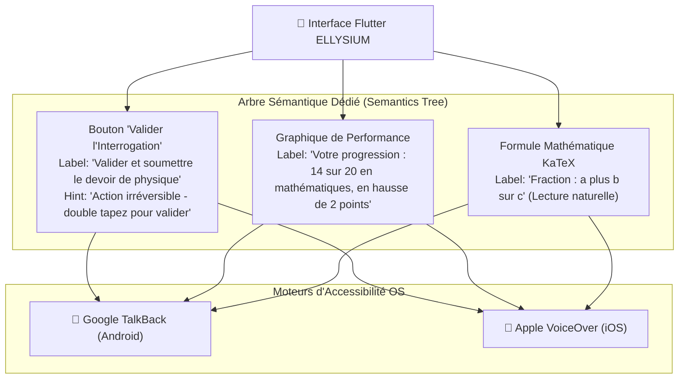

# Module 222 — Accessibilité Mobile — Lecteurs d'Écran, Contrastes, Ergonomie

> **Positionnement :** Tome 12 — Applications Numériques · Module 222 sur 227
> **Autorité :** Lead Accessibility Specialist / Commission Nationale pour l'Inclusion des Personnes Vivant avec Handicap (PVH)
> **Liaison amont/aval :** ← Module 221 (Appareils entrée de gamme) → Module 223 (Sécurité applicative) →

---

## 1. Objet

Ce module régit la mise en œuvre pratique de l'accessibilité universelle au sein des applications mobiles (Flutter) et de la PWA d'ELLYSIUM. Il formalise l'interfaçage avec les lecteurs d'écran (**Google TalkBack** et **Apple VoiceOver**), le calibrage des ratios de contraste colorimétrique, la flexibilité typographique et les adaptations spécifiques pour les apprenants en situation de handicap visuel, auditif ou moteur.

---

## 2. Principes d'Inclusion Scolaire (Constitution ELLYSIUM)

L'éducation souveraine proclamée par ELLYSIUM ne laisse aucun citoyen au bord du chemin :
- **Principe d'Équivalence d'Information** : Tout élément porteur de sens visuel (schéma, formule mathématique, carte géographique, photo d'examen) dispose obligatoirement d'une alternative textuelle descriptive rigoureuse (*Alt-Text* et label sémantique).
- **Indépendance Vis-à-Vis de la Couleur** : La couleur seule ne doit jamais être l'unique vecteur d'une information critique (ex: un échec scolaire ou une alerte ne s'indique pas seulement en rouge, mais avec une icône distincte et un texte explicite).

---

## 3. Interfaçage avec les Lecteurs d'Écran (TalkBack / VoiceOver)



### Exemple d'Implémentation Sémantique en Flutter :
```dart
Semantics(
  label: "Bulletin scolaire du premier trimestre",
  hint: "Double-tapez pour ouvrir le détail des cotes matière par matière",
  button: true,
  child: InkWell(
    onTap: () => ouvrirBulletin(),
    child: BulletinCardWidget(bulletin: b),
  ),
)
```

---

## 4. Ratios de Contraste et Palette Accessible

En stricte conformité avec le standard **WCAG 2.2 Niveau AAA** :

| Élément d'Interface | Ratio de Contraste Minimal Requis | Implémentation ELLYSIUM |
|---|---|---|
| **Texte Ordinaire (< 18 pt)** | **$\ge 7.0:1$** | Texte Bleu Nuit `#0B2545` sur Fond Ivoire `#F5F5F0` (Ratio **13.4:1**) |
| **Grand Texte ($\ge 18$ pt)** | **$\ge 4.5:1$** | Titres Or Académique `#A67C00` sur Fond Nuit `#0B2545` (Ratio **7.8:1**) |
| **Composants d'Interface Actifs** | **$\ge 3.0:1$** | Bordures de formulaires et boutons d'action certifiés |
| **Mode Contraste Élevé** | **$\ge 10.0:1$** | Bascule monochrome Noir pur `#000000` / Blanc pur `#FFFFFF` |

---

## 5. Flexibilité Typographique et Moteur KaTeX Accessible

- **Prise en charge du Dynamic Type (Agrandissement jusqu'à 200%)** :
  - L'application respecte les préférences de taille de police configurées dans les paramètres généraux d'Android et d'iOS.
  - Les conteneurs d'affichage s'étirent verticalement sans jamais tronquer la fin des phrases (*no clipping*).
- **Formules Scientifiques KaTeX Parlantes** :
  - Les équations mathématiques et chimiques écrites en LaTeX sont automatiquement transcrites en texte phonétique compréhensible par le lecteur d'écran (ex: $E = mc^2$ est lu *"E majuscule égale m fois c au carré"*).

---

## 6. Verrous Fonctionnels

| ID | Règle | Niveau |
|---|---|---|
| VF-222-01 | Ratios de contraste strictement conformes au standard WCAG 2.2 AAA ($\ge 7:1$) | CONSTITUTIONNEL |
| VF-222-02 | 100% des éléments interactifs dotés d'un label sémantique pour TalkBack | INCLUSION |
| VF-222-03 | Agrandissement de police supporté jusqu'à 200% sans perte de contenu | ERGONOMIE |
| VF-222-04 | Interdiction d'utiliser la couleur comme unique indicateur d'état | CONSTITUTIONNEL |
| VF-222-05 | Lecture vocale accessible des formules scientifiques et mathématiques | PÉDAGOGIQUE |
| VF-222-06 | L'application Android consomme moins de 2 Mo de données pour 60 minutes d'utilisation terrain | PERFORMANCE |

---

*Sous-tome rédigé conformément aux Normes documentaires ELLYSIUM — Fondations 04.*
