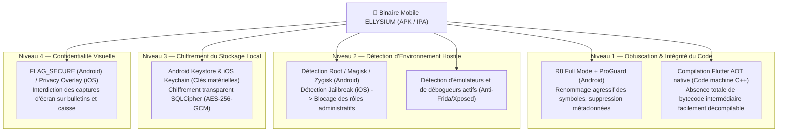

# Module 223 — Sécurité Applicative Mobile (Obfuscation, Stockage Sécurisé)

> **Positionnement :** Tome 12 — Applications Numériques · Module 223 sur 227
> **Autorité :** Responsable Sécurité Mobile / RSSI ELLYSIUM
> **Liaison amont/aval :** ← Module 222 (Accessibilité) → Module 224 (Capture appareil photo) →

---

## 1. Objet

Ce module détaille le dispositif de défense en profondeur implémenté au cœur des applications mobiles ELLYSIUM (Android et iOS). Il régit la protection contre l'ingénierie inverse, l'obfuscation du binaire, la détection des environnements corrompus (Root / Jailbreak), le stockage chiffré local et le verrouillage des captures d'écran sur les données sensibles.

---

## 2. Menaces Mobiles Spécifiques au Contexte

1. **Tentatives de fraude aux examens** : Décompilation de l'APK pour extraire les clés de décryptage des banques d'épreuves locales ou modifier les cotes avant synchronisation.
2. **Vol d'appareils et accès non autorisé** : Extraction physique des bases SQLite locales par débogage USB (ADB) sur un smartphone volé à un enseignant ou à un préfet.
3. **Attaques par interception (Man-In-The-Middle)** : Utilisation de proxys d'interception sur des réseaux Wi-Fi publics ou non sécurisés.

---

## 3. Matrice des Contre-Mesures Techniques



---

## 4. Chiffrement Local des Données (SQLCipher + Keystore)

Toute donnée persistée localement (cours téléchargés, cotes en attente d'envoi, copies d'examen) est chiffrée de bout en bout :

```dart
// Initialisation de la base locale chiffrée en Flutter
Future<Database> initialiserBaseLocaleSecurisee() async {
  // 1. Récupération ou génération d'une clé AES-256 dans l'Android Keystore / iOS Keychain
  final secureStorage = const FlutterSecureStorage();
  String? dbKey = await secureStorage.read(key: 'cnel_sqlite_db_key');
  
  if (dbKey == null) {
    final keyBytes = Uint8List(32);
    final random = Random.secure();
    for (int i = 0; i < 32; i++) {
      keyBytes[i] = random.nextInt(256);
    }
    dbKey = base64Url.encode(keyBytes);
    await secureStorage.write(key: 'cnel_sqlite_db_key', value: dbKey);
  }

  // 2. Ouverture de SQLite avec SQLCipher et la clé dérivée
  return openDatabase(
    join(await getDatabasesPath(), 'ellysium_local_vault.db'),
    password: dbKey,
    version: 1,
  );
}
```

---

## 5. Protection Anti-Capture d'Écran (`FLAG_SECURE`)

Pour empêcher la diffusion frauduleuse de sujets d'examen avant l'heure ou la fuite de données personnelles :
- Le drapeau natif Android **`WindowManager.LayoutParams.FLAG_SECURE`** est activé dynamiquement sur :
  1. L'écran de passation d'un examen en ligne.
  2. L'écran de consultation des états de caisse et recettes.
  3. L'écran de visualisation des bulletins scolaires avant scellement officiel.
- Sur iOS, l'interface bascule sur un écran de masquage opaque dès que l'application passe en arrière-plan dans le multitâche.

---

## 6. Verrous Fonctionnels

| ID | Règle | Niveau |
|---|---|---|
| VF-223-01 | Obfuscation R8 obligatoire sur tous les builds de production | TECHNIQUE |
| VF-223-02 | Refus d'exécution des rôles administratifs (Préfet, Caissier) sur terminaux rootés | SÉCURITÉ |
| VF-223-03 | Stockage local chiffré exclusivement en AES-256 avec clé protégée par Keystore/Keychain | CONSTITUTIONNEL |
| VF-223-04 | Capture d'écran bloquée par `FLAG_SECURE` pendant toute épreuve d'examen | FRAUDE |
| VF-223-05 | Zéro log applicatif ou donnée sensible dans `Logcat` ou la console en mode release | OBLIGATOIRE |

---

*Sous-tome rédigé conformément aux Normes documentaires ELLYSIUM — Fondations 04.*
