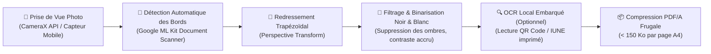

# Module 224 — Capture de Documents via Appareil Photo (CameraX / ML Kit)

> **Positionnement :** Tome 12 — Applications Numériques · Module 224 sur 227
> **Autorité :** Lead Vision Engineer / Direction des Examens et Concours
> **Liaison amont/aval :** ← Module 223 (Sécurité mobile) → Module 225 (Mises à jour) →

---

## 1. Objet

Ce module régit la numérisation intelligente, le traitement d'image embarqué et la conversion en PDF dématérialisé des copies d'examens manuscrites, pièces d'état civil, reçus de versement et devoirs papier via le capteur photo du smartphone. Il exploite les API natives **Android CameraX** et **Google ML Kit** pour opérer un redressement et un filtrage haute qualité directement sur le terminal client sans saturer la bande passante.

---

## 2. Pipeline de Traitement Embarqué (Edge Vision)



---

## 3. Spécifications du Scanner de Documents Intelligent

Dans le contexte des écoles congolaises où l'éclairage est souvent précaire (lampes à pétrole, néons vacillants) et les appareils photo bas de gamme :
1. **Correction d'Ombre et de Contre-Jour** : L'algorithme analyse l'histogramme de luminance en temps réel pour éliminer les ombres projetées de la main ou du téléphone sur la feuille de devoir.
2. **Binarisation Adaptative (Sauvola / Otsu)** : Transformation de la photo couleur en une image binaire nette (texte noir profond sur fond blanc immaculé), réduisant le poids du fichier de 95 % par rapport à un JPEG couleur classique.
3. **Poids Cible du Document Produit** : Une copie d'examen manuscrite de 4 pages ne doit pas dépasser **450 Ko au total** une fois convertie en PDF/A.

---

## 4. Lecture Automatique des QR Codes d'Identification

Lors des examens officiels ou des devoirs surveillés :
- Chaque feuille d'épreuve imprimée comporte un QR Code souverain en en-tête identifiant l'épreuve et l'élève.
- Dès que la caméra pointe sur la copie, **Google ML Kit Barcode Scanning** lit le code en moins de **80 millisecondes**, associe automatiquement la capture au bon dossier d'élève en base locale et valide la page (Page 1/3, Page 2/3, etc.).
- L'enseignant n'a besoin d'effectuer aucun classement manuel chronophage.

---

## 5. Exemple d'Intégration Flutter / Android

```dart
// Intégration du Document Scanner Google ML Kit
Future<File?> capturerCopieExamen(BuildContext context) async {
  final options = DocumentScannerOptions(
    documentFormat: DocumentFormat.pdf,
    mode: ScannerMode.filter, // Filtres automatiques Noir & Blanc
    pageLimit: 10,
    isGalleryImportAllowed: false, // Empêche l'import de photos trafiquées
  );

  final scanner = DocumentScanner(options: options);
  final DocumentScanningResult result = await scanner.scanDocument();

  if (result.pdf != null) {
    final pdfFile = File(result.pdf!.uri);
    // Vérification de la taille frugale
    final tailleKo = await pdfFile.length() / 1024;
    debugPrint("Copie numérisée : ${tailleKo.toStringAsFixed(1)} Ko");
    return pdfFile;
  }
  return null;
}
```

---

## 6. Verrous Fonctionnels

| ID | Règle | Niveau |
|---|---|---|
| VF-224-01 | Traitement et filtrage d'image exécutés localement sur le terminal (Edge Processing) | FRUGALITÉ |
| VF-224-02 | Poids d'une page numérisée strictement inférieur à 150 Ko en sortie | SLO TECHNIQUE |
| VF-224-03 | Détection automatique et validation obligatoire du QR Code d'en-tête de copie | INTÉGRITÉ |
| VF-224-04 | Interdiction d'importer des photos depuis la galerie pour les copies d'examen | ANTI-FRAUDE |
| VF-224-05 | Les images brutes temporaires sont purgées de la mémoire après génération du PDF | CONFIDENTIALITÉ |

---

*Sous-tome rédigé conformément aux Normes documentaires ELLYSIUM — Fondations 04.*
