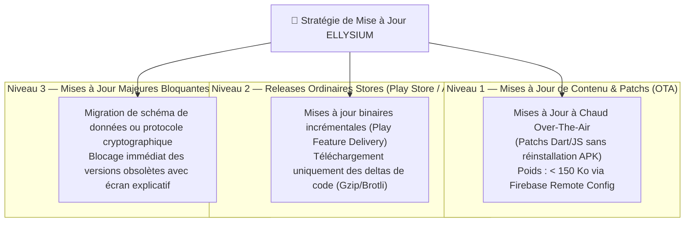

# Module 225 — Mises à Jour et Gestion des Versions (OTA, Stores)

> **Positionnement :** Tome 12 — Applications Numériques · Module 225 sur 227
> **Autorité :** Release Manager / Responsable Déploiement Applicatif
> **Liaison amont/aval :** ← Module 224 (Capture documents) → Module 226 (Tests multi-appareils) →

---

## 1. Objet

Ce module fixe les stratégies de déploiement continu, de mise à jour transparente, de rétrocompatibilité et de gestion du cycle de vie des versions des applications ELLYSIUM (Android, iOS, PWA). Il concilie le déploiement sur les stores officiels avec les mécanismes de mise à jour à chaud sans fil (**Over-The-Air - OTA**) indispensables pour contourner la rareté des forfaits Internet des usagers congolais.

---

## 2. Typologie des Mises à Jour ELLYSIUM

---

## 3. Déploiement OTA et Firebase Remote Config

Pour corriger un bug critique ou ajuster une règle d'affichage sans contraindre l'apprenant à télécharger un nouvel APK de 12 Mo :
1. **Google Firebase Remote Config** : Injection dynamique de paramètres, feature flags et règles de routage en temps réel.
2. **Patching Dynamique** : Téléchargement silencieux d'un micro-delta de code compressé appliqué au prochain démarrage de l'application.
3. **Zéro Forfait Dépensé Inutilement** : La vérification de version s'effectue via un simple en-tête HTTP `If-None-Match` consommant moins de 200 octets.

---

## 4. Politique de Gestion des Versions (Semantic Versioning)

ELLYSIUM applique le versionnement sémantique strict :

$$\mathbf{MAJOR.MINOR.PATCH} \quad (\text{Ex: } 2.4.1)$$

- **MAJOR** : Changement d'année académique, refonte constitutionnelle de l'architecture, rupture d'API.
- **MINOR** : Ajout de fonctionnalités majeures (ex: nouveau type de quiz, intégration d'une nouvelle province).
- **PATCH** : Correction de bugs, optimisation de performance mémoire.

### Matrice de Support et Dépréciation

| Statut de la Version | Comportement Applicatif | Seuil Temporel |
|---|---|---|
| **Version Active (Actuelle)** | Accès complet sans avertissement | Version en cours ($N$) |
| **Version Supportée ($N-1$)** | Accès complet, bannière d'information discrète | Jusqu'à 6 mois d'ancienneté |
| **Version Dépréciée ($N-2$)** | Accès maintenu en lecture seule, invitation pressante à la mise à jour | 6 à 12 mois |
| **Version Bloquée ($< N-2$)** | Écran rouge de blocage absolu : mise à jour obligatoire requise | $> 12$ mois ou faille de sécurité |

---

## 5. Mises à Jour Hors-Ligne en Pair-à-Pair (P2P Mesh)

Dans les zones rurales dépourvues de réseau cellulaire :
- L'application Android intègre une fonctionnalité d'auto-distribution via **Wi-Fi Direct / Nearby Share**.
- Un délégué d'école ou un enseignant disposant de la dernière version certifiée peut la transmettre en quelques secondes au smartphone d'un élève sans aucune connexion Internet.
- L'intégrité du binaire transmis est validée localement par vérification de la signature cryptographique d'État avant installation.

---

## 6. Verrous Fonctionnels

| ID | Règle | Niveau |
|---|---|---|
| VF-225-01 | Vérification de version obligatoire au lancement via Firebase Remote Config | TECHNIQUE |
| VF-225-02 | Blocage absolu des versions applicatives présentant une faille de sécurité critique | SÉCURITÉ |
| VF-225-03 | Les deltas de mise à jour OTA doivent peser strictement moins de 500 Ko | FRUGALITÉ |
| VF-225-04 | Distribution P2P sécurisée avec contrôle de signature d'État obligatoire | SOUVERAINETÉ |
| VF-225-05 | Rétrocompatibilité garantie sur au moins 2 versions majeures antérieures | DISPONIBILITÉ |

---

*Sous-tome rédigé conformément aux Normes documentaires ELLYSIUM — Fondations 04.*
