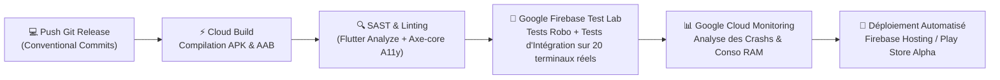

# Module 226 — Tests Automatisés Multi-Appareils (Firebase Test Lab)

> **Positionnement :** Tome 12 — Applications Numériques · Module 226 sur 227
> **Autorité :** Lead Quality Assurance (QA) / Ingénieur d'Automatisation de Tests
> **Liaison amont/aval :** ← Module 225 (Mises à jour) → Module 227 (Matrice des dépendances Tome 12) →

---

## 1. Objet

Ce module régit la stratégie d'assurance qualité, d'intégration continue et de tests automatisés sur terminaux réels pour l'ensemble des applications ELLYSIUM. Conformément à la **DOCTRINE INFRASTRUCTURE GOOGLE**, ce dispositif exploite massivement **Google Firebase Test Lab**, garantissant que chaque release est validée sur un parc matériel physique représentatif des téléphones africains avant toute mise en ligne.

---

## 2. Matrice du Banc d'Essai Matériel (Firebase Test Lab)

Chaque commit validé sur la branche de release déclenche automatiquement une suite de tests d'intégration sur un pool d'appareils physiques hébergés dans les datacenters de test de Google :

| Segment d'Appareils | Modèles Physiques Testés | Paramètres Vérifiés |
|---|---|---|
| **Ultra-Entrée de Gamme (Android Go)** | Itel A56, Tecno Spark Go, Samsung Galaxy A03 Core | RAM $< 1.5$ Go, Android 8.1 / 10 / 11 Go Edition, Pas de GPU dédié |
| **Milieu de Gamme Africain** | Infinix Hot 12, Tecno Camon 19, Redmi 9A | Écrans 720p/1080p, SoC MediaTek Helio, Android 12/13 |
| **Haut de Gamme / Tablettes** | Samsung Galaxy S21, Google Pixel 7, iPad 9e Génération | Biométrie, 60/120 fps, grands écrans, mode paysage |
| **Navigateurs Web (PWA)** | Chrome Mobile, Firefox Android, Safari iOS, Edge Desktop | Service Worker, IndexedDB, responsive fluid |

---

## 3. Pipeline de Tests Automatisés (Google Cloud Build)

---

## 4. Typologie des Suites de Tests Automatisés

### 4.1 Tests Robo Automatisés (Exploration par IA de Google)
Le robot intelligent de Firebase Test Lab explore de manière autonome l'application en simulant des gestes utilisateurs (clics, swipes, rotations d'écran, saisies aléatoires de caractères congolais) pour détecter :
- Les régressions de mise en page (*RenderFlex Overflows*).
- Les fuites de mémoire et crashs inopinés.
- Les lenteurs de démarrage (*Cold Start Time*).

### 4.2 Tests d'Intégration Critique (Flutter Integration Tests)
Scénarios bout-en-bout (*End-to-End*) validant les parcours fonctionnels majeurs :
1. **Scénario 1** : Connexion élève $\to$ Téléchargement d'un cours $\to$ Coupure simulée du réseau $\to$ Réalisation d'un quiz $\to$ Reconnexion $\to$ Synchronisation certifiée.
2. **Scénario 2** : Appel en classe par un enseignant $\to$ Validation de l'absence en moins de 90 secondes $\to$ Vérification du déclenchement Push FCM.
3. **Scénario 3** : Parcours d'encaissement caisse $\to$ Simulation d'un double clic rapide $\to$ Contrôle d'idempotence stricte (zéro doublon en base).

---

## 5. Critères de Blocage de Release (Quality Gates)

Le pipeline de déploiement interrompt immédiatement la publication si l'un des critères suivants n'est pas satisfait :

$$\text{Taux de Réussite des Tests} = 100\% \quad \text{sur l'ensemble des scénarios critiques}$$

- **Taux de crash** : Strictement égal à **0,00 %** sur les 50 premières minutes de test.
- **Temps de démarrage à froid** : $< 2,0$ secondes sur le terminal le plus faible (Itel A56).
- **Consommation RAM maximale** : $< 140$ Mo mesurée par le profiler Android.

---

## 6. Verrous Fonctionnels

| ID | Règle | Niveau |
|---|---|---|
| VF-226-01 | Tests obligatoires sur terminaux physiques réels via Google Firebase Test Lab | CONSTITUTIONNEL |
| VF-226-02 | Tolérance zéro aux crashs sur le terminal étalon d'entrée de gamme (Itel/Tecno) | QUALITÉ |
| VF-226-03 | Validation automatique des 3 scénarios critiques E2E avant toute release | TECHNIQUE |
| VF-226-04 | Tous les rapports de tests sont conservés de manière traçable sur Cloud Logging | AUDIT |
| VF-226-05 | Interdiction absolue de publier en production un build sans rapport de test vert | SÉCURITÉ |

---

*Sous-tome rédigé conformément aux Normes documentaires ELLYSIUM — Fondations 04.*
