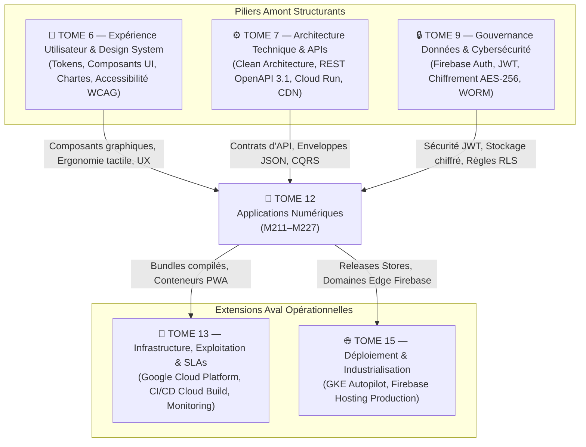

# Module 227 — Matrice des Dépendances — Tome 12 avec Tomes 6, 7, 9

> **Positionnement :** Tome 12 — Applications Numériques · Module 227 sur 227 (CLÔTURE DU TOME 12)
> **Autorité :** Architecte Souverain ELLYSIUM / Comité Technique Intégré
> **Liaison amont/aval :** ← Module 226 (Tests multi-appareils) · Clôture Tome 12 → Tome 13 (Infrastructure et Exploitation) →

---

## 1. Objet

Ce module formalise la matrice d'interconnexion technique et fonctionnelle unissant le **Tome 12 (Applications Numériques : PWA, Android, iOS, Vitrine Firebase)** aux piliers structurels du système : le Design System et l'Expérience Utilisateur (Tome 6), l'Architecture Backend et les APIs (Tome 7), et la Sécurité des Données et la Cryptographie (Tome 9).

---

## 2. Vue d'Ensemble des Liaisons Fondamentales

---

## 3. Matrice Détaillée des Dépendances

### 3.1 Dépendances Amont (Ce que le Tome 12 consomme)

| Composant Consommé | Module Source | Rôle dans le Tome 12 | Spécification d'Interface / Règle |
|---|---|---|---|
| **Tokens de Design (Couleurs, Typo)** | **Tome 6** (Module 97) | Thème global Flutter et Tailwind CSS | Bleu `#0B2545`, Or `#D4AF37`, WOFF2 |
| **Composants UI Réutilisables** | **Tome 6** (Module 98) | Boutons, champs de formulaire, modals | Bibliothèque `ellysium_ui` |
| **Enveloppe JSON Standardisée** | **Tome 7** (Module 115) | Format unique de réponse API pour la PWA/Mobile | `{ "statut": "SUCCES", "donnees": ... }` |
| **Gestion du Mode Hors-Ligne CRDT** | **Tome 7** (Module 120) | Logique de réconciliation et file d'attente Outbox | Modèle Pn-Counter / Horloges Lamport |
| **Authentification Firebase & JWT** | **Tome 9** (Module 159) | Sessions utilisateur, Custom Claims par rôle | Clé Ed25519, validation côté terminal |
| **Chiffrement au Repos (AES-256)** | **Tome 9** (Module 158) | Protection de la base SQLite locale (SQLCipher) | Dérivation de clé Keystore / Keychain |
| **Sécurité OWASP Top 10 Mobile** | **Tome 9** (Module 165) | Obfuscation R8, anti-tampering, Flag Secure | `network_security_config.xml` certifié |

### 3.2 Dépendances Aval (Ce que le Tome 12 fournit)

| Livrable du Tome 12 | Module Récepteur | Rôle dans l'Écosystème ELLYSIUM |
|---|---|---|
| **Bundles PWA & Assets Vitrine** | **Tome 13** (Module 230) | Déploiement sur l'infrastructure Google Firebase Hosting |
| **Métriques de Télémétrie & Crashs** | **Tome 13** (Module 234) | Alimentation des dashboards Google Cloud Monitoring |
| **Artefacts de Release (AAB / APK)** | **Tome 15** (Industrialisation) | Signature de production avec clés certifiées d'État |
| **Preuves de Tests Multi-Appareils** | **Tome 13** (Module 239) | Rapports d'assurance qualité Firebase Test Lab |

---

## 4. Tableau Récapitulatif de Complétude du Tome 12

| Sous-tome | Intitulé officiel | Statut Documentaire |
|---|---|---|
| Module 211 | Périmètre du Tome 12 – stratégie multi-plateformes (PWA, Android, iOS) | ✅ COMPLET |
| Module 212 | Conformité avec la Constitution (accessibilité, mobile-first) | ✅ COMPLET |
| Module 213 | Application web progressive (PWA) – grand public (Firebase Hosting) | ✅ COMPLET |
| Module 214 | Application Android – spécifications, optimisation entrée/moyenne gamme | ✅ COMPLET |
| Module 215 | Application iOS – normes, ergonomie, déploiement App Store | ✅ COMPLET |
| Module 216 | Site internet institutionnel – multiples landing pages (Firebase Hosting) | ✅ COMPLET |
| Module 217 | Mode hors ligne – téléchargement des cours, exercices, feuilles de route | ✅ COMPLET |
| Module 218 | Synchronisation multi-appareils – priorisation, résolution CRDT | ✅ COMPLET |
| Module 219 | Gestion du cache local et téléchargement intelligent (Brotli/AVIF) | ✅ COMPLET |
| Module 220 | Notifications push (Firebase Cloud Messaging - Android/iOS/Web) | ✅ COMPLET |
| Module 221 | Compatibilité avec appareils d'entrée de gamme (RAM < 2 Go, batterie) | ✅ COMPLET |
| Module 222 | Accessibilité mobile – lecteurs d'écran, ergonomie tactile, contrastes | ✅ COMPLET |
| Module 223 | Sécurité applicative mobile – obfuscation R8, stockage Keystore | ✅ COMPLET |
| Module 224 | Capture de documents via appareil photo (CameraX / ML Kit) | ✅ COMPLET |
| Module 225 | Mises à jour et gestion des versions (OTA, stores) | ✅ COMPLET |
| Module 226 | Tests automatisés multi-appareils (Firebase Test Lab) | ✅ COMPLET |
| Module 227 | Dépendances – avec les Tomes 6, 7, 9 | ✅ COMPLET |

---

## 5. Prochaine Étape du Chantier

Le Tome 12 étant **intégralement achevé, validé et scellé**, le chantier ELLYSIUM franchit un cap décisif avec l'ouverture du :

> **→ TOME 13 — INFRASTRUCTURE, EXPLOITATION ET ASSURANCE QUALITÉ TECHNIQUE**
> *Modules 228 à 248 — Google Cloud Platform, GKE Autopilot, Cloud SQL HA, SLA 99,5%, CI/CD Cloud Build, PCA/PRA*

---

*Sous-tome rédigé conformément aux Normes documentaires ELLYSIUM — Fondations 04.*
*Tome 12 — APPLICATIONS NUMÉRIQUES — COMPLET ✅*
*17 modules rédigés : M211 → M227*
