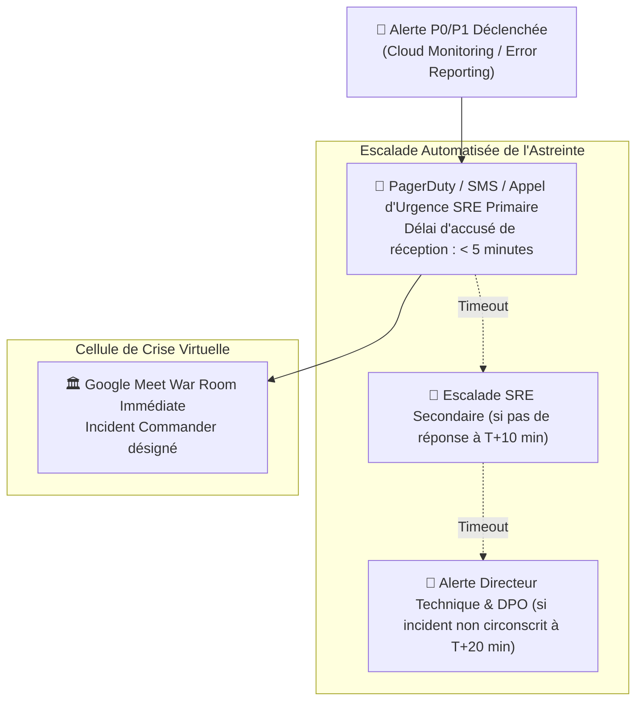

# Module 228 — Périmètre du Tome 13 — Politique d'Exploitation et SLAs (99,5 %)

> **Positionnement :** Tome 13 — Infrastructure, Exploitation & Qualité · Module 228 sur 246
> **Autorité :** Lead Site Reliability Engineer (SRE) / Directeur des Opérations Cloud
> **Liaison amont/aval :** ← Tome 12 (Applications) · Module 229 (Conformité) →

---

## 1. Objet

Ce module fixe les règles fondamentales d'exploitation industrielle, de disponibilité opérationnelle et les engagements de niveau de service (**Service Level Agreements - SLAs**) garantis par l'infrastructure ELLYSIUM. Il formalise le seuil contractuel d'indisponibilité maximale tolérée (disponibilité $\ge 99,5\%$ sur l'année) et instaure la discipline d'ingénierie de fiabilité des sites (**Site Reliability Engineering - SRE**).

---

## 2. Définition Mathématique du SLA (99,5 %) et Budget d'Erreur

Le contrat de service souverain garantit une disponibilité globale minimale de **99,5 %** mesurée sur une base calendaire annuelle :

$$\text{Disponibilité} = \left( \frac{\text{Temps Total} - \text{Temps d'Indisponibilité Non Planifiée}}{\text{Temps Total}} \right) \times 100 \ge 99,5\%$$

### Budget d'Erreur (*Error Budget*) Annuel Toléré :
- **Par An** : 43 heures et 49 minutes d'indisponibilité cumulée maximale autorisée.
- **Par Mois** : 3 heures et 39 minutes maximales.
- **Par Semaine** : 50 minutes et 24 secondes.

> **Règle d'Or SRE** : Si le budget d'erreur mensuel est consommé à plus de 75 %, tous les déploiements de nouvelles fonctionnalités sont automatiquement gelés. L'équipe d'ingénierie se consacre à 100% aux correctifs de résilience et de stabilité.

---

## 3. Matrice des SLAs / SLOs par Service Critique

| Service Applicatif ELLYSIUM | Service Google Cloud Sous-Jacent | SLA Garanti GCP | SLO Interne ELLYSIUM |
|---|---|---|---|
| **Portail de Vérification des Diplômes** | Firebase Hosting + Cloud CDN + Cloud Run | $99,99\%$ | **$99,95\%$** |
| **API de Caisse & Paiements Mobile Money** | Google Cloud Run + Cloud SQL HA | $99,95\%$ | **$99,95\%$** |
| **Moteur d'Évaluation & Examens (Exam-Svc)** | GKE Autopilot Multi-Zones | $99,95\%$ | **$99,90\%$** |
| **Consultation des Cours en Ligne** | Cloud Storage + Cloud CDN | $99,90\%$ | **$99,50\%$** |
| **Tuteur IA & Analyse Pédagogique** | Vertex AI Inférence | $99,90\%$ | **$99,00\%$** (Dégradation gracieuse) |

---

## 4. Organisation de l'Astreinte SRE (On-Call 24/7/365)

---

## 5. Principes d'Exploitation sans Interruption de Service

1. **Zéro Fenêtre de Maintenance Visible** : Aucun redémarrage de serveur ne doit afficher une page d'indisponibilité *"Site en maintenance"*. Tous les déploiements s'effectuent par permutation progressive (*Rolling Update* ou *Blue-Green*).
2. **Dégradation Gracieuse (*Graceful Degradation*)** : Si un composant non critique tombe en panne (ex: l'inférence Vertex AI ou le moteur de recommandations), la plateforme continue d'offrir l'accès complet aux cours, aux cotes et aux bulletins sans afficher d'erreur générale.
3. **Surveillance Synthétique Active** : Des sondes robotisées exécutent toutes les 60 secondes le parcours utilisateur critique (connexion, affichage du bulletin) depuis Johannesburg, Kinshasa et Paris pour mesurer la disponibilité perçue réelle.

---

## 6. Verrous Fonctionnels

| ID | Règle | Niveau |
|---|---|---|
| VF-228-01 | Respect impératif du SLA global annuel minimal de 99,5% | CONSTITUTIONNEL |
| VF-228-02 | Gel automatique des déploiements si le budget d'erreur mensuel dépasse 75% | SRE / QUALITÉ |
| VF-228-03 | Astreinte technique opérationnelle 24h/24 avec temps de réponse < 5 minutes pour P0 | SÉCURITÉ |
| VF-228-04 | Interdiction formelle de planifier des interruptions de service en journée ouvrable | DISPONIBILITÉ |
| VF-228-05 | Publication mensuelle transparente de l'état de santé du service sur `status.ellysium.cd` | TRANSPARENCE |

---

*Sous-tome rédigé conformément aux Normes documentaires ELLYSIUM — Fondations 04.*
