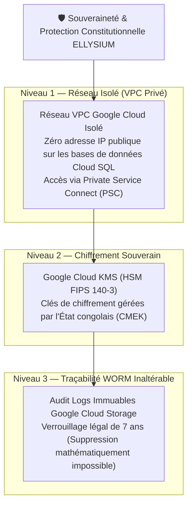

# Module 229 — Conformité avec la Constitution (Continuité de Service, Protection)

> **Positionnement :** Tome 13 — Infrastructure, Exploitation & Qualité · Module 229 sur 246
> **Autorité :** Conseil Constitutionnel ELLYSIUM / Direction des Affaires Juridiques
> **Liaison amont/aval :** ← Module 228 (Périmètre & SLAs) → Module 230 (Stratégie d'hébergement) →

---

## 1. Objet

Ce module traduit les principes fondamentaux de continuité de l'État, de souveraineté numérique et de protection des usagers inscrits dans la Constitution ELLYSIUM en exigences d'infrastructure non négociables. Il érige la disponibilité de l'enseignement en service public vital au même titre que l'eau ou l'électricité.

---

## 2. Traduction des Articles Constitutionnels dans l'Infrastructure

### 2.1 Article 1 — Souveraineté Territoriale et Géographique des Données
- **Ancrage Africain Impératif** : L'ensemble des instances de production opérationnelles (**Cloud SQL**, clusters **GKE Autopilot**, compartiments **Cloud Storage**) sont localisées dans la région Google Cloud **`africa-south1`** (Johannesburg, Afrique du Sud).
- **Interdiction de Transfert Hors Périmètre Conventionné** : Aucune base de données contenant l'identité ou les résultats académiques des élèves congolais ne peut être répliquée vers des zones géographiques non régies par des accords bilatéraux de protection des données conformes à la loi RDC n° 15/023.

### 2.2 Article 8 — Traçabilité Intégrale des Interventions d'Infrastructure
- **Principe du Moindre Privilège (PoLP) et Zero Trust** :
  - Aucun ingénieur système ne possède d'accès SSH permanent en production.
  - Toute élévation temporaire de privilèges administrateur (*Break-Glass Access*) génère une session enregistrée et visée par le RSSI dans Google Cloud Logging.
  - Les clés de déchiffrement matérielles sous Google Cloud KMS ne peuvent jamais être exportées ou extraites des modules HSM.

### 2.3 Article 14 — Continuité Absolue du Service Public Pédagogique
- **Immunité Contre les Catastrophes Physiques** :
  - Tolérance aux pannes de niveau datacenter grâce à la répartition active-active sur **3 zones de disponibilité indépendantes** au sein de la région `africa-south1` (zones A, B, C).
  - Bascule transparente automatique (*Automated Failover*) en moins de 60 secondes en cas d'effondrement d'un bâtiment ou d'une liaison sous-marine.

---

## 3. Matrice de Souveraineté et de Protection des Données

---

## 4. Garde-Fous Contre les Blocages Administratifs ou Arbitraires

Pour prévenir tout risque de chantage ou de coupure abusive :
1. **Contrat Pluriannuel Garanti** : Les accords de souscription à Google Cloud Platform sont adossés à des engagements pluriannuels protégés par convention d'État, immunisant le système contre toute suspension unilatérale pour litige commercial mineur.
2. **Sauvegarde Indépendante Chiffrée (Miroir Froid)** : Une copie complète de sauvegarde déconnectée, chiffrée selon le standard AES-256 avec une clé détenue physiquement par le Conservateur des Archives Nationales, est générée mensuellement.

---

## 5. Verrous Fonctionnels

| ID | Règle | Niveau |
|---|---|---|
| VF-229-01 | Hébergement primaire impératif en région Google Cloud `africa-south1` | CONSTITUTIONNEL |
| VF-229-02 | Clés de chiffrement Cloud KMS gérées exclusivement sous HSM (CMEK) | SOUVERAINETÉ |
| VF-229-03 | Accès direct SSH aux conteneurs de production strictement proscrit | SÉCURITÉ |
| VF-229-04 | Bascule automatique multi-zones garantie en moins de 60 secondes | RÉSILIENCE |
| VF-229-05 | Journal d'audit d'infrastructure WORM inaltérable conservé pendant 7 ans | LÉGAL |
| VF-229-06 | Tout déploiement nécessite un plan de secours documenté testé au moins une fois par mois | FIABILITÉ |

---

*Sous-tome rédigé conformément aux Normes documentaires ELLYSIUM — Fondations 04.*
