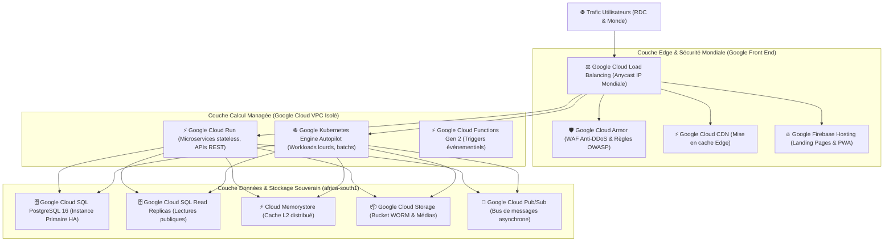

# Module 230 — Stratégie d'Hébergement — 100% Google Cloud et Dimensionnement

> **Positionnement :** Tome 13 — Infrastructure, Exploitation & Qualité · Module 230 sur 246
> **Autorité :** Lead Cloud Solutions Architect / Direction Technique ELLYSIUM
> **Liaison amont/aval :** ← Module 229 (Conformité) → Module 231 (Conteneurisation) →

---

## 1. Objet et Directive Solennelle

Ce module détaille la stratégie d'hébergement, la topologie des réseaux et le dimensionnement capacitaire d'ELLYSIUM.

Conformément à la **DOCTRINE D'INFRASTRUCTURE IMMUABLE DU 17 SEPTEMBRE 2026**, ELLYSIUM est hébergé **EXCLUSIVEMENT sur Google Cloud Platform (GCP)**. Toute proposition d'hébergement concurrent (AWS, Azure, OVH, serveurs bare-metal auto-hébergés) est formellement bannie et réputée nulle.

---

## 2. Topologie Globale de l'Infrastructure Google Cloud



---

## 3. Dimensionnement Capacitaire et Profils de Charge

L'infrastructure est calibrée pour répondre à trois régimes de trafic distincts :

| Régime de Charge | Contexte Académique | Trafic Simultané Cible | Dimensionnement GCP Automatique |
|---|---|---|---|
| **Régime Ordinaire** | Semaines de cours habituelles, apprentissage quotidien | 15 000 à 45 000 requêtes/sec | Cloud Run (20 à 80 instances), Cloud SQL 8 vCPU / 32 Go RAM |
| **Période de Pointes** | Fin de trimestre, soumission des devoirs, appels de 08h | 80 000 à 150 000 requêtes/sec | Autoscaling Cloud Run jusqu'à 300 instances, Read Replicas $\times 3$ |
| **Haute Tempête Nationale** | Proclamation des résultats EXETAT / Bulletins fin d'année | **65 000 requêtes/sec en écriture, 500 000 en lecture** | Cache Edge Cloud CDN (98% offload), GKE Autopilot débridé, Cloud Spanner si nécessaire |

---

## 4. Politique FinOps et Frugalité Énergétique (Scale-to-Zero)

Pour préserver les ressources financières de l'institution :
- **Scale-to-Zero Nocturne** : Sur les microservices administratifs non sollicités entre **23h00 et 05h00 du matin**, le nombre d'instances Cloud Run tombe automatiquement à **zéro** (`min-instances = 0`), ramenant la facture de calcul à zéro dollar durant cette plage.
- **Réservation d'Instances et Engagements d'Usage (CUD)** : Réduction de 45% sur le coût des instances de base de données Cloud SQL grâce aux contrats d'engagement pluriannuels Google Cloud.
- **Cycle de Vie du Stockage GCS** : Bascule automatique des devoirs et archives de cours de plus de 90 jours vers la classe de stockage **Coldline** puis **Archive**, réduisant le coût au gigaoctet de plus de 80 %.

---

## 5. Configuration Réseau VPC Privé et Sécurité Périmétrique

```hcl
# Extrait Terraform du VPC Google Cloud
resource "google_compute_network" "ellysium_vpc" {
  name                    = "cnel-elysium-vpc-prod"
  auto_create_subnetworks = false
  routing_mode            = "REGIONAL"
}

resource "google_compute_subnetwork" "subnet_africa" {
  name                     = "subnet-africa-south1"
  ip_cidr_range            = "10.10.0.0/20"
  region                   = "africa-south1"
  network                  = google_compute_network.ellysium_vpc.id
  private_ip_google_access = true # Permet l'accès privé aux APIs Google sans passer par Internet
}
```

---

## 6. Verrous Fonctionnels

| ID | Règle | Niveau |
|---|---|---|
| VF-230-01 | Hébergement 100% Google Cloud Platform (proscription absolue d'autres clouds) | CONSTITUTIONNEL |
| VF-230-02 | Déploiement obligatoire des bases de données en sous-réseau privé sans IP publique | SÉCURITÉ |
| VF-230-03 | Autoscaling dynamique paramétré pour absorber 150 000 requêtes/seconde sans latence | CAPACITAIRE |
| VF-230-04 | Optimisation FinOps Scale-to-Zero active sur tous les services non critiques | FRUGALITÉ |
| VF-230-05 | Protection anti-DDoS Google Cloud Armor activée en permanence sur le Load Balancer | CONSTITUTIONNEL |

---

*Sous-tome rédigé conformément aux Normes documentaires ELLYSIUM — Fondations 04.*
