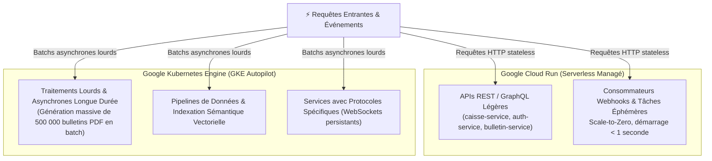

# Module 231 — Conteneurisation et Orchestration (GKE Autopilot & Cloud Run)

> **Positionnement :** Tome 13 — Infrastructure, Exploitation & Qualité · Module 231 sur 246
> **Autorité :** Lead DevOps & Platform Engineer / Direction Technique ELLYSIUM
> **Liaison amont/aval :** ← Module 230 (Hébergement Google) → Module 232 (Environnements) →

---

## 1. Objet

Ce module définit les standards de conteneurisation des microservices ELLYSIUM, la politique de construction d'images légères et sécurisées, ainsi que les règles d'orchestration sur **Google Cloud Run** et **Google Kubernetes Engine (GKE) Autopilot**. Il élimine la complexité de gestion manuelle des nœuds tout en garantissant un partitionnement strict des charges de travail.

---

## 2. Répartition des Rôles : Cloud Run vs GKE Autopilot

ELLYSIUM n'utilise aucun cluster Kubernetes non managé ou auto-hébergé (MicroK8s, K3s, k0s) : l'orchestration est assurée exclusivement par GKE Autopilot. La charge de calcul est arbitré selon une dichotomie claire :



---

## 3. Standards de Construction des Images Conteneurs (Docker)

Pour garantir une surface d'attaque minimale et un démarrage instantané :
1. **Images de Base Minimales (Distroless Google)** :
   - Proscription formelle d'Ubuntu, Debian ou Alpine en production.
   - Utilisation exclusive des images **`gcr.io/distroless/static-debian12`** pour les binaires compilés en Go, et **`gcr.io/distroless/nodejs20-debian12`** pour les services Node.
   - Poids final d'une image conteneur : **$< 25$ Mo**.
2. **Multi-Stage Build Strict** : Séparation totale de l'environnement de compilation (SDK complet) et de l'environnement d'exécution (binaire pur).
3. **Utilisateur Non-Root Obligatoire** : Aucun conteneur ne tourne avec l'UID 0 (`USER nonroot:nonroot`).

### Exemple de Dockerfile Référence (Go Microservice) :
```dockerfile
# Étape 1 : Compilation
FROM golang:1.23-bookworm AS builder
WORKDIR /app
COPY go.mod go.sum ./
RUN go mod download
COPY . .
RUN CGO_ENABLED=0 GOOS=linux GOARCH=amd64 go build -ldflags="-w -s" -o /app/server ./cmd/server

# Étape 2 : Image d'exécution Distroless ultra-légère (22 Mo)
FROM gcr.io/distroless/static-debian12:nonroot
WORKDIR /
COPY --from=builder /app/server /server
EXPOSE 8080
USER nonroot:nonroot
ENTRYPOINT ["/server"]
```

---

## 4. Gestion et Sécurisation des Registres (Artifact Registry)

Les images de conteneurs sont stockées exclusivement dans **Google Artifact Registry** en région `africa-south1` :
- **Analyse Automatique des Vulnérabilités (Container Analysis)** : Tout conteneur poussé est scanné en continu contre la base CVE.
- **Autorisation Binaire (Binary Authorization)** : Seules les images signées cryptographiquement par la clé de signature du pipeline CI/CD peuvent être instanciées sur GKE Autopilot ou Cloud Run. Tout conteneur non certifié est immédiatement bloqué au niveau du noyau de l'orchestrateur.

---

## 5. Configuration GKE Autopilot Souveraine

Le mode **Autopilot** de GKE décharge l'équipe d'exploitation de la gestion des VMs, des mises à jour de nœuds et du patching du système d'exploitation de base :
- **Dimensionnement automatique des Pods (Vertical Pod Autoscaler)**.
- **Réseau GKE VPC-Native** : Chaque pod dispose d'une adresse IP privée directement routable dans le VPC ELLYSIUM.
- **Workload Identity Federation** : Les pods communiquent avec les services Google (Cloud SQL, Cloud Storage) sans manipuler de clés de service JSON statiques risquant la fuite.

---

## 6. Verrous Fonctionnels

| ID | Règle | Niveau |
|---|---|---|
| VF-231-01 | Images conteneurs bâties exclusivement sur socle Distroless Google (< 30 Mo) | SÉCURITÉ |
| VF-231-02 | Exécution non-root (`USER nonroot`) obligatoire sur 100% des conteneurs | SÉCURITÉ |
| VF-231-03 | Binary Authorization activée : refus de démarrage de toute image non signée | CONSTITUTIONNEL |
| VF-231-04 | Stockage des images exclusivement dans Google Artifact Registry (africa-south1) | SOUVERAINETÉ |
| VF-231-05 | Workload Identity obligatoire : zéro clé de service JSON codée en dur | SÉCURITÉ |

---

*Sous-tome rédigé conformément aux Normes documentaires ELLYSIUM — Fondations 04.*
