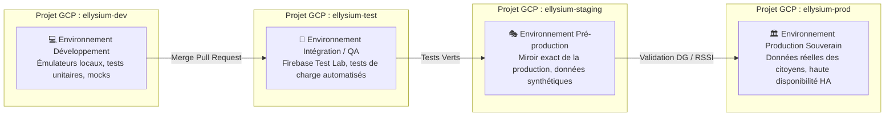

# Module 232 — Gestion des Environnements (Dev, Test, Staging, Production GCP Isolés)

> **Positionnement :** Tome 13 — Infrastructure, Exploitation & Qualité · Module 232 sur 246
> **Autorité :** Lead Platform Engineer / Responsable Sécurité des Systèmes d'Information (RSSI)
> **Liaison amont/aval :** ← Module 231 (Conteneurisation) → Module 233 (Déploiement CI/CD) →

---

## 1. Objet

Ce module définit l'isolation stricte, le provisionnement automatisé par Infrastructure-as-Code (Terraform), la politique d'étanchéité des données et le cycle de promotion logicielle à travers les quatre environnements officiels d'ELLYSIUM. Chaque environnement est encapsulé dans un **projet Google Cloud Platform dédié**, doté de ses propres clés IAM et quotas.

---

## 2. Matrice des 4 Projets Google Cloud Isolés



---

## 3. Caractéristiques et Politiques d'Accès par Environnement

| Environnement | Projet Google Cloud ID | Données Utilisées | Accès Développeurs | Politique IAM |
|---|---|---|---|---|
| **Développement** | `cnel-elysium-dev` | Données factices / Mocks générés | Lecture / Écriture libre | Rôles de développement standard |
| **Test & QA** | `cnel-elysium-test` | Datasets de test anonymisés | Lecture / Déploiement CI/CD | Service Account Cloud Build exclusif |
| **Pré-production (Staging)** | `cnel-elysium-staging` | Données synthétiques haute fidélité | Lecture seule des logs | Double approbation pour déploiement |
| **Production** | `cnel-elysium-prod` | **Données réelles des citoyens (RDC)** | **Accès direct INTERDIT** | Zéro accès humain permanent (NoOps) |

---

## 4. Politique d'Étanchéité des Données Réelles

```
RÈGLE DE SÉCURITÉ ABSOLUE (Article 1 & 8 de la Constitution) :
1. Aucune donnée réelle issue de la production ne doit JAMAIS être copiée,
   exportée ou restaurée dans les environnements de Dev, Test ou Staging.
2. Tout jeu de données de test en staging est généré par un générateur de
   données synthétiques respectant la distribution démographique et les
   patronymes congolais sans contenir d'IUNE réel.
3. Les buckets GCS de production disposent d'une Google Cloud Organization
   Policy interdisant formellement l'export vers des buckets hors du projet prod.
```

---

## 5. Provisionnement par Infrastructure-as-Code (Terraform)

L'intégralité des 4 projets Google Cloud est déclarée et synchronisée via des modules **Terraform** versionnés sous Git. Aucun clic manuel dans la console GCP n'est autorisé pour créer ou altérer une ressource :

```hcl
# Structure des répertoires Terraform ELLYSIUM
terraform/
├── modules/
│   ├── cloud_run/
│   ├── cloud_sql/
│   ├── vpc_network/
│   └── security_kms/
└── environments/
    ├── dev/
    │   └── main.tf        # Déploie sur cnel-elysium-dev
    ├── test/
    │   └── main.tf        # Déploie sur cnel-elysium-test
    ├── staging/
    │   └── main.tf        # Déploie sur cnel-elysium-staging
    └── prod/
        └── main.tf        # Déploie sur cnel-elysium-prod avec verrous stricts
```

---

## 6. Procédure d'Accès d'Urgence en Production (*Break-Glass Access*)

Dans l'éventualité exceptionnelle d'un incident P0 bloquant nécessitant une inspection manuelle :
1. Déclenchement de la demande d'accès d'urgence motivée dans le portail interne.
2. Approbation conjointe obligatoire et synchrone du **RSSI** et du **DPO Souverain** (double facteur MFA).
3. Élévation temporaire des droits IAM pour une durée maximale de **120 minutes**.
4. Enregistrement vidéo et journalisation intégrale de toutes les commandes tapées dans Google Cloud Logging (Mode WORM).

---

## 7. Verrous Fonctionnels

| ID | Règle | Niveau |
|---|---|---|
| VF-232-01 | Chaque environnement est encapsulé dans un projet Google Cloud distinct et étanche | CONSTITUTIONNEL |
| VF-232-02 | Interdiction formelle de charger des données réelles de production en staging/dev | LÉGAL |
| VF-232-03 | Zéro accès humain permanent en production (déploiements 100% automatisés par CI/CD) | SÉCURITÉ |
| VF-232-04 | Gestion d'infrastructure exclusivement par code Terraform audité et versionné | TECHNIQUE |
| VF-232-05 | L'accès d'urgence Break-Glass nécessite obligatoirement l'accord conjoint RSSI + DPO | CONSTITUTIONNEL |
| VF-232-06 | Tout déploiement nécessite un plan de secours documenté testé au moins une fois par mois | FIABILITÉ |

---

*Sous-tome rédigé conformément aux Normes documentaires ELLYSIUM — Fondations 04.*
