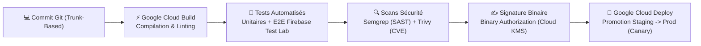
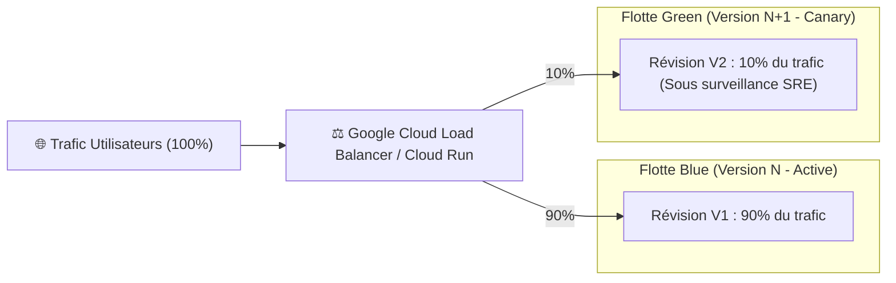

# Module 233 — Stratégie de Déploiement — CI/CD, Blue-Green, Rollback (Google Cloud Build & Deploy)

> **Positionnement :** Tome 13 — Infrastructure, Exploitation & Qualité · Module 233 sur 246
> **Autorité :** Lead Release Engineer / Lead SRE ELLYSIUM
> **Liaison amont/aval :** ← Module 232 (Environnements) → Module 234 (Surveillance & Monitoring) →

---

## 1. Objet

Ce module régit les pipelines d'intégration et de livraison continues (CI/CD), la stratégie de déploiement progressif (*Canary Deployment*) et sans interruption (*Blue-Green*), ainsi que les mécanismes de retour arrière automatisé instantané (**Rollback en un clic**) au sein de la plateforme ELLYSIUM. Ce cycle est opéré exclusivement par **Google Cloud Build** et **Google Cloud Deploy**.

---

## 2. Pipeline Automatisé CI/CD (Google Cloud Build)



---

## 3. Stratégie de Déploiement Progressif (Canary & Blue-Green)

Pour éliminer le risque d'incident lors de la mise à jour d'un service critique (ex: `evaluation-service` ou `caisse-service`) :

1. **Déploiement Canary par Fractionnement de Trafic (*Traffic Splitting*) sur Cloud Run** :
   - Déploiement de la nouvelle révision logicielle ($V_2$).
   - Aiguillage de **1 %** du trafic réel vers $V_2$ pendant 15 minutes.
   - Surveillance continue du taux d'erreur HTTP 5xx et de la latence par Google Cloud Monitoring.
   - Si les métriques restent saines : passage à **10 %**, puis **50 %**, puis bascule à **100 %**.
2. **Architecture Blue-Green sur GKE Autopilot** :
   - L'ancienne flotte (*Blue*) reste active et prête à reprendre immédiatement la totalité de la charge si la nouvelle flotte (*Green*) montre le moindre signe d'instabilité.



---

## 4. Rollback Automatisé Instantané (< 30 Secondes)

Si le système détecte une anomalie critique durant la phase de Canary :

$$\text{Taux d'Erreurs 5xx} > 0,5\% \quad \text{OU} \quad \text{Latence P95} > 800\text{ ms}$$

- **Annulation Automatique par Cloud Deploy** : Le routeur Google Cloud Run réaiguille immédiatement **100 % du trafic** vers la révision saine précédente $V_1$ sans intervention humaine requise.
- **Délai d'exécution** : Le basculement s'effectue en **moins de 5 secondes**, protégeant les apprenants d'une interruption de service.
- **Alerte d'Incident Post-Rollback** : Envoi instantané d'un rapport de diagnostic sur le canal d'astreinte SRE.

---

## 5. Fichier Déclaratif Cloud Deploy (`clouddeploy.yaml`)

```yaml
apiVersion: deploy.cloud.google.com/v1
kind: DeliveryPipeline
metadata:
  name: ellysium-core-pipeline
description: Pipeline de promotion industrielle souveraine ELLYSIUM
serialPipeline:
  stages:
  - targetId: staging-africa
    profiles: [staging]
  - targetId: prod-africa-south1
    profiles: [production]
    strategy:
      canary:
        runtimeConfig:
          cloudRun:
            automaticTrafficControl: true
        canaryDeployment:
          percentages: [10, 50]
          verify: true
```

---

## 6. Verrous Fonctionnels

| ID | Règle | Niveau |
|---|---|---|
| VF-233-01 | Déploiements opérés exclusivement par Google Cloud Build et Cloud Deploy | CONSTITUTIONNEL |
| VF-233-02 | Déploiement Canary obligatoire sur tout service traitant les cotes ou les finances | OBLIGATOIRE |
| VF-233-03 | Rollback automatique déclenché dès que le taux d'erreur 5xx dépasse 0,5% | SRE / SLO |
| VF-233-04 | Interdiction de déployer le vendredi après-midi ou la veille d'un examen d'État | DISCIPLINE |
| VF-233-05 | Traçabilité intégrale de chaque déploiement (auteur, commit SHA, build log WORM) | AUDIT |

---

*Sous-tome rédigé conformément aux Normes documentaires ELLYSIUM — Fondations 04.*
