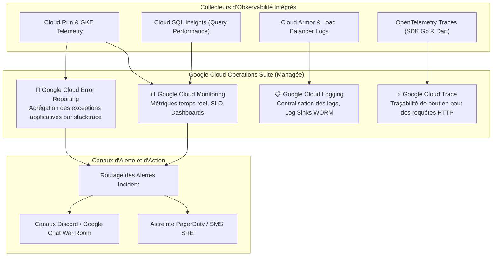

# Module 234 — Surveillance (Monitoring) — Métriques, Logs, Alertes et Traçabilité Distribuée

> **Positionnement :** Tome 13 — Infrastructure, Exploitation & Qualité · Module 234 sur 246
> **Autorité :** Lead Observability Engineer / Direction des Opérations SRE
> **Liaison amont/aval :** ← Module 233 (Déploiement) → Module 235 (Gestion des incidents) →

---

## 1. Objet

Ce module formalise l'observabilité intégrale de la plateforme ELLYSIUM. Il définit les 4 piliers d'ingénierie de télémétrie : collecte des **métriques de performance**, centralisation des **journaux d'événements (logs)**, **traçabilité distribuée des requêtes (Tracing)** et routage proactif des **alertes opérationnelles**. L'ensemble de la pile s'appuie sur la suite native **Google Cloud Operations (anciennement Stackdriver)**.

---

## 2. Architecture de la Suite d'Observabilité Google Cloud

---

## 3. Les 4 Signaux Dorés SRE (*The 4 Golden Signals*)

Conformément à la méthodologie SRE de Google, la santé de chaque microservice est évaluée selon 4 métriques cardinales :

1. **Latence** : Temps nécessaire pour traiter une requête.
   - *Seuil d'alerte P95* : $> 600\text{ ms}$ sur les APIs de cours, $> 1,2\text{ s}$ sur les délibérations lourdes.
2. **Trafic** : Demande globale imposée au système.
   - *Mesure* : Nombre de requêtes par seconde (RPS) et volume de bande passante réseau.
3. **Erreurs** : Taux de requêtes qui échouent.
   - *Seuil d'alerte critique* : Taux d'erreurs HTTP 5xx $> 0,5\%$ pendant plus de 2 minutes consécutives.
4. **Saturation** : Mesure de l'utilisation des ressources les plus contraintes.
   - *Seuil d'alerte* : Utilisation CPU Cloud Run $> 80\%$, pool de connexions Cloud SQL $> 85\%$.

---

## 4. Traçabilité Distribuée (Google Cloud Trace & OpenTelemetry)

Pour identifier instantanément le goulot d'étranglement lors d'un appel API complexe (ex: Enregistrement d'une note avec vérification RBAC, appel IA et mise à jour de caisse) :
- Chaque requête entrante sur le Load Balancer se voit attribuer un en-tête canonique **`X-Cloud-Trace-Context`**.
- Cet identifiant de trace est propagé à travers tous les microservices Cloud Run, requêtes SQL et appels Pub/Sub.
- Le diagnostic d'une requête lente se fait en un clic visualisant la cascade temporelle (*Waterfall Chart*).

---

## 5. Matrice des Alertes et Seuils Critiques

| Nom de l'Alerte | Métrique Surveillée | Condition de Déclenchement | Niveau | Action Immédiate |
|---|---|---|---|---|
| **P0-DATABASE-UNAVAILABLE** | `cloudsql.googleapis.com/database/up` | Valeur $= 0$ pendant $> 30\text{ s}$ | P0 (Urgence Vitale) | Appel vocal astreinte SRE + Failover réplica |
| **P0-AUTH-FAILURE-SPIKE** | `firebase.googleapis.com/auth/login_errors` | Augmentation de 300% en 1 min | P0 (Attaque / Panne) | Alerte RSSI + activation WAF Cloud Armor |
| **P1-LATENCY-EXCEEDED** | `run.googleapis.com/request_latencies` | P95 $> 1,5\text{ s}$ pendant 5 min | P1 (Dégradation) | Notification astreinte + Autoscaling forcé |
| **P2-STORAGE-QUOTA-HIGH** | `storage.googleapis.com/storage/total_bytes` | Consommation $> 85\%$ du budget | P2 (Capacité) | Ticket Jira automatique pour extension |

---

## 6. Verrous Fonctionnels

| ID | Règle | Niveau |
|---|---|---|
| VF-234-01 | Surveillance assurée exclusivement par Google Cloud Operations Suite | CONSTITUTIONNEL |
| VF-234-02 | Alerte automatique déclenchée en moins de 60 secondes pour toute panne P0 | SLO / SRE |
| VF-234-03 | Traçabilité distribuée activée sur 100% des appels d'API de production | TECHNIQUE |
| VF-234-04 | Tous les dashboards de supervision accessibles sans latence aux équipes SRE | OPÉRATIONNEL |
| VF-234-05 | Zéro mot de passe ou donnée confidentielle en clair dans les logs d'application | SÉCURITÉ |

---

*Sous-tome rédigé conformément aux Normes documentaires ELLYSIUM — Fondations 04.*
