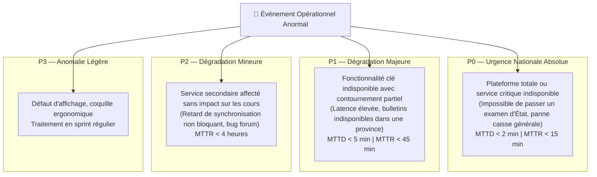

# Module 235 — Gestion des Incidents Techniques — Détection, Escalade et Post-Mortem

> **Positionnement :** Tome 13 — Infrastructure, Exploitation & Qualité · Module 235 sur 246
> **Autorité :** Incident Commander SRE / Direction des Opérations Techniques
> **Liaison amont/aval :** ← Module 234 (Surveillance) → Module 236 (Plan de continuité PCA/PRA) →

---

## 1. Objet

Ce module régit le protocole de réponse aux incidents techniques, les critères de classification de gravité (de P0 à P3), l'organisation hiérarchique de l'astreinte (*Incident Command System*), la communication de crise transparente envers la communauté scolaire et la rédaction systématique de revues post-incidents sans blâme (**Blameless Post-Mortem**).

---

## 2. Classification des Niveaux de Gravité



---

## 3. Rôles dans la Cellule de Gestion de Crise (War Room)

Dès qu'un incident de niveau **P0 ou P1** est déclaré, une cellule de crise virtuelle s'ouvre instantanément sur **Google Meet** sous l'autorité d'une chaîne de commandement claire :

| Rôle | Titulaire | Responsabilité Exécutive |
|---|---|---|
| **Incident Commander (IC)** | Lead SRE de garde | Dirige les opérations, arbitre les actions de remédiation, cadence la crise |
| **Operations Lead (Ops)** | Ingénieur Cloud / DBA | Exécute les diagnostics techniques, restaure les services, applique les rollbacks |
| **Communications Lead (Comms)** | Responsable Relations Publiques | Rédige les messages de statut officiels sur `status.ellysium.cd` et alerte la direction |
| **Scribe / Documenteur** | Ingénieur Assurance Qualité | Note la chronologie exacte de tous les faits et commandes passées pour le post-mortem |

---

## 4. Communication de Crise et Page de Statut Publique

En vertu du principe constitutionnel de transparence (Article 8) :
- La page publique **`status.ellysium.cd`** (hébergée indépendamment sur Firebase Hosting avec son propre projet GCP pour rester accessible même en cas de panne de l'application principale) est actualisée en moins de **10 minutes** après la détection d'un incident P0/P1.
- Les messages communiqués sont précis, factuels et dénués de jargon obscur (ex: *"Un ralentissement est actuellement constaté lors de la consultation des cotes à Kinshasa. Nos équipes sont mobilisées. Vos données sont intègres."*).

---

## 5. Méthodologie du Post-Mortem Sans Blâme (*Blameless Post-Mortem*)

Chaque incident P0 ou P1 donne lieu, dans les **72 heures ouvrables**, à la publication d'un rapport post-mortem collégial :

```markdown
# Modèle de Rapport Post-Mortem ELLYSIUM

## 1. Résumé Exécutif
- Date et Heure de Début : 2026-09-17 14:12 UTC+1
- Date et Heure de Résolution : 2026-09-17 14:26 UTC+1
- Durée Totale de l'Interruption : 14 minutes
- Impact Utilisateurs : ~12 000 élèves n'ont pas pu valider un quiz en ligne

## 2. Chronologie Détaillée des Faits (Timeline)
- 14:12 : Alerte P0 déclenchée par Cloud Monitoring (Hausse latence Cloud SQL)
- 14:14 : Prise en charge par l'Incident Commander
- 14:18 : Identification de la cause (requête SQL non indexée sur les cotes)
- 14:22 : Déploiement d'un index d'urgence et redémarrage du pool de connexions
- 14:26 : Retour à la normale confirmé sur l'ensemble des métriques

## 3. Analyse de la Cause Racine (Méthode des 5 Pourquoi)
- Pourquoi le service a ralenti ? Pool de connexions Cloud SQL saturé.
- Pourquoi le pool a saturé ? Requête d'agrégation trop lente exécutée 500 fois/sec.
- Pourquoi la requête était lente ? Index manquant sur la colonne `date_scellement`.
- Pourquoi l'index manquait ? Omission lors de la migration du Module 180.
- Pourquoi les tests de charge n'ont pas vu l'omission ? Jeu de données de test sous-dimensionné.

## 4. Plan d'Action et Mesures Correctives (Action Items)
- [P0] Ajouter l'index manquant sur tous les environnements (Assigné à : DBA - Terminé)
- [P1] Enrichir le jeu de tests de charge Staging à 1 million de lignes (Assigné à : QA - J+7)
- [P2] Mettre en place une alerte préventive sur la saturation du pool de connexions (Assigné à : SRE - J+3)
```

---

## 6. Verrous Fonctionnels

| ID | Règle | Niveau |
|---|---|---|
| VF-235-01 | Déclenchement automatique de la cellule de crise sous 5 minutes pour tout incident P0 | SRE / SLO |
| VF-235-02 | Actualisation de la page de statut public sous 10 minutes maximum | TRANSPARENCE |
| VF-235-03 | Rédaction obligatoire d'un post-mortem sans blâme dans les 72h après résolution | QUALITÉ |
| VF-235-04 | Hébergement indépendant de la page de statut sur un tenant Firebase isolé | RÉSILIENCE |
| VF-235-05 | Suivi et clôture formelle de 100% des plans d'action issus des post-mortems | DISCIPLINE |

---

*Sous-tome rédigé conformément aux Normes documentaires ELLYSIUM — Fondations 04.*
