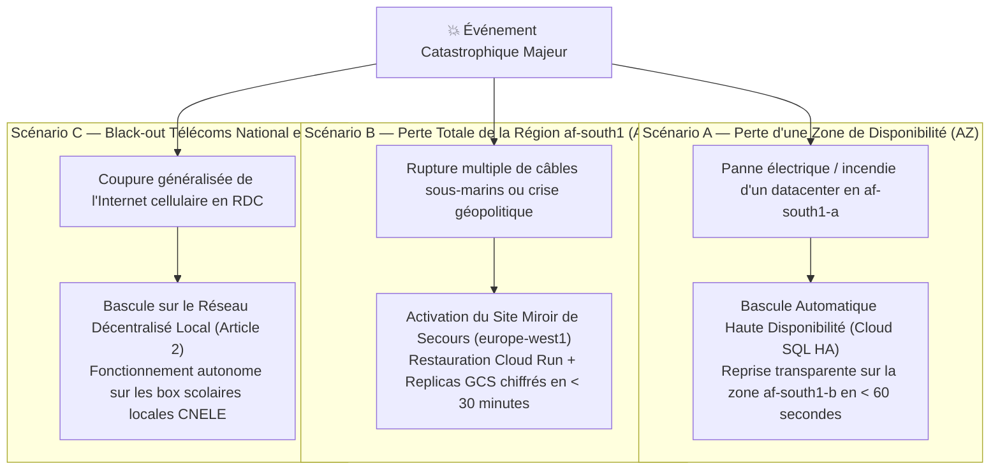

# Module 236 — Plan de Continuité d'Activité (PCA) et Reprise après Sinistre (PRA / DRP)

> **Positionnement :** Tome 13 — Infrastructure, Exploitation & Qualité · Module 236 sur 246
> **Autorité :** Directeur de la Continuité Pédagogique / RSSI ELLYSIUM
> **Liaison amont/aval :** ← Module 235 (Gestion des incidents) → Module 237 (Sauvegardes 3-2-1) →

---

## 1. Objet

Ce module définit la stratégie globale garantissant la pérennité absolue de la mission éducative nationale d'ELLYSIUM face aux crises majeures (catastrophes naturelles, pannes géantes de datacenters, cyberattaques étatiques, coupures de câbles sous-marins). Il articule le **Plan de Continuité d'Activité (PCA)** pour le maintien du service dégradé et le **Plan de Reprise d'Activité (PRA / Disaster Recovery Plan)** pour la restauration intégrale.

---

## 2. Objectifs Métriques de Continuité (RPO et RTO)

| Périmètre de Données | RPO Cible (Perte de Données Maximale Tolérée) | RTO Cible (Temps de Reprise Maximal Garanti) |
|---|---|---|
| **Diplômes, Bulletins Scellés, PV de Jurys** | **$\mathbf{RPO = 0}$** (Tolérance zéro / Réplication synchrone) | **$< 15 \text{ minutes}$** |
| **Transactions de Caisse & Reçus Mobile Money** | **$\mathbf{RPO < 10 \text{ secondes}}$** | **$< 30 \text{ minutes}$** |
| **Contenus Pédagogiques & Cours** | **$\mathbf{RPO < 1 \text{ heure}}$** | **$< 1 \text{ heure}$** |
| **Historique des Logs & Analytics** | **$\mathbf{RPO < 24 \text{ heures}}$** | **$< 4 \text{ heures}$** |

---

## 3. Scénarios de Crise et Stratégies de Bascule (Google Cloud Platform)



---

## 4. Procédure Exécutive de Déclenchement du PRA (Failover Régional)

Si la région primaire `africa-south1` devient totalement inaccessible :

1. **Décision Formelle** : Constat de rupture de plus de 15 minutes validé conjointement par le Directeur Général et le RSSI.
2. **Exécution du Script Terraform de Failover** :
   ```bash
   # Bascule du trafic mondial vers la région de secours europe-west1
   terraform apply -var="active_region=europe-west1" -auto-approve
   ```
3. **Promotion de la Base Cloud SQL de Secours** : La réplique de lecture située en Europe est promue en base primaire d'écriture (`gcloud sql instances promote-replica`).
4. **Mise à Jour Anycast du Load Balancer** : Le Google Cloud Load Balancing réoriente 100% des flux mondiaux vers les microservices Cloud Run déployés en Europe en moins de 120 secondes.

---

## 5. Exercices Périodiques de Simulation de Sinistre (*Disaster Drills*)

Pour s'assurer que le plan de reprise n'est pas une simple déclaration théorique :
- **Exercice Semestriel Obligatoire** : Simulation in situ d'une coupure brutale de la base primaire en pleine journée de cours sur l'environnement de Staging.
- **Rapport de Test PRA** : Évaluation formelle du temps réel mesuré de reprise ($RTO_{\text{réel}}$) et de l'intégrité cryptographique des données restaurées.
- **Certification des Équipes** : Tout ingénieur d'astreinte doit avoir exécuté au moins une simulation de failover réussie avant d'être validé sur le planning de garde.

---

## 6. Verrous Fonctionnels

| ID | Règle | Niveau |
|---|---|---|
| VF-236-01 | RPO strictement égal à zéro pour les données de délibération et diplômes | CONSTITUTIONNEL |
| VF-236-02 | Déploiement multi-régions des sauvegardes (africa-south1 et europe-west1) | SÉCURITÉ |
| VF-236-03 | Exercice pratique de simulation de sinistre réalisé obligatoirement tous les 6 mois | QUALITÉ |
| VF-236-04 | RTO global inférieur à 30 minutes en cas de perte intégrale de la région primaire | SLO |
| VF-236-05 | Continuité pédagogique locale garantie même en cas de coupure Internet nationale | CONSTITUTIONNEL |
| VF-236-06 | Tout déploiement nécessite un plan de secours documenté testé au moins une fois par mois | FIABILITÉ |

---

*Sous-tome rédigé conformément aux Normes documentaires ELLYSIUM — Fondations 04.*
