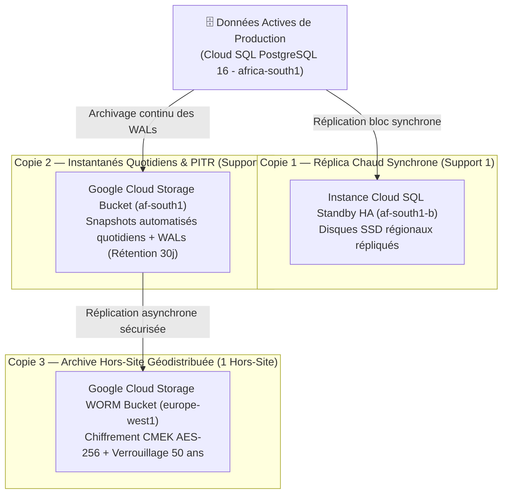

# Module 237 — Sauvegardes Techniques — Bases de Données, Fichiers, Stratégie 3-2-1 (Google Cloud)

> **Positionnement :** Tome 13 — Infrastructure, Exploitation & Qualité · Module 237 sur 246
> **Autorité :** Lead Database Administrator (DBA) / Responsable Sauvegardes et Archives
> **Liaison amont/aval :** ← Module 236 (PCA/PRA) → Module 238 (Haute disponibilité DB) →

---

## 1. Objet

Ce module formalise l'implémentation industrielle de la règle d'or de sauvegarde **3-2-1** adaptée à l'environnement exclusif Google Cloud Platform d'ELLYSIUM : **3 copies** distinctes des données, sur **2 classes ou services de stockage** différents (Cloud SQL Persistent Disk et Cloud Storage), avec au moins **1 copie géographiquement isolée** hors de la région primaire.

---

## 2. Déclinaison Concrète de la Règle 3-2-1 sous Google Cloud



---

## 3. Mécanismes de Restauration Point-in-Time (PITR)

Pour se prémunir contre les erreurs humaines catastrophiques (ex: exécution accidentelle d'un `DROP TABLE` ou corruption logique d'une table de cotes) :
- **Journaux de Transactions (Write-Ahead Logging - WAL)** : Les WAL de PostgreSQL sont continuellement diffusés vers Cloud Storage toutes les **60 secondes**.
- **Restauration à la Seconde Près** : Le DBA peut cloner la base de production à n'importe quel instant précis des **7 derniers jours calendaires** :
  ```bash
  # Commande gcloud de restauration PITR
  gcloud sql instances clone cnel-elysium-pg-prod cnel-elysium-pg-restore-temp \
      --point-in-time="2026-09-17T11:42:15.000Z" \
      --project=cnel-elysium-prod
  ```

---

## 4. Sauvegardes des Fichiers et Médias (Google Cloud Storage)

Les fichiers multimédias, pièces d'état civil et copies scannées déposés sur GCS bénéficient d'une double protection :
1. **Gestion des Versions d'Objets (Object Versioning)** : Toute écrasement ou suppression d'un fichier conserve automatiquement la version antérieure.
2. **Protection contre la Suppression Accidentelle (Bucket Lock)** : Les compartiments de diplômes et bulletins scellés interdisent la suppression d'objets pendant une durée incompressible de **50 ans**.

---

## 5. Calendrier Automatisé de Test et d'Audit des Sauvegardes

Une sauvegarde non testée étant réputée inexistante, ELLYSIUM applique un calendrier rigide de tests d'intégrité :

| Type de Test | Fréquence d'Exécution | Responsable | Critère de Validation |
|---|---|---|---|
| **Contrôle d'Empreinte SHA-256** | Quotidien (Automatisé par Cloud Functions) | Système | Les hashs des archives correspondent exactement aux métadonnées |
| **Restauration Automatique Sandbox** | Hebdomadaire (Dimanche 02h00) | Robot CI/CD | Démarrage réussi d'une instance PostgreSQL à partir du snapshot |
| **Test de Restauration Complète Métier** | Mensuel (Premier lundi du mois) | Lead DBA | Vérification de cohérence applicative sur 10 000 dossiers d'élèves |
| **Audit Juridique de Non-Répudiation** | Trimestriel | DPO Souverain | Rapport certifié garantissant l'intégrité du patrimoine national |

---

## 6. Verrous Fonctionnels

| ID | Règle | Niveau |
|---|---|---|
| VF-237-01 | Règle 3-2-1 obligatoire : 3 copies, 2 supports, 1 copie hors région africaine | CONSTITUTIONNEL |
| VF-237-02 | Restauration PITR active et testée avec capacité de retour arrière à la seconde près | TECHNIQUE |
| VF-237-03 | Chiffrement obligatoire de 100% des sauvegardes au repos via Cloud KMS (CMEK) | SÉCURITÉ |
| VF-237-04 | Test automatique hebdomadaire de restauration en bac à sable obligatoire | QUALITÉ |
| VF-237-05 | Rétention des archives de diplômes verrouillée à 50 ans sans suppression possible | LÉGAL |

---

*Sous-tome rédigé conformément aux Normes documentaires ELLYSIUM — Fondations 04.*
