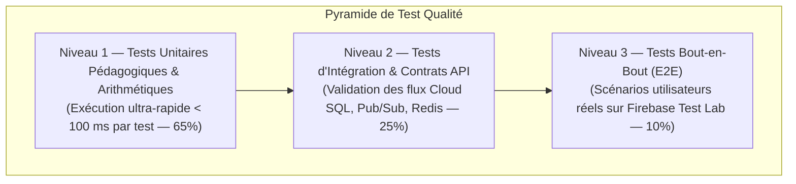

# Module 239 — Tests Unitaires, d'Intégration et de Non-Régression

> **Positionnement :** Tome 13 — Infrastructure, Exploitation & Qualité · Module 239 sur 246
> **Autorité :** Lead Quality Assurance / Architecte Méthodologies de Test
> **Liaison amont/aval :** ← Module 238 (Haute disponibilité DB) → Module 240 (Tests de charge) →

---

## 1. Objet

Ce module définit la pyramide des tests, la politique de couverture logicielle, les frameworks d'automatisation et les règles de non-régression d'ELLYSIUM. Il garantit que chaque ligne de code écrite en Go, Dart (Flutter) ou TypeScript respecte rigoureusement la logique métier souveraine avant toute intégration dans la branche principale.

---

## 2. Pyramide des Tests ELLYSIUM



---

## 3. Exigences de Couverture de Code (Code Coverage)

Pour interdire la dette technique et sécuriser les calculs régaliens :

| Composant Logiciel | Seuil Minimal de Couverture Exigé | Type de Test Obligatoire |
|---|---|---|
| **Moteur Arithmétique des Cotes (Module 181)** | **$\mathbf{100\%}$ de couverture stricte** | Tests unitaires exhaustifs avec cas limites |
| **Module Caisse & Paiements (Module 201)** | **$\mathbf{100\%}$ de couverture stricte** | Tests d'idempotence et de concurrence |
| **Génération des Diplômes & Hash (Module 185)** | **$\mathbf{95\%}$ de couverture** | Tests de conformité cryptographique SHA-256 |
| **APIs REST & Services Métiers (Cloud Run)** | **$\mathbf{85\%}$ de couverture** | Tests d'intégration avec base PostgreSQL de test |
| **Interfaces Graphiques Flutter & PWA** | **$\mathbf{75\%}$ de couverture** | Tests de widgets et tests d'accessibilité sémantique |

---

## 4. Tests Unitaires de la Formule Constitutionnelle (Go)

Exemple de suite de tests unitaires validant l'immuabilité de la formule officielle RDC (Article 3) :

```go
// Extrait de test unitaire : calcul_test.go
func TestCalculerTauxGlobal_ConformiteRDC(t *testing.T) {
    tests := []struct {
        nom            string
        cotes          []Cote
        tauxAttendu    float64
        doitEtreErreur bool
    }{
        {
            nom: "Cas Nominal Élève Réussite",
            cotes: []Cote{
                {PointsTJ: 30, MaximumTJ: 40, PointsExamen: 45, MaximumExamen: 60}, // 75/100
                {PointsTJ: 20, MaximumTJ: 40, PointsExamen: 30, MaximumExamen: 60}, // 50/100
            },
            tauxAttendu: 62.50, // (75 + 50) / 200 * 100 = 62.5%
        },
        {
            nom: "Démonstration Interdiction Moyenne de Pourcentages",
            cotes: []Cote{
                {PointsTJ: 10, MaximumTJ: 20, PointsExamen: 10, MaximumExamen: 30}, // 20/50 (40%)
                {PointsTJ: 80, MaximumTJ: 100, PointsExamen: 120, MaximumExamen: 150}, // 200/250 (80%)
            },
            tauxAttendu: 73.33, // Vraie formule : 220 / 300 = 73.33% (alors que moyenne des % = 60%)
        },
    }

    for _, tt := range tests {
        t.Run(tt.nom, func(t *testing.T) {
            taux := CalculerTauxGlobal(tt.cotes)
            if math.Abs(taux - tt.tauxAttendu) > 0.01 {
                t.Fatalf("VIOLATION CONSTITUTIONNELLE : taux calculé %.2f != attendu %.2f", taux, tt.tauxAttendu)
            }
        })
    }
}
```

---

## 5. Tests de Non-Régression Automatisés dans Google Cloud Build

Chaque Pull Request déclenche l'exécution des tests en conteneur éphémère :
- Durée totale d'exécution du pipeline de test : **$< 4$ minutes**.
- En cas d'échec d'un seul test unitaire ou d'intégration, la fusion (*Merge*) dans la branche principale est **automatiquement verrouillée**.
- Génération d'un rapport de couverture téléversé vers Cloud Storage et commenté directement dans la revue de code.

---

## 6. Verrous Fonctionnels

| ID | Règle | Niveau |
|---|---|---|
| VF-239-01 | Couverture de test stricte de 100% sur le calcul des cotes et la caisse | CONSTITUTIONNEL |
| VF-239-02 | Blocage absolu de tout merge Git en cas de test unitaire en échec | TECHNIQUE |
| VF-239-03 | Tests de non-régression exécutés automatiquement dans Google Cloud Build | QUALITÉ |
| VF-239-04 | Interdiction d'utiliser des bases de données de production pour les tests | SÉCURITÉ |
| VF-239-05 | Validation systématique du comportement en cas de données corrompues ou nulles | RÉSILIENCE |

---

*Sous-tome rédigé conformément aux Normes documentaires ELLYSIUM — Fondations 04.*
