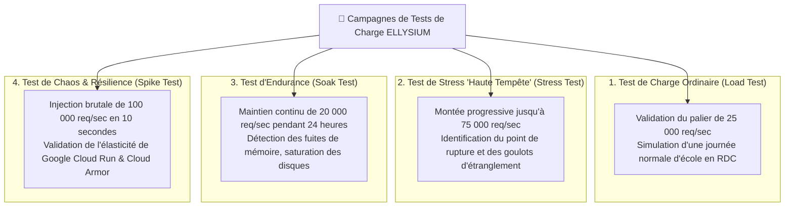

# Module 240 — Tests de Charge, de Performance et de Stress (Mode Haute Tempête 65k req/s)

> **Positionnement :** Tome 13 — Infrastructure, Exploitation & Qualité · Module 240 sur 246
> **Autorité :** Lead Performance Architect / Responsable Tests de Charge Nationaux
> **Liaison amont/aval :** ← Module 239 (Tests unitaires) → Module 241 (Assurance qualité du code) →

---

## 1. Objet

Ce module régit la méthodologie, l'outillage distribué et les seuils d'acceptabilité des tests de charge, d'endurance et de stress de l'infrastructure ELLYSIUM. Il prépare le système à affronter le **"Mode Haute Tempête"** : le pic national annuel de publication des résultats de l'EXETAT et des délibérations de fin d'année, calibré pour soutenir **65 000 requêtes d'écriture par seconde et plus de 500 000 requêtes de consultation par seconde**.

---

## 2. Typologie des Campagnes de Tir de Charge



---

## 3. Banc d'Essai Distribué (k6 & Google Cloud Distributed Load Testing)

Les tirs de charge sont exécutés par le moteur open-source **tableaux de bord Cloud Monitoring k6** conteneurisé et orchestré sur Google Kubernetes Engine pour générer un trafic virtuel réaliste depuis plusieurs nœuds géographiques :

```javascript
// Scénario de test k6 : Publication des Bulletins Haute Tempête
import http from 'k6/http';
import { check, sleep } from 'k6';

export const options = {
  stages: [
    { duration: '2m', target: 10000 },  // Montée à 10 000 utilisateurs
    { duration: '5m', target: 65000 },  // Pic Haute Tempête (65k req/s)
    { duration: '10m', target: 65000 }, // Maintien du plateau
    { duration: '3m', target: 0 },      // Descente progressive
  ],
  thresholds: {
    http_req_duration: ['p(95)<400'],   // 95% des requêtes sous 400 ms
    http_req_failed: ['rate<0.001'],    // Moins de 0,1% d'échecs tolérés
  },
};

export default function () {
  const params = {
    headers: {
      'Accept-Encoding': 'gzip, br',
      'User-Agent': 'ELLYSIUM-LoadTest-Bot/1.0',
    },
  };
  const res = http.get('https://staging.ellysium.cd/api/v1/bulletins/verify/sample-hash', params);
  check(res, {
    'Statut 200 OK': (r) => r.status === 200,
    'Temps de réponse < 500ms': (r) => r.timings.duration < 500,
  });
  sleep(0.1);
}
```

---

## 4. Comportement du Système en Mode Haute Tempête

Lorsque le trafic dépasse le seuil critique des **50 000 requêtes/seconde**, l'infrastructure bascule automatiquement en mode de protection de charge :
1. **Délestage Agressif sur Cloud CDN** : Les résultats scellés et diplômes publics sont servis à **99 % directement depuis le cache mondial Google Cloud CDN**, sans toucher la base de données SQL.
2. **Rate-Limiting Éthique par Cloud Armor** : Protection contre les scrapers abusifs (limitation à 100 requêtes par minute par adresse IP).
3. **Mise en File d'Attente Virtuelle (Virtual Waiting Room)** : Si la capacité maximale est atteinte, les nouveaux arrivants sont accueillis par une page d'attente soignée indiquant leur position dans la file avec estimation du temps d'accès.

---

## 5. Critères de Validation du Tir de Charge

Pour qu'une version soit déclarée apte à la production :

$$\text{Taux d'Échec HTTP 5xx} \le 0,05\% \quad \text{au pic de 65 000 req/sec}$$

- **Latence au 95e centile (P95)** : Strictement inférieure à **500 ms**.
- **Latence au 99e centile (P99)** : Strictement inférieure à **1 200 ms**.
- **Temps de retour à la normale** après la fin du tir : Moins de **90 secondes**.

---

## 6. Verrous Fonctionnels

| ID | Règle | Niveau |
|---|---|---|
| VF-240-01 | Test de charge Haute Tempête validé obligatoirement avant la rentrée scolaire | CONSTITUTIONNEL |
| VF-240-02 | Capacité démontrée de soutenir 65 000 requêtes/seconde sans crash système | SLO / SRE |
| VF-240-03 | Délestage Edge obligatoire : au moins 90% des lectures publiques servies par CDN | TECHNIQUE |
| VF-240-04 | Interdiction d'exécuter des tirs de charge sur l'environnement de production direct | SÉCURITÉ |
| VF-240-05 | Traçabilité intégrale des métriques de chaque tir archivée sur Cloud Storage | QUALITÉ |
| VF-240-06 | Tout déploiement nécessite un plan de secours documenté testé au moins une fois par mois | FIABILITÉ |

---

*Sous-tome rédigé conformément aux Normes documentaires ELLYSIUM — Fondations 04.*
