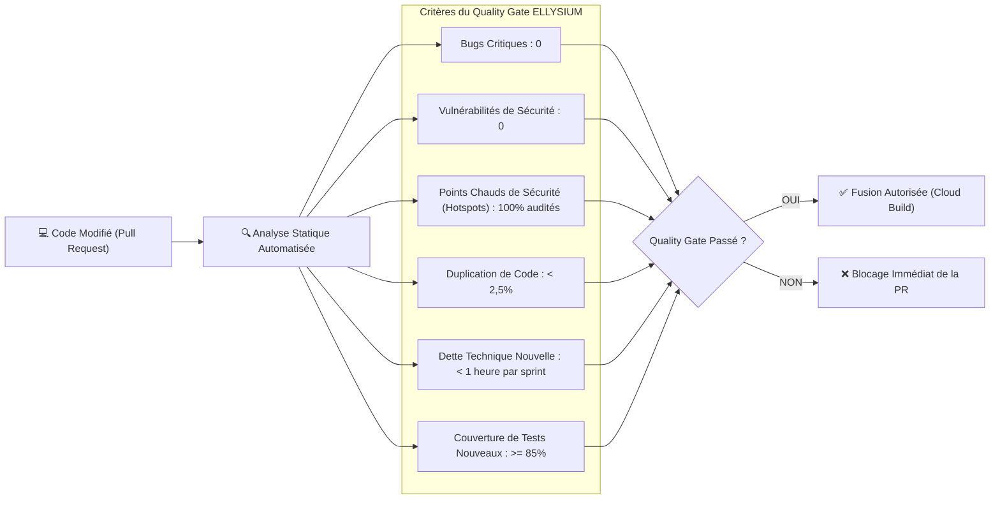

# Module 241 — Assurance Qualité du Code (SonarQube, Analyse Statique, Dette Technique)

> **Positionnement :** Tome 13 — Infrastructure, Exploitation & Qualité · Module 241 sur 246
> **Autorité :** Lead Software Quality Engineer / Architecte Code ELLYSIUM
> **Liaison amont/aval :** ← Module 240 (Tests de charge) → Module 242 (Audit de panne) →

---

## 1. Objet

Ce module régit la gouvernance de la qualité logicielle, les règles d'analyse statique du code source (**SAST**), le contrôle impitoyable de la dette technique et les barrières de qualité (**Quality Gates**) bloquantes intégrées dans le pipeline de développement continu d'ELLYSIUM.

---

## 2. Barrière de Qualité Déclarative (*Quality Gate Strict*)

Aucune contribution de code (Pull Request) ne peut être intégrée dans les branches de release si elle ne satisfait pas l'ensemble des critères suivants audités par **SonarQube / SonarCloud** :

---

## 3. Outils d'Analyse Statique par Langage

L'analyse de code s'effectue à chaque sauvegarde locale et au sein du conteneur CI/CD :

| Langage / Composant | Outils d'Analyse Statique Intégrés | Règles et Linters Spécifiques |
|---|---|---|
| **Go (Backend APIs)** | `golangci-lint`, `govet`, `staticcheck` | Vérification de la gestion des erreurs, interdiction des allocations inutiles |
| **Dart / Flutter (Mobile)** | `flutter analyze`, `dart_code_metrics` | Règles de performance de widgets, proscription des fuites mémoire |
| **TypeScript (Frontend / PWA)** | `ESLint`, `Prettier`, `typescript-eslint` | Typage strict sans utilisation de `any`, règles d'accessibilité JSX a11y |
| **Sécurité Globale (SAST)** | `Semgrep`, `Trivy`, `Trufflehog` | Détection de secrets en dur, failles d'injection SQL, vulnérabilités OWASP |
| **Infrastructure-as-Code** | `tflint`, `tfsec`, `checkov` | Conformité aux règles de sécurité Google Cloud Provider |

---

## 4. Politique de Gestion et Résorption de la Dette Technique

Pour éviter l'accumulation progressive de code obsolète :
1. **Règle du Boy-Scout Permanente** : Tout développeur modifiant un fichier est tenu de le laisser dans un état plus propre et mieux testé qu'il ne l'a trouvé (*Clean as you go*).
2. **Sprint de Salubrité Académique (Sprint Refacto)** : À la fin de chaque trimestre scolaire (avant la session d'examens), un sprint complet de **2 semaines** est exclusivement consacré au nettoyage du code, à la mise à jour des dépendances et à la réduction de la dette technique, sans ajout de nouvelles fonctionnalités.
3. **Plafond Maximal de Dette Technique Globale** : La dette technique totale mesurée sur l'ensemble du dépôt Git ne doit jamais excéder **5 jours-homme**.

---

## 5. Détection des Secrets et Clés Privées (Zéro Fuite)

Pour garantir la souveraineté absolue et prévenir la compromission d'identifiants :
- **Hooks Pré-Commit (TruffleHog)** : Tout développeur exécutant un `git commit` voit son code analysé localement. Si une clé API Google, un token Firebase, un certificat ou un mot de passe est détecté, le commit est **physiquement bloqué sur la machine locale**.
- **Scan de l'Historique Git** : Analyse continue de l'ensemble des branches pour détecter toute introduction historique accidentelle de secret.

---

## 6. Verrous Fonctionnels

| ID | Règle | Niveau |
|---|---|---|
| VF-241-01 | Zéro vulnérabilité critique ou bug bloquant toléré dans le Quality Gate | QUALITÉ |
| VF-241-02 | Détection pré-commit obligatoire des secrets interdisant tout commit contenant des clés | SÉCURITÉ |
| VF-241-03 | Taux de duplication de code strictement inférieur à 2,5% sur le dépôt | TECHNIQUE |
| VF-241-04 | Sprint trimestriel de résorption de dette technique obligatoire avant chaque examen | GOUVERNANCE |
| VF-241-05 | L'évaluation statique du code est exécutée automatiquement sur Google Cloud Build | PROCESSUS |

---

*Sous-tome rédigé conformément aux Normes documentaires ELLYSIUM — Fondations 04.*
