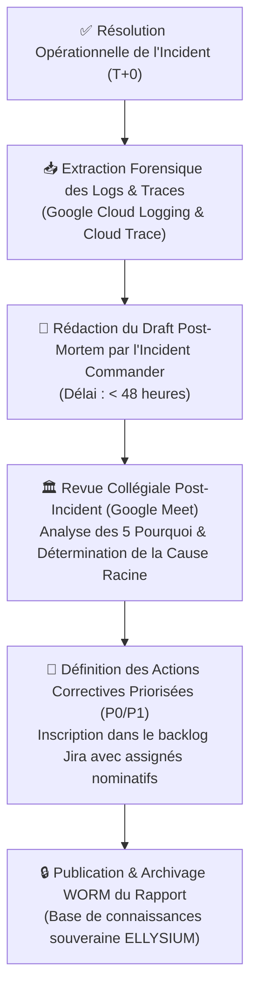

# Module 242 — Procédure d'Audit de Panne et Revue Post-Incident (Sans Blâme)

> **Positionnement :** Tome 13 — Infrastructure, Exploitation & Qualité · Module 242 sur 246
> **Autorité :** Lead SRE / Responsable Audit Interne ELLYSIUM
> **Liaison amont/aval :** ← Module 241 (Qualité du code) → Module 243 (FinOps GCP) →

---

## 1. Objet

Ce module formalise l'ingénierie forensique, la méthodologie d'investigation et le protocole collégial de clôture des incidents techniques au sein d'ELLYSIUM. Il fusionne les processus d'audit de panne système et les revues post-incidents pour transformer chaque défaillance en un actif d'apprentissage institutionnel pérenne, sans recherche de coupable individuel (**Culture Blameless**).

---

## 2. Principes Fondateurs de la Revue Sans Blâme (*Blameless Culture*)

1. **Postulat d'Intention Bienveillante** : Les défaillances logicielles ou opérationnelles ne sont jamais le fait de la négligence délibérée d'un ingénieur, mais la conséquence de failles systémiques, de documentation insuffisante ou de garde-fous manquants.
2. **Focalisation sur la Résilience du Système** : L'audit n'a pas pour but de sanctionner une personne, mais de concevoir les barrières techniques (automatisations, linters, tests de charge) empêchant la réapparition de la même classe d'erreur.
3. **Vérité Factuelle et Horodatage Indiscutable** : Seules les données prouvées par les logs immuables de Google Cloud Logging et les traces de Cloud Trace font foi.

---

## 3. Workflow de la Revue Post-Incident

---

## 4. Méthodologie Forensique d'Analyse de Panne

Lors de l'investigation technique :
- **Reconstitution Temporelle à la Milliseconde (Timeline)** : Alignement précis des événements sur l'horloge TrueTime de Google Cloud.
- **Corrélation des Événements** : Croisement entre les commits déployés par Cloud Build, les modifications d'infrastructure Terraform et les pics d'erreurs 5xx sur Cloud Monitoring.
- **Isolement des Effets de Bord** : Identification des éventuelles corruptions logiques de données collatérales (ex: vérification de l'intégrité de la table `cotes` après un crash de base de données).

---

## 5. Gouvernance des Plans d'Action Post-Incident

Toute action corrective identifiée lors d'un audit de panne est soumise à un suivi strict :

| Priorité de l'Action | Nature de l'Amélioration | Délai Impératif de Résolution | Sanction en Cas de Retard |
|---|---|---|---|
| **Action P0 (Bloquante)** | Correctif de code direct, ajout d'un index vital, règle WAF Cloud Armor | **$< 24 \text{ heures}$** | Gel immédiat des déploiements applicatifs |
| **Action P1 (Structurelle)** | Refonte d'un composant, ajout d'un test de charge k6 spécifique | **$< 7 \text{ jours}$** | Alerte formelle au Directeur Technique |
| **Action P2 (Documentation)** | Mise à jour des manuels opérationnels, amélioration des dashboards | **$< 14 \text{ jours}$** | Clôture lors du sprint de salubrité |

---

## 6. Verrous Fonctionnels

| ID | Règle | Niveau |
|---|---|---|
| VF-242-01 | Tenue obligatoire de la réunion post-mortem sous 72h après tout incident P0/P1 | QUALITÉ |
| VF-242-02 | Respect strict du principe Blameless : interdiction des reproches nominatifs | ÉTHIQUE |
| VF-242-03 | Les actions correctives P0 doivent être livrées et testées en moins de 24 heures | SRE / SÉCURITÉ |
| VF-242-04 | Tous les rapports d'audit de panne sont conservés de manière inaltérable sur GCS | ARCHIVE |
| VF-242-05 | Publication semestrielle d'une synthèse de fiabilité pour le Conseil d'Administration | TRANSPARENCE |

---

*Sous-tome rédigé conformément aux Normes documentaires ELLYSIUM — Fondations 04.*
