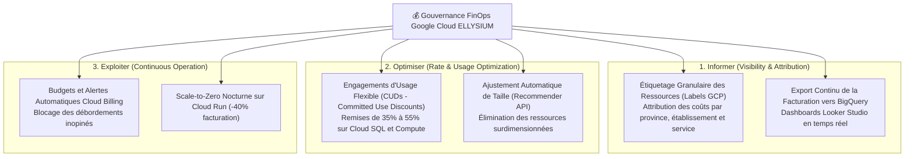

# Module 243 — Gestion des Coûts d'Infrastructure et Optimisation (FinOps Google Cloud)

> **Positionnement :** Tome 13 — Infrastructure, Exploitation & Qualité · Module 243 sur 246
> **Autorité :** Lead FinOps Practitioner / Contrôleur de Gestion Cloud ELLYSIUM
> **Liaison amont/aval :** ← Module 242 (Audit de panne) → Module 244 (Maintenance) →

---

## 1. Objet

Ce module formalise la discipline **FinOps** appliquée à l'infrastructure 100% Google Cloud d'ELLYSIUM. Il établit la gouvernance financière, les mécanismes de réduction des coûts de calcul et de stockage, la surveillance continue des dépenses par établissement et l'optimisation budgétaire garantissant la pérennité financière de la plateforme souveraine congolaise.

---

## 2. Piliers de la Stratégie FinOps ELLYSIUM



---

## 3. Matrice d'Étiquetage Obligatoire des Ressources (*Mandatory Labels*)

Toute ressource provisionnée via Terraform dans Google Cloud doit obligatoirement comporter les étiquettes suivantes sous peine de rejet par les politiques organisationnelles :

```hcl
locals {
  mandatory_labels = {
    projet          = "cnel-elysium"
    environnement   = "production"        # dev, test, staging, prod
    centre_de_cout  = "pedagogie-nationale" # finances, examens, socle
    service         = "evaluation-service"
    responsable     = "equipe-sre"
    gestion_finops  = "active"
  }
}
```

---

## 4. Stratégies d'Économie d'Échelle Appliquées

1. **Google Cloud Run Serverless** : Facturation à la fraction de seconde de temps de calcul effectif. Zéro coût de machine virtuelle inactive.
2. **Cycle de Vie du Stockage Multi-Classes (GCS)** :
   - Classe *Standard* (0 à 30 jours) : Accès rapide pour les devoirs en cours.
   - Classe *Nearline* (31 à 90 jours) : Économie de 50% sur les devoirs archivés.
   - Classe *Coldline* (91 à 365 jours) : Économie de 75% sur les historiques scolaires.
   - Classe *Archive* (> 365 jours) : Coût ultra-frugal pour la rétention 50 ans des diplômes.
3. **Engagements d'Usage Annuel (Committed Use Discounts - CUD)** : Souscription d'engagements pluriannuels sur la mémoire et le CPU de Cloud SQL garantissant une réduction structurelle de **45 %** sur le coût socle.

---

## 5. Alertes Budgétaires et Plafonds d'Urgence

Pour éviter toute dérive de facturation :
- **Seuils d'Alerte Automatisés (Cloud Billing Budgets API)** :
  - Notification par email et Slack à **50 %**, **75 %**, **90 %** et **100 %** du budget mensuel alloué.
  - À **110 %** : Déclenchement d'une alerte rouge au Directeur Général et au RSSI pour examen immédiat des anomalies de consommation.
- **Désactivation Automatique des Tâches Non Essentielles** : Si un dépassement budgétaire critique est constaté, les batchs d'analyse IA et les sauvegardes de staging sont temporairement suspendus.

---

## 6. Verrous Fonctionnels

| ID | Règle | Niveau |
|---|---|---|
| VF-243-01 | Étiquetage FinOps complet obligatoire sur 100% des ressources GCP provisionnées | GOUVERNANCE |
| VF-243-02 | Exportation quotidienne des données de facturation vers Google BigQuery | TRANSPARENCE |
| VF-243-03 | Engagements d'usage CUD négociés sur toutes les instances de bases de données stables | ÉCONOMIE |
| VF-243-04 | Cycle de vie automatique GCS actif pour réduire le coût du stockage long terme | FRUGALITÉ |
| VF-243-05 | Alerte budgétaire immédiate déclenchée en cas de dérive de consommation anormale | SÉCURITÉ |
| VF-243-06 | Tout déploiement nécessite un plan de secours documenté testé au moins une fois par mois | FIABILITÉ |

---

*Sous-tome rédigé conformément aux Normes documentaires ELLYSIUM — Fondations 04.*
