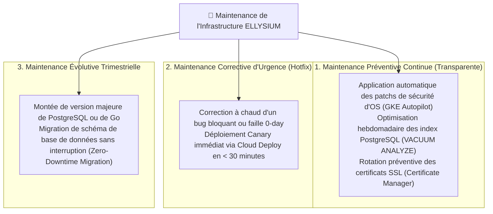
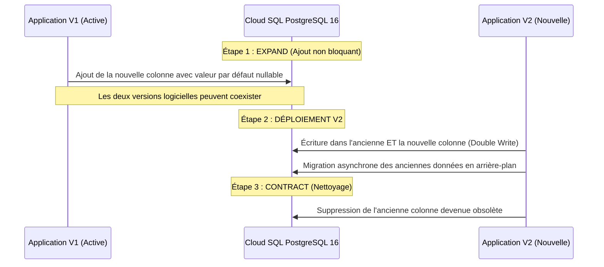

# Module 244 — Maintenance Préventive et Corrective (Zéro Interruption)

> **Positionnement :** Tome 13 — Infrastructure, Exploitation & Qualité · Module 244 sur 246
> **Autorité :** Lead Maintenance Engineer / Directeur des Opérations SRE
> **Liaison amont/aval :** ← Module 243 (FinOps) → Module 245 (Gouvernance DevOps) →

---

## 1. Objet

Ce module formalise les protocoles d'intervention technique, la maintenance préventive planifiée, l'application des correctifs de sécurité critiques et la gestion des patchs sans aucune rupture de service (**Zero-Downtime Maintenance**) au sein de la plateforme souveraine ELLYSIUM.

---

## 2. Typologie des Opérations de Maintenance

---

## 3. Protocoles de Migration de Schéma Sans Interruption (Expand & Contract)

Toute évolution de la base de données de production suit la méthodologie **Expand and Contract** pour éliminer tout verrouillage de table :

---

## 4. Maintenance Managée par Google Cloud Platform

L'exploitation s'appuie sur la gestion autonome des couches basses par Google :
- **GKE Autopilot Node Auto-Repair & Auto-Upgrade** : Google assure la maintenance et la mise à jour des versions stables de Kubernetes sans aucune action manuelle des équipes ELLYSIUM.
- **Maintenance Cloud SQL Planifiée** :
  - Définition d'une fenêtre de maintenance hebdomadaire fixe : **Dimanche entre 03h00 et 04h00 (heure locale de Kinshasa)**.
  - Notification préalable avec délai de préavis de **7 jours** par Google Cloud.
  - Grâce à l'architecture Haute Disponibilité (Module 238), la mise à jour s'exécute sur l'instance Standby avant basculement, limitant la coupure à un bref flottement de moins de 30 secondes.

---

## 5. Registre Public des Maintenances

Toute intervention de maintenance programmée est enregistrée et rendue publique :
- Inscription sur le calendrier officiel 72 heures à l'avance.
- Notification préventive adressée aux préfets d'écoles pour éviter de planifier des épreuves durant la fenêtre de maintenance nocturne.
- Rapport d'achèvement consigné dans le journal des opérations administratives (Module 209).

---

## 6. Verrous Fonctionnels

| ID | Règle | Niveau |
|---|---|---|
| VF-244-01 | Méthode Expand & Contract obligatoire pour toute migration de schéma de données | QUALITÉ |
| VF-244-02 | Fenêtre de maintenance système planifiée exclusivement le dimanche entre 03h et 04h | DISPONIBILITÉ |
| VF-244-03 | Préavis obligatoire de 72 heures pour toute opération de maintenance planifiée | TRANSPARENCE |
| VF-244-04 | Interdiction totale d'exécuter des opérations manuelles non scriptées en production | SÉCURITÉ |
| VF-244-05 | Rollback planifié et testé avant toute intervention de maintenance majeure | RÉSILIENCE |
| VF-244-06 | Tout déploiement nécessite un plan de secours documenté testé au moins une fois par mois | FIABILITÉ |

---

*Sous-tome rédigé conformément aux Normes documentaires ELLYSIUM — Fondations 04.*
