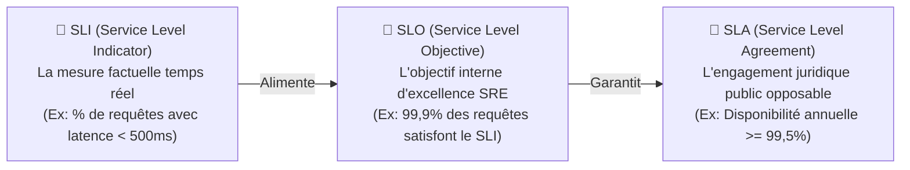
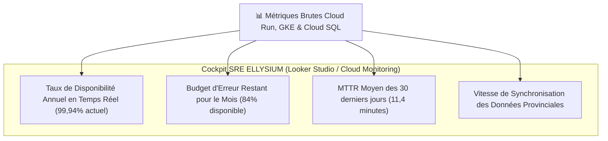

# Module 245 — Gouvernance DevOps & SRE — Métriques DORA, SLA, SLO, SLI et MTTR

> **Positionnement :** Tome 13 — Infrastructure, Exploitation & Qualité · Module 245 sur 246
> **Autorité :** Lead SRE / Directeur de la Gouvernance Technologique
> **Liaison amont/aval :** ← Module 244 (Maintenance) → Module 246 (Matrice des dépendances Tome 13) →

---

## 1. Objet

Ce module formalise le modèle de gouvernance opérationnelle **DevOps & Site Reliability Engineering (SRE)** d'ELLYSIUM. Il définit les indicateurs clés de performance industrielle (**Métriques DORA**), l'alignement contractuel entre les SLI, SLO et SLA, et la culture d'amélioration continue guidée par les données de télémétrie de Google Cloud.

---

## 2. Déclinaison Méthodologique : SLI $\to$ SLO $\to$ SLA

Pour éliminer toute ambiguïté sur la qualité de service :

---

## 3. Les 4 Métriques Clés DORA (DevOps Research and Assessment)

ELLYSIUM mesure sa vélocité et sa stabilité selon les standards d'élite DORA de Google Cloud :

| Métrique DORA | Définition Industrielle | Objectif Cible ELLYSIUM | Niveau de Performance Visé |
|---|---|---|---|
| **Fréquence de Déploiement** (*Deployment Frequency*) | Rythme des mises en production réussies | **Plusieurs déploiements par jour** | Élite (*On-Demand*) |
| **Délai de Livraison d'un Changement** (*Lead Time for Changes*) | Du commit Git à l'exécution en production | **$< 45 \text{ minutes}$** | Élite |
| **Temps Moyen de Rétablissement** (*MTTR - Mean Time to Restore*) | Durée de résolution d'un incident P0/P1 | **$< 15 \text{ minutes}$** | Élite |
| **Taux d'Échec des Changements** (*Change Failure Rate*) | % de déploiements provoquant un rollback ou incident | **$< 2,0\%$** | Élite |

---

## 4. Tableau de Bord Unifié de Gouvernance (Google Cloud Monitoring)

Toutes les métriques opérationnelles sont synthétisées sur un cockpit en temps réel accessible à la direction générale et aux équipes d'ingénierie :

---

## 5. Gestion et Arbitrage du Budget d'Erreur (*Error Budget Policy*)

Le budget d'erreur n'est pas un défaut, mais un outil contractuel d'arbitrage entre vitesse d'innovation et stabilité du service :
- **Budget Sain ($> 50\%$ restant)** : Déploiements fluides, tests de nouvelles fonctionnalités pédagogiques autorisés.
- **Budget en Alerte ($25\%$ à $50\%$ restant)** : Réduction du rythme de release, revue approfondie des tests de charge obligatoire.
- **Budget Épuisé ($< 25\%$ restant)** : **Gel immédiat des déploiements fonctionnels**. 100% des ressources de développement sont réaffectées à la fiabilisation de l'infrastructure et aux correctifs SRE.

---

## 6. Verrous Fonctionnels

| ID | Règle | Niveau |
|---|---|---|
| VF-245-01 | Respect strict des métriques DORA de niveau Élite mesurées par Google Cloud | SRE |
| VF-245-02 | Gel automatique des livraisons de fonctionnalités si le budget d'erreur < 25% | GOUVERNANCE |
| VF-245-03 | MTTR inférieur à 15 minutes pour tout incident critique P0 | SLO / SRE |
| VF-245-04 | Calcul continu et public des SLI via Google Cloud Monitoring | TRANSPARENCE |
| VF-245-05 | Revue mensuelle formelle des indicateurs SRE présentée au Conseil d'Administration | CONSTITUTIONNEL |
| VF-245-06 | Tout déploiement nécessite un plan de secours documenté testé au moins une fois par mois | FIABILITÉ |

---

*Sous-tome rédigé conformément aux Normes documentaires ELLYSIUM — Fondations 04.*
