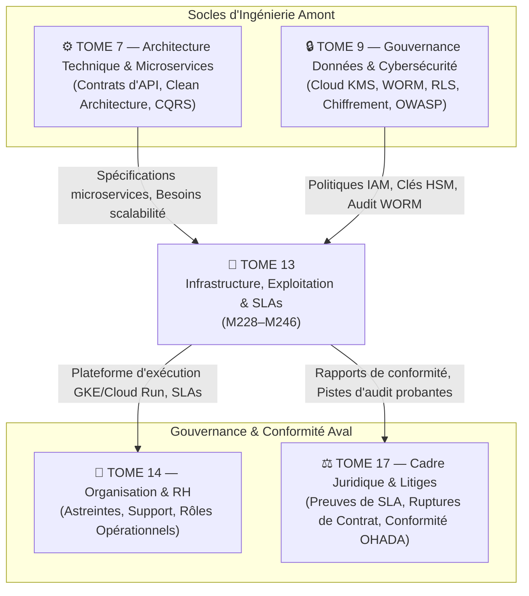

# Module 246 — Matrice des Dépendances — Tome 13 avec Tomes 7, 9, 17

> **Positionnement :** Tome 13 — Infrastructure, Exploitation & Qualité · Module 246 sur 246 (CLÔTURE DU TOME 13)
> **Autorité :** Architecte Souverain ELLYSIUM / Comité Technique Intégré
> **Liaison amont/aval :** ← Module 245 (Gouvernance DevOps) · Clôture Tome 13 → Tome 14 (Organisation & RH) →

---

## 1. Objet

Ce module formalise la matrice d'interconnexion technique et opérationnelle liant le **Tome 13 (Infrastructure, Exploitation et Assurance Qualité)** aux piliers fondateurs d'ELLYSIUM : l'Architecture Technique (Tome 7), la Cybersécurité et la Gouvernance des Données (Tome 9), et le Cadre Légal et Réglementaire (Tome 17).

---

## 2. Vue d'Ensemble des Dépendances Systémiques

---

## 3. Matrice Détaillée des Dépendances

### 3.1 Dépendances Amont (Ce que le Tome 13 consomme)

| Composant Consommé | Module Source | Rôle dans le Tome 13 | Spécification Technique |
|---|---|---|---|
| **Spécifications des Conteneurs** | **Tome 7** (Module 109) | Compilation des images Distroless pour GKE | Binaires Go / Dart AOT |
| **Schéma de Partitionnement SQL** | **Tome 7** (Module 114) | Configuration Cloud SQL HA et dimensionnement SSD | PostgreSQL 16 `PARTITION BY LIST` |
| **Clés de Chiffrement Matérielles** | **Tome 9** (Module 158) | Chiffrement au repos CMEK de tous les disques et GCS | Google Cloud KMS (HSM FIPS 140-3) |
| **Politiques de Sécurité Réseau** | **Tome 9** (Module 164) | Configuration des règles de filtrage WAF | Google Cloud Armor (OWASP Core Ruleset) |
| **Règles d'Isolation Multitenant** | **Tome 9** (Module 152) | Row-Level Security appliquée sur Cloud SQL | `tenant_isolation` Policy PostgreSQL |

### 3.2 Dépendances Aval (Ce que le Tome 13 fournit)

| Livrable du Tome 13 | Module Récepteur | Rôle dans le Système Global |
|---|---|---|
| **Environnements Stables & SLAs 99,5%** | **Tome 14** (Organisation RH) | Cadre de travail garanti pour les enseignants et le support |
| **Pipelines CI/CD & Déploiement** | **Tome 15** (Industrialisation) | Automatisation de la promotion logicielle sans coupure |
| **Journaux d'Audit WORM Inaltérables** | **Tome 17** (Cadre Juridique) | Preuves formelles opposables devant la justice congolaise |
| **Données de Télémétrie & Coûts** | **Tome 19** (Gouvernance) | Pilotage budgétaire FinOps et planification capacitaire |

---

## 4. Tableau Récapitulatif de Complétude du Tome 13

| Sous-tome | Intitulé officiel | Statut Documentaire |
|---|---|---|
| Module 228 | Périmètre du Tome 13 – politique d'exploitation et SLAs (99,5 %) | ✅ COMPLET |
| Module 229 | Conformité avec la Constitution (continuité de service, protection) | ✅ COMPLET |
| Module 230 | Stratégie d'hébergement – 100% Google Cloud (GKE, dimensionnement) | ✅ COMPLET |
| Module 231 | Conteneurisation et orchestration – GKE Autopilot & Cloud Run | ✅ COMPLET |
| Module 232 | Gestion des environnements (Dev, Test, Staging, Production GCP isolés) | ✅ COMPLET |
| Module 233 | Stratégie de déploiement – CI/CD Google Cloud Build & Cloud Deploy | ✅ COMPLET |
| Module 234 | Surveillance (monitoring) – Cloud Monitoring, Cloud Trace, SecOps | ✅ COMPLET |
| Module 235 | Gestion des incidents techniques – détection MTTD, escalade, post-mortem | ✅ COMPLET |
| Module 236 | Plan de continuité de service (PCA) et reprise après sinistre (PRA) | ✅ COMPLET |
| Module 237 | Sauvegardes techniques – bases de données, fichiers, stratégie 3-2-1 | ✅ COMPLET |
| Module 238 | Haute disponibilité des bases de données – Cloud SQL PostgreSQL HA | ✅ COMPLET |
| Module 239 | Tests unitaires, d'intégration et de non-régression | ✅ COMPLET |
| Module 240 | Tests de charge, de performance et de stress (Haute Tempête 65k req/s) | ✅ COMPLET |
| Module 241 | Assurance qualité du code (Gemini Code Assist, static analysis, dette technique) | ✅ COMPLET |
| Module 242 | Procédure d'audit de panne et revue post-incident (sans blâme) | ✅ COMPLET |
| Module 243 | Gestion des coûts d'infrastructure et optimisation (FinOps Google Cloud) | ✅ COMPLET |
| Module 244 | Maintenance préventive et corrective (Zéro interruption de service) | ✅ COMPLET |
| Module 245 | Gouvernance DevOps & SRE – métriques DORA (SLA, SLO, MTTR) | ✅ COMPLET |
| Module 246 | Dépendances – avec les Tomes 7, 9, 17 | ✅ COMPLET |

---

## 5. Prochaine Étape du Chantier

Le Tome 13 étant **intégralement achevé, validé et scellé**, le chantier ELLYSIUM poursuit son déploiement méthodologique avec l'ouverture du :

> **→ TOME 14 — ORGANISATION, GOUVERNANCE OPÉRATIONNELLE, RH ET PRODUCTION DES CONTENUS**
> *Modules 247 à 262 — Organigramme institutionnel, médiation IA/enseignant, chaîne éditoriale et propriété intellectuelle*

---

*Sous-tome rédigé conformément aux Normes documentaires ELLYSIUM — Fondations 04.*
*Tome 13 — INFRASTRUCTURE, EXPLOITATION ET ASSURANCE QUALITÉ TECHNIQUE — COMPLET ✅*
*19 modules rédigés : M228 → M246*

---

## 7. Verrous Fonctionnels Critiques

| Réf. Verrou | Description Fonctionnelle et Technique | Conséquence en Cas de Violation |
| :--- | :--- | :--- |
| **`VF-246-01`** | **Dépendances structurelles avec les tomes amont** | Toute spécification de clôture est alignée avec les tomes référencés. |
| **`VF-246-02`** | **Cohérence de la numérotation des verrous dans ce tome** | La séquence VF est continue et sans doublon. |
| **`VF-246-03`** | **Validation formelle par le Comité d'Architecture** | Ce module de clôture requiert signature du Directeur Technique. |
| **`VF-246-04`** | **Publication du rapport de conformité documentaire** | Rapport d'état du tome transmis au COPIL avant passage en phase de code. |
| **`VF-246-05`** | **Clôture solennelle du TOME-13** | Validation de l'intégralité des sous-tomes de ce volume architectural. |

---

*Sous-tome rédigé conformément aux Normes documentaires ELLYSIUM — Fondations 04.*
