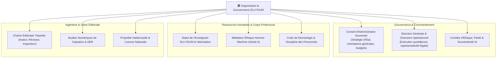

# Module 247 — Périmètre du Tome 14 — Organisation Générale et Gouvernance

> **Positionnement :** Tome 14 — Organisation, Gouvernance & Production · Module 247 sur 262
> **Autorité :** Secrétaire Général ELLYSIUM / Conseil d'Administration
> **Liaison amont/aval :** ← Tome 13 (Infrastructure) · Module 248 (Conformité) →

---

## 1. Objet

Ce module circonscrit l'architecture institutionnelle humaine, la répartition des pouvoirs régaliens et les principes directeurs de gouvernance qui animent le Centre National d'Étude en Ligne ELLYSIUM. Il fixe les frontières entre la gouvernance stratégique, le pilotage académique, la gestion des ressources humaines et l'usine de production des contenus pédagogiques souverains.

---

## 2. Cartographie des Domaines Opérationnels du Tome 14

---

## 3. Principes Fondateurs de Gouvernance

1. **Dualité d'Ancrage (Public-Privé Conventionné)** :
   - ELLYSIUM est une institution d'utilité publique sous haute tutelle de l'État (Ministères de l'EPST et de l'ESU), opérée avec la rigueur et la réactivité d'une infrastructure technologique de classe mondiale.
2. **Primauté de l'Intégrité Pédagogique sur la Logique Commerciale** :
   - Aucune considération de rentabilité financière ne peut prévaloir sur l'exigence de gratuité des candidats indépendants (Article 4) ou sur la rigueur de délibération des jurys (Tome 10).
3. **Souveraineté des Compétences Nationales** :
   - Priorité absolue aux talents, pédagogues, développeurs et chercheurs congolais dans l'encadrement et la direction technique du projet.

---

## 4. Cadre Opérationnel et Rôles de Direction

| Instance de Direction | Présidence / Mandat | Missions Régaliennes Principales |
|---|---|---|
| **Conseil d'Administration (CA)** | Président du Conseil / Mandat de 4 ans | Vote des budgets annuels, approbation des conventions ministérielles, contrôle éthique |
| **Direction Générale (DG)** | Directeur Général / Fondateur | Pilotage exécutif, coordination des tomes, arbitrage inter-pôles, relations d'État |
| **Direction Académique** | Inspecteur Général / Doyen Émérite | Référentiels pédagogiques, intégrité des examens, supervision des préfets |
| **Direction des Systèmes d'Information** | Lead Cloud Architect | Exploitation 100% Google Cloud, sécurité, SRE, intégrité des données |

---

## 5. Verrous Fonctionnels

| ID | Règle | Niveau |
|---|---|---|
| VF-247-01 | Respect impératif de la tutelle des Ministères de l'EPST et de l'ESU | CONSTITUTIONNEL |
| VF-247-02 | Séparation stricte du pouvoir délibératif pédagogique et de la gestion financière | CONSTITUTIONNEL |
| VF-247-03 | Mandats de direction collégiaux avec obligation de comptes rendus publics annuels | TRANSPARENCE |
| VF-247-04 | Priorité nationale absolue pour le recrutement des cadres de direction | SOUVERAINETÉ |
| VF-247-05 | Formalisation de chaque procédure interne sous forme de SOP auditable | QUALITÉ |
| VF-247-06 | Toute décision de gestion est revêtue d'un identifiant de traçabilité unique lié à l'acte signé | OBLIGATOIRE |

---

*Sous-tome rédigé conformément aux Normes documentaires ELLYSIUM — Fondations 04.*
