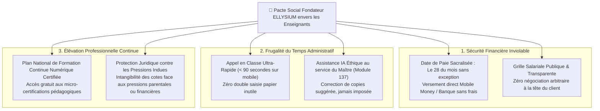

# Module 248 — Conformité avec la Constitution (Engagements envers les Enseignants, Transparence)

> **Positionnement :** Tome 14 — Organisation, Gouvernance & Production · Module 248 sur 262
> **Autorité :** Conseil d'Éthique Institutionnel / Délégués des Enseignants ELLYSIUM
> **Liaison amont/aval :** ← Module 247 (Périmètre) → Module 249 (Organigramme fonctionnel) →

---

## 1. Objet

Ce module traduit les principes de justice sociale et de protection du corps professoral inscrits dans la Constitution ELLYSIUM en obligations contractuelles et managériales concrètes. Il érige la transparence des rémunérations, la régularité des versements salariaux et le respect de la liberté pédagogique de l'enseignant en principes cardinaux inviolables.

---

## 2. Le Pacte Républicain avec le Corps Enseignant

L'histoire éducative de la République Démocratique du Congo ayant été trop souvent marquée par la précarité des maîtres, les retards de salaires et la démotivation, ELLYSIUM instaure un **Pacte Social Solennel** opposable :

---

## 3. Matrice de Transparence Institutionnelle

En conformité avec l'**Article 8 de la Constitution** :
- **Transparence sur les Critères d'Évaluation des Enseignants** : La notation administrative des enseignants repose sur des critères objectifs et mesurables (assiduité, respect des programmes officiels, bienveillance pédagogique, retours d'élèves anonymisés).
- **Interdiction Formelle du Licenciement Arbitraire** : Tout motif de rupture conventionnelle ou de sanction disciplinaire fait obligatoirement l'objet d'une procédure contradictoire devant la Commission Paritaire (Module 260).
- **Publicité des Décisions Administratives** : Tous les arrêtés d'affectation, barèmes d'heures et PV d'arbitrage sont consultables dans le coffre-fort documentaire de l'établissement.

---

## 4. Protection de la Liberté Pédagogique et Préservation du Rôle de l'IA

Conformément à l'**Article 6 de la Constitution** :
- **L'Enseignant est le Seul Souverain de sa Classe** : Aucun algorithme de machine learning, aucun modèle Vertex AI ne peut imposer une note, réécrire un bulletin ou ordonner le redoublement d'un élève à la place du professeur titulaire.
- **Droit au Démenti d'une Recommandation Algorithmique** : Si l'IA signale un élève comme "en risque de décrochage" ou propose une note divergente, l'enseignant peut refuser la recommandation d'un simple clic motivé, sans justification administrative pesante.

---

## 5. Verrous Fonctionnels

| ID | Règle | Niveau |
|---|---|---|
| VF-248-01 | Obligation de paiement des salaires et primes le 28 de chaque mois civil | CONSTITUTIONNEL |
| VF-248-02 | L'enseignant conserve en toutes circonstances le pouvoir final d'évaluation | CONSTITUTIONNEL |
| VF-248-03 | Interdiction absolue de subordonner la rémunération d'un professeur au taux de réussite | ÉTHIQUE |
| VF-248-04 | Droit garanti à la formation continue numérique prise en charge à 100% | SOCIAL |
| VF-248-05 | Protection juridique intégrale de l'enseignant contre les pressions financières indues | INSTITUTIONNEL |
| VF-248-06 | Toute décision de gestion est revêtue d'un identifiant de traçabilité unique lié à l'acte signé | OBLIGATOIRE |

---

*Sous-tome rédigé conformément aux Normes documentaires ELLYSIUM — Fondations 04.*
