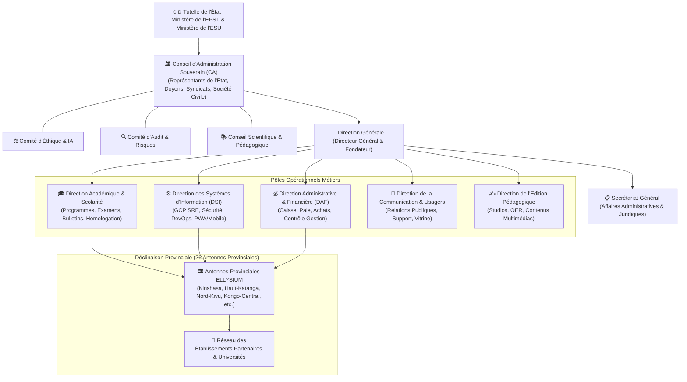

# Module 249 — Organigramme Fonctionnel — Conseil d'Administration, Direction et Comités

> **Positionnement :** Tome 14 — Organisation, Gouvernance & Production · Module 249 sur 262
> **Autorité :** Conseil d'Administration / Secrétaire Général ELLYSIUM
> **Liaison amont/aval :** ← Module 248 (Engagements enseignants) → Module 250 (Gouvernance tripartite) →

---

## 1. Objet

Ce module formalise l'organigramme institutionnel complet, la chaîne de commandement exécutif, les comités statutaires spécialisés et les liens hiérarchiques et fonctionnels qui structurent le Centre National d'Étude en Ligne ELLYSIUM sur le territoire national et dans ses représentations provinciales.

---

## 2. Organigramme Général de Commandement ELLYSIUM

---

## 3. Composition et Rôle des Comités Spécialisés

### 3.1 Le Comité d'Éthique et de Souveraineté de l'IA (CESIA)
- **Composition** : 7 membres indépendants (juristes, éthiciens, représentants des parents d'élèves, ingénieurs IA).
- **Missions** :
  - Audit annuel des algorithmes de recommandation Vertex AI.
  - Contrôle du respect absolu de l'Article 6 (Non-décisionnalité de l'IA).
  - Examen des plaintes relatives à d'éventuels biais algorithmiques de genre ou régionaux.

### 3.2 Le Conseil Scientifique et Pédagogique National (CSPN)
- **Composition** : Professeurs d'université émérites, inspecteurs généraux de l'EPST, didacticiens nationaux.
- **Missions** :
  - Validation scientifique des programmes de cours (Tome 5).
  - Agrément des banques d'items d'examen TENASOSP et EXETAT (Tome 10).
  - Évolution des maquettes de diplômes en régime LMD.

---

## 4. Attributions de la Direction Générale et Séparation des Pouvoirs

Pour éviter la concentration des pouvoirs et garantir l'impartialité républicaine :
- Le **Directeur Général** n'a aucun pouvoir individuel de modification d'une cote d'examen ou d'un bulletin scellé.
- Le **Directeur Administratif et Financier (DAF)** ne peut pas ordonner le blocage d'un dossier scolaire pour arriéré de paiement.
- Le **Directeur des Systèmes d'Information (DSI)** n'a aucun accès direct aux données en clair sans mandat formalisé du DPO.

---

## 5. Les Antennes Provinciales ELLYSIUM

Dans chacune des 26 provinces de la RDC :
- Une antenne provinciale est dirigée par un **Délégué Provincial ELLYSIUM**.
- Elle assure le lien de proximité avec la Direction Provinciale de l'Éducation (**DIPROMAT**), les gouvernorats et les comités provinciaux de parents.
- Elle supervise le bon fonctionnement des serveurs relais locaux (**CNELE Local Box**) dans les territoires ruraux enclavés.

---

## 6. Verrous Fonctionnels

| ID | Règle | Niveau |
|---|---|---|
| VF-249-01 | Organigramme soumis à l'approbation conjointe des Ministères EPST et ESU | LÉGAL |
| VF-249-02 | Indépendance garantie des comités d'éthique et d'audit vis-à-vis de la direction | CONSTITUTIONNEL |
| VF-249-03 | Impossibilité pour la direction générale de modifier unilatéralement un résultat de jury | CONSTITUTIONNEL |
| VF-249-04 | Représentation obligatoire des 26 provinces au sein du conseil consultatif | SOUVERAINETÉ |
| VF-249-05 | Parité homme-femme activement promue dans la composition des comités et directions | INCLUSION |

---

*Sous-tome rédigé conformément aux Normes documentaires ELLYSIUM — Fondations 04.*
