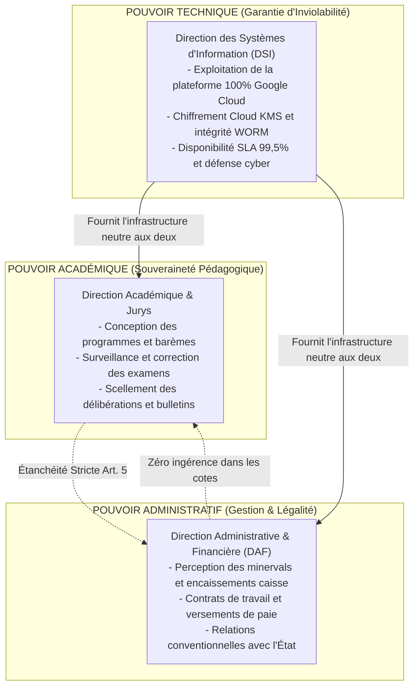

# Module 250 — Gouvernance Académique, Technique et Administrative (Rôles Distincts)

> **Positionnement :** Tome 14 — Organisation, Gouvernance & Production · Module 250 sur 262
> **Autorité :** Secrétaire Général ELLYSIUM / Comité d'Organisation Institutionnelle
> **Liaison amont/aval :** ← Module 249 (Organigramme) → Module 251 (Rôles académiques clés) →

---

## 1. Objet

Ce module formalise le principe cardinal de **séparation tripartite des pouvoirs** au sein d'ELLYSIUM : le pouvoir académique (pédagogie et examens), le pouvoir technique (infrastructure Google Cloud et algorithmes) et le pouvoir administratif (finances, ressources humaines et partenariats). Cette étanchéité institutionnelle prévient tout abus d'autorité et garantit la neutralité du service public souverain.

---

## 2. Le Triptyque des Pouvoirs Institutionnels

---

## 3. Matrice d'Incompatibilité et d'Étanchéité Opérationnelle

Pour rendre cette séparation inviolable dans le code et les processus :

| Action Critique | Autorité Décisionnaire | Avis Requis | Contrôle Technique Bloquant |
|---|---|---|---|
| **Scellement d'un Bulletin** | Préfet des Études / Doyen | Jury de Délibération | Impossible pour le DAF ou le DSI d'exécuter la signature KMS |
| **Encaissement de Minerval** | Caissier Établissement | DAF Établissement | Totalement invisible pour les enseignants et inspecteurs (Art. 5) |
| **Modification de Code Source** | Équipe Ingénierie DSI | Revue de Code Pairs | Bloquée si elle tente d'altérer la formule constitutionnelle du taux |
| **Radiation d'un Élève** | Conseil de Discipline | Commission Contentieux | Exige le double visa Direction Académique + DAF |

---

## 4. Règles d'Arbitrage Inter-Pôles

En cas de friction ou de divergence entre les pôles :
1. **Priorité Hiérarchique de l'Académique** : Si une contrainte administrative ou financière entre en conflit avec une obligation pédagogique (ex: retard de paiement vs droit de passer un examen), l'autorité académique prévaut de plein droit. L'enfant passe son examen.
2. **Priorité de la Sécurité sur l'Urgence Métier** : Si le pôle technique ou le RSSI détecte une vulnérabilité de sécurité critique ou une rupture d'intégrité, il dispose du droit de veto technique immédiat pour suspendre la fonctionnalité compromise.

---

## 5. Verrous Fonctionnels

| ID | Règle | Niveau |
|---|---|---|
| VF-250-01 | Séparation tripartite stricte : aucun individu ne peut cumuler des rôles dans deux pôles | CONSTITUTIONNEL |
| VF-250-02 | Le pôle administratif ne dispose d'aucun levier de blocage pédagogique (Art. 5) | CONSTITUTIONNEL |
| VF-250-03 | Le pôle technique ne peut jamais modifier de cote ou de bulletin en base de données | SOUVERAINETÉ |
| VF-250-04 | Droit de veto sécuritaire accordé au RSSI en cas de faille compromise avérée | SÉCURITÉ |
| VF-250-05 | Enregistrement de tout arbitrage inter-pôles dans le registre d'audit institutionnel | TRANSPARENCE |

---

*Sous-tome rédigé conformément aux Normes documentaires ELLYSIUM — Fondations 04.*
