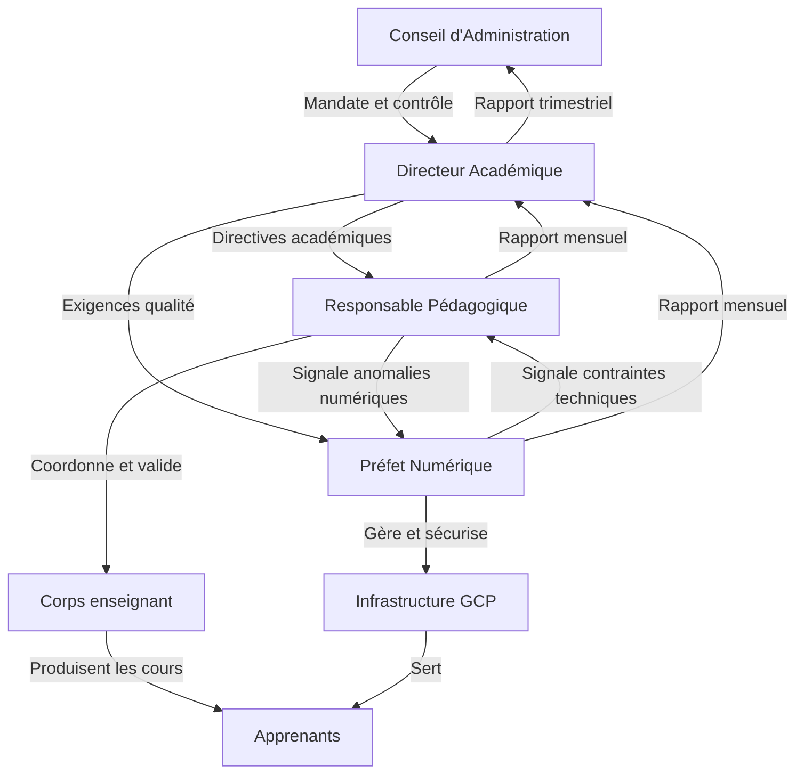
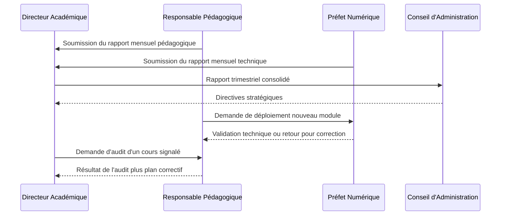

# Module 251 — Rôle du directeur académique, du responsable pédagogique et du préfet numérique

> **Positionnement :** Tome 14 — Organisation, Gouvernance Opérationnelle, RH et Production des Contenus
> Module 5 sur 16 | Référence : ELLYSIUM-T14-M251
> **Autorité :** Direction générale ELLYSIUM
> **Liaison amont :** Module 250 — Gouvernance tripartite
> **Liaison aval :** Module 252 — Directeurs d'établissements partenaires

---

## 1. Objet

Ce module définit avec précision les responsabilités, les périmètres d'action, les pouvoirs de décision et les obligations de reddition de comptes des trois postes de direction de premier niveau dans la chaîne de commandement pédagogique et numérique d'ELLYSIUM.

Ces trois fonctions forment le **triangle de direction opérationnelle** : l'une pilote la qualité académique globale, l'autre garantit la cohérence pédagogique quotidienne, la troisième assure l'intégrité du dispositif numérique. Leurs rôles sont complémentaires, distincts et soumis à des mécanismes de contrôle croisé conformément à la Constitution ELLYSIUM.

---

## 2. Directeur Académique (DA)

### 2.1 Mission générale

Le Directeur Académique est la plus haute autorité intellectuelle de la plateforme ELLYSIUM. Il répond directement devant le Conseil d'Administration (CA) de la qualité de l'offre de formation dans son ensemble.

### 2.2 Responsabilités

| Domaine | Responsabilité détaillée |
|---|---|
| **Offre de formation** | Valider les référentiels de compétences, les programmes par filière, les crédits ECTS/équivalents |
| **Qualité académique** | Présider le Comité Pédagogique Supérieur (CPS) ; approuver les examens finaux |
| **Relations institutionnelles** | Représenter ELLYSIUM auprès des ministères (EPST, ESU), du CAMES et des universités partenaires |
| **Recrutement enseignants** | Co-signer tout contrat de recrutement d'enseignant ; valider les grilles de rémunération |
| **Reporting** | Présenter un rapport académique trimestriel au CA |
| **Veille** | Assurer la veille sur les évolutions des curricula nationaux et des standards internationaux |

### 2.3 Pouvoirs et limites

- **Peut :** suspendre une filière pour cause de non-conformité académique ; bloquer la publication d'un contenu non validé scientifiquement.
- **Ne peut pas :** modifier les conditions financières des apprenants (Article 5 de la Constitution) ; intervenir dans les décisions techniques de l'infrastructure cloud.

---

## 3. Responsable Pédagogique (RP)

### 3.1 Mission générale

Le Responsable Pédagogique est le chef d'orchestre de l'expérience d'apprentissage au quotidien. Il veille à ce que chaque séquence pédagogique produite soit conforme aux standards didactiques d'ELLYSIUM et réponde aux besoins concrets des apprenants.

### 3.2 Responsabilités

| Domaine | Responsabilité détaillée |
|---|---|
| **Ingénierie pédagogique** | Concevoir et maintenir les gabarits de cours, séquences, évaluations formatives |
| **Supervision éditoriale** | Coordonner la chaîne éditoriale (rédaction → relecture → validation → publication) |
| **Suivi des enseignants** | Animer les réunions pédagogiques hebdomadaires ; valider les plans de cours soumis |
| **Analyse des données** | Exploiter les tableaux de bord BigQuery/Looker Studio pour détecter les cours à faible engagement |
| **Formation continue** | Organiser les sessions de perfectionnement pédagogique pour les enseignants |
| **Reporting** | Soumettre un rapport mensuel au Directeur Académique |

### 3.3 Pouvoirs et limites

- **Peut :** retourner un cours à l'enseignant pour révision ; recommander le non-renouvellement d'un contrat enseignant ; déclencher une médiation (cf. Module 254).
- **Ne peut pas :** décider seul d'un licenciement ; modifier un référentiel de filière sans accord du DA.

---

## 4. Préfet Numérique (PN)

### 4.1 Mission générale

Le Préfet Numérique est le garant de la disponibilité, de la sécurité et de la performance du dispositif technologique ELLYSIUM. Il est l'interface entre la pédagogie et l'infrastructure Google Cloud Platform.

### 4.2 Responsabilités

| Domaine | Responsabilité détaillée |
|---|---|
| **Disponibilité plateforme** | Garantir un SLA ≥ 99,5 % ; piloter les astreintes Cloud Run / GKE Autopilot |
| **Sécurité des données** | Superviser Cloud KMS, IAM, Cloud Armor ; déclencher les procédures d'incident |
| **Environnement numérique** | Gérer les licences Firebase, les quotas GCP, les clés API Vertex AI |
| **Support utilisateurs** | Superviser le helpdesk de niveau 2 (escalade depuis le support de niveau 1) |
| **Conformité RGPD/données** | S'assurer que toute donnée apprenant est traitée conformément aux politiques de confidentialité |
| **Reporting** | Soumettre un rapport mensuel de disponibilité et d'incidents à la Direction générale |

### 4.3 Pouvoirs et limites

- **Peut :** déclencher une coupure d'urgence d'un service défaillant ; refuser le déploiement d'une mise à jour non testée ; activer le mode dégradé.
- **Ne peut pas :** accéder aux contenus pédagogiques en dehors des besoins techniques ; modifier les résultats d'examens (séparation des droits garantie par IAM).

---

## 5. Diagramme de Flux Décisionnel entre les Trois Postes



---

## 6. Interactions Réciproques et Mécanismes de Contrôle Croisé



---

## 7. Fiche de Poste — Format Synthétique

| Attribut | Directeur Académique | Responsable Pédagogique | Préfet Numérique |
|---|---|---|---|
| **Hiérarchie** | Dépend du CA | Dépend du DA | Dépend de la Direction Générale |
| **Profil requis** | Doctorat + 10 ans d'enseignement | Master + 5 ans d'ingénierie pédagogique | Master Ingénierie + certifications GCP |
| **Périmètre principal** | Qualité intellectuelle | Qualité didactique | Qualité technique |
| **KPI principal** | Taux de réussite global | Taux d'engagement cours | Disponibilité plateforme SLA |
| **Fréquence reporting** | Trimestriel vers CA | Mensuel vers DA | Mensuel vers DG + DA |
| **Droit de veto** | Contenus non conformes | Plans de cours non valides | Déploiements non sécurisés |

---

## 8. Implémentation dans le Système d'Information

```go
// ellysium/governance/roles.go
package governance

// DirectionRole représente un rôle de direction opérationnelle
type DirectionRole string

const (
    RoleDirecteurAcademique    DirectionRole = "DA"
    RoleResponsablePedagogique DirectionRole = "RP"
    RolePrefetNumerique        DirectionRole = "PN"
)

// DirecteurOperationnel contient les attributs d'un dirigeant
type DirecteurOperationnel struct {
    ID                string        `json:"id"`
    Nom               string        `json:"nom"`
    Role              DirectionRole `json:"role"`
    Email             string        `json:"email"`
    DatePriseFonction string        `json:"date_prise_fonction"`
    Actif             bool          `json:"actif"`
}

// PeutPublierContenu vérifie si le rôle a le droit de valider une publication
func PeutPublierContenu(role DirectionRole) bool {
    return role == RoleDirecteurAcademique || role == RoleResponsablePedagogique
}

// PeutDeclencherIncidentGCP vérifie si le rôle peut déclencher une alerte cloud
func PeutDeclencherIncidentGCP(role DirectionRole) bool {
    return role == RolePrefetNumerique
}
```

---

## 9. Verrous Fonctionnels

| ID | Règle | Niveau |
|---|---|---|
| VF-251-01 | Toute validation de contenu doit porter la signature électronique du DA **et** du RP avant publication | CRITIQUE |
| VF-251-02 | Le PN ne peut accéder aux données pédagogiques qu'en lecture seule et via des rôles IAM nominatifs | CRITIQUE |
| VF-251-03 | Les KPI des trois directeurs sont mesurés et publiés dans le tableau de bord CA chaque trimestre | OBLIGATOIRE |
| VF-251-04 | Toute modification de périmètre d'un poste doit être approuvée par le CA et archivée dans Cloud Storage | OBLIGATOIRE |
| VF-251-05 | En cas de vacance d'un poste, un intérimaire nommé par le CA prend les fonctions sous 72 heures maximum | CRITIQUE |
| VF-251-06 | Toute décision de gestion est revêtue d'un identifiant de traçabilité unique lié à l'acte signé | OBLIGATOIRE |

---

*Sous-tome rédigé conformément aux Normes documentaires ELLYSIUM — Fondations 04.*
