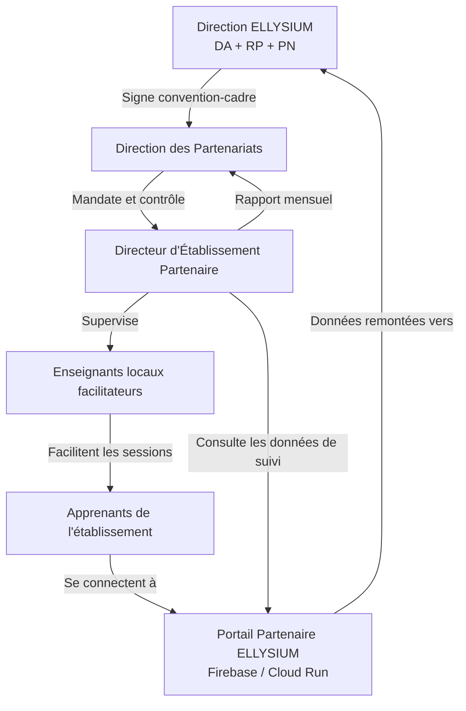
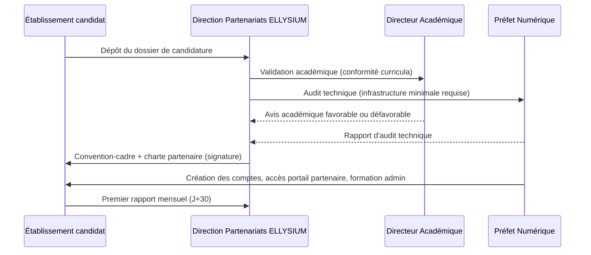

# Module 252 — Rôle des directeurs d'établissements partenaires

> **Positionnement :** Tome 14 — Organisation, Gouvernance Opérationnelle, RH et Production des Contenus
> Module 6 sur 16 | Référence : ELLYSIUM-T14-M252
> **Autorité :** Direction générale ELLYSIUM / Direction des Partenariats
> **Liaison amont :** Module 251 — Directeur académique, responsable pédagogique, préfet numérique
> **Liaison aval :** Module 253 — Gestion intégrée des enseignants

---

## 1. Objet

ELLYSIUM est une plateforme hybride : ses contenus sont produits centralement, mais leur mise en œuvre pédagogique peut s'effectuer à travers un réseau d'établissements physiques partenaires (écoles secondaires, instituts supérieurs, centres de formation professionnelle, cybercentres).

Ce module définit le rôle, les obligations, les droits et la relation contractuelle des **directeurs d'établissements partenaires (DEP)**, qui sont les représentants locaux d'ELLYSIUM dans leurs institutions respectives.

---

## 2. Définition et Catégories d'Établissements Partenaires

| Catégorie | Description | Exemples |
|---|---|---|
| **Établissement Partenaire Primaire (EPP)** | Intègre ELLYSIUM dans son programme officiel ; délivre des attestations co-signées | Instituts techniques et commerciaux |
| **Établissement Partenaire Secondaire (EPS)** | Utilise ELLYSIUM comme ressource complémentaire | Lycées, centres d'excellence |
| **Centre d'Accès Numérique (CAN)** | Fournit l'infrastructure physique sans programme formel intégré | Cybercentres, bibliothèques |
| **Antenne Communautaire (AC)** | Point d'accès décentralisé dans des zones à faible connectivité | Paroisses, maisons de quartier |

---

## 3. Rôle et Responsabilités du Directeur d'Établissement Partenaire

### 3.1 Rôle principal

Le DEP est le **garant local de la qualité de déploiement** d'ELLYSIUM dans son établissement. Il ne produit pas de contenus — il organise les conditions d'accès, de suivi et d'évaluation locale des apprenants.

### 3.2 Responsabilités opérationnelles

| Domaine | Responsabilité détaillée |
|---|---|
| **Accès et logistique** | Assurer l'accès aux équipements (ordinateurs, tablettes, connexion internet ou offline) |
| **Organisation des sessions** | Planifier les plages horaires d'utilisation d'ELLYSIUM dans l'établissement |
| **Suivi des apprenants** | Consulter les tableaux de bord de progression des apprenants via le portail partenaire |
| **Encadrement enseignant** | Superviser les enseignants locaux qui facilitent les sessions ELLYSIUM |
| **Remontée d'information** | Signaler les incidents, les besoins de formation et les retours d'expérience à ELLYSIUM |
| **Conformité contractuelle** | Respecter la charte partenaire : pas de revente de comptes, pas de restriction d'accès basée sur les frais |
| **Reporting** | Soumettre un rapport mensuel d'activité via le tableau de bord partenaire |

---

## 4. Ce que le DEP ne peut pas faire

La Constitution ELLYSIUM impose des limites absolues que le DEP doit contractuellement respecter :

| Interdiction | Base constitutionnelle |
|---|---|
| Bloquer l'accès d'un apprenant pour non-paiement de frais de scolarité locaux | Article 5 — Séparation caisse/pédagogie |
| Modifier les contenus, évaluations ou résultats hébergés sur ELLYSIUM | Intégrité académique |
| Utiliser les données des apprenants à des fins commerciales locales | RGPD / politique de confidentialité |
| Recruter des enseignants ELLYSIUM en dehors du cadre contractuel central | Contrat-type ELLYSIUM (Module 253) |
| Substituer des évaluations locales aux examens ELLYSIUM certifiants | Normes de certification |

---

## 5. Relation Contractuelle et Flux d'Autorité



---

## 6. Processus d'Onboarding d'un Établissement Partenaire



---

## 7. Infrastructure Minimale Requise pour un Établissement Partenaire

| Critère | Seuil minimal | Seuil recommandé |
|---|---|---|
| Nombre d'ordinateurs/tablettes | 5 appareils | 20 appareils |
| Connexion internet | 2 Mbps (débit réel) | 10 Mbps fibre |
| Mode offline | Modules offline obligatoires préchargés | Cache complet |
| Alimentation électrique | Groupe électrogène ou onduleur | Solaire + batterie |
| Espace dédié | 1 salle fermée | Salle informatique dédiée |

---

## 8. Indicateurs de Performance du Partenariat

| KPI | Formule | Cible |
|---|---|---|
| Taux d'utilisation | Sessions réalisées / Sessions planifiées | >= 80 % |
| Taux de progression apprenants | Modules complétés / Modules inscrits | >= 70 % |
| Incidents signalés | Incidents remontés dans les délais | 100 % dans les 48h |
| Satisfaction apprenants | Score NPS collecté trimestriellement | >= 40 |
| Conformité contractuelle | Zéro infraction à la charte | 100 % |

---

## 9. Sanctions et Résiliation

| Niveau | Manquement | Conséquence |
|---|---|---|
| **Avertissement** | KPI en deçà des seuils 1 mois | Lettre formelle + plan de redressement |
| **Mise sous surveillance** | KPI insuffisants 3 mois consécutifs | Audit terrain + suspension temporaire |
| **Résiliation** | Infraction à la charte (blocage d'apprenants pour impayés) | Résiliation immédiate + retrait des accès |

---

## 10. Extrait SQL — Table des Établissements Partenaires

```sql
-- Schéma Cloud SQL PostgreSQL 16
CREATE TABLE etablissements_partenaires (
    id                  UUID PRIMARY KEY DEFAULT gen_random_uuid(),
    nom                 VARCHAR(200) NOT NULL,
    categorie           VARCHAR(50) CHECK (categorie IN ('EPP', 'EPS', 'CAN', 'AC')),
    directeur_nom       VARCHAR(150) NOT NULL,
    directeur_email     VARCHAR(200) UNIQUE NOT NULL,
    province            VARCHAR(100),
    date_convention     DATE NOT NULL,
    date_fin_convention DATE,
    statut              VARCHAR(20) DEFAULT 'ACTIF'
                        CHECK (statut IN ('ACTIF', 'SUSPENDU', 'RESILIE')),
    nb_apprenants       INTEGER DEFAULT 0,
    nb_equipements      INTEGER DEFAULT 0,
    score_nps_last      NUMERIC(5,2),
    created_at          TIMESTAMPTZ DEFAULT NOW(),
    updated_at          TIMESTAMPTZ DEFAULT NOW()
);

CREATE INDEX idx_ep_statut   ON etablissements_partenaires(statut);
CREATE INDEX idx_ep_province ON etablissements_partenaires(province);
```

---

## 11. Verrous Fonctionnels

| ID | Règle | Niveau |
|---|---|---|
| VF-252-01 | Aucun établissement ne peut être activé sans convention signée et audit technique validé par le PN | CRITIQUE |
| VF-252-02 | Le portail partenaire ne doit jamais exposer les données financières individuelles des apprenants au DEP | CRITIQUE |
| VF-252-03 | Tout blocage d'accès apprenant détecté déclenche une résiliation automatique après enquête contradictoire | CRITIQUE |
| VF-252-04 | Les KPI sont calculés automatiquement depuis BigQuery et publiés sans intervention manuelle du DEP | OBLIGATOIRE |
| VF-252-05 | La convention-cadre est révisée annuellement et co-signée ; l'absence de renouvellement entraîne la suspension automatique | OBLIGATOIRE |
| VF-252-06 | Toute décision de gestion est revêtue d'un identifiant de traçabilité unique lié à l'acte signé | OBLIGATOIRE |

---

*Sous-tome rédigé conformément aux Normes documentaires ELLYSIUM — Fondations 04.*
