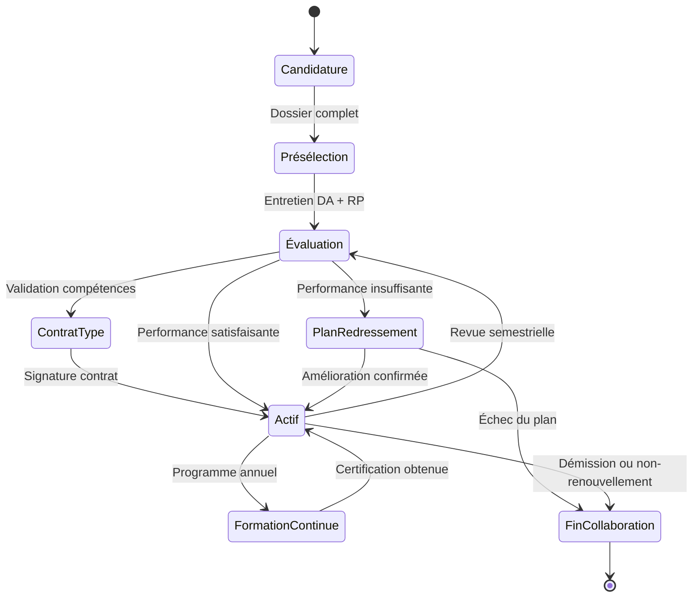
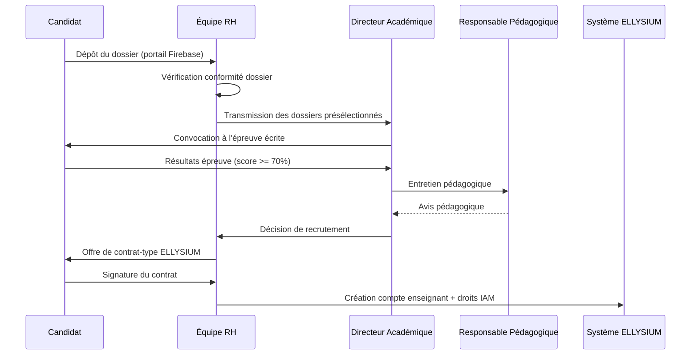
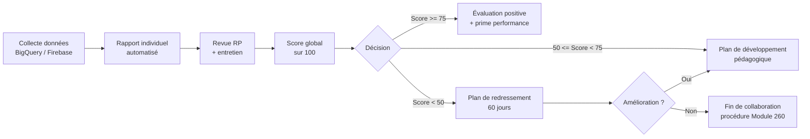

# Module 253 — Gestion intégrée des enseignants : recrutement, contrat-type, rémunération, évaluation, formation continue

> **Positionnement :** Tome 14 — Organisation, Gouvernance Opérationnelle, RH et Production des Contenus
> Module 7 sur 16 | Référence : ELLYSIUM-T14-M253
> **Autorité :** Direction des Ressources Humaines / Directeur Académique
> **Liaison amont :** Module 252 — Directeurs d'établissements partenaires
> **Liaison aval :** Module 254 — Gestion des conflits enseignant/IA

---

## 1. Objet

Les enseignants constituent le capital humain fondateur d'ELLYSIUM. Sans eux, aucun contenu de qualité ne peut exister. Ce module couvre l'intégralité du cycle de vie professionnel de l'enseignant dans la plateforme, depuis le recrutement jusqu'à la retraite ou la fin de collaboration, en passant par la contractualisation, la rémunération équitable, l'évaluation objective et le développement continu des compétences.

Ce module est délibérément **fusionné** (comme indiqué dans le sommaire) pour assurer la cohérence systémique de la gestion RH enseignante, évitant les contradictions entre sous-politiques isolées.

---

## 2. Cycle de Vie de l'Enseignant ELLYSIUM



---

## 3. Processus de Recrutement

### 3.1 Critères d'admissibilité

| Critère | Niveau secondaire | Niveau supérieur |
|---|---|---|
| Diplôme minimum | Licence + CAPES ou équivalent | Master + 3 ans d'enseignement supérieur |
| Maîtrise disciplinaire | Épreuve écrite (score >= 70 %) | Épreuve écrite + présentation d'un module de cours |
| Aisance numérique | Utilisation des outils LMS | Conception de contenus multimédias |
| Langue de travail | Français courant | Français + anglais professionnel |
| Vérification des antécédents | Casier judiciaire vierge | Casier judiciaire vierge + références académiques |

### 3.2 Étapes du processus



---

## 4. Contrat-Type ELLYSIUM

### 4.1 Types de contrats

| Type | Durée | Conditions | Renouvellement |
|---|---|---|---|
| **Essai pédagogique** | 3 mois | Premier engagement | Conversion si évaluation positive |
| **Prestation de service** | Par module produit | Freelance / expert ponctuel | Par commande |
| **CDI pédagogique** | Indéterminée | Après 1 an d'essai positif | Automatique sauf résiliation |
| **Convention de collaboration** | 1 an renouvelable | Enseignants partenaires institutionnels | Revue annuelle |

### 4.2 Clauses fondamentales du contrat-type

Tout contrat enseignant ELLYSIUM doit impérativement contenir :
- **Clause de propriété intellectuelle :** Les contenus produits appartiennent à ELLYSIUM sous licence définie au Module 258, avec rémunération de cession clairement établie.
- **Clause de confidentialité :** Toute donnée apprenant traitée est strictement confidentielle.
- **Clause de déontologie :** Engagement au respect du code de conduite (Module 260).
- **Clause de non-concurrence :** Durée et périmètre définis par filière (négociable).
- **Clause de disponibilité :** Engagement de réponse aux apprenants dans les 48h ouvrables.

---

## 5. Grille de Rémunération

### 5.1 Modèle de rémunération hybride

ELLYSIUM adopte un modèle combinant une rémunération fixe garantissant la dignité et une composante variable récompensant la performance.

| Composante | Calcul | Poids |
|---|---|---|
| **Forfait de production** | Par module complet livré et validé | 40 % |
| **Redevance d'engagement** | Prorata du temps de réponse aux apprenants | 20 % |
| **Prime de performance** | Basée sur le taux de réussite aux évaluations du cours | 25 % |
| **Prime d'ancienneté** | +5 % par année de collaboration continue | 15 % |

### 5.2 Règles salariales constitutionnelles

- **Interdiction formelle** d'une rémunération conditionnée au recouvrement des frais des apprenants (Article 5).
- La rémunération minimale garantie ne peut descendre en dessous du seuil de dignité fixé par le CA annuellement.
- Les grilles sont révisées chaque année lors de l'assemblée générale du corps enseignant.

---

## 6. Évaluation des Enseignants

### 6.1 Indicateurs clés d'évaluation

| KPI | Source des données | Fréquence | Poids |
|---|---|---|---|
| Taux de complétion des cours | BigQuery / tableau de bord | Mensuel | 30 % |
| Score de satisfaction apprenants | Enquête NPS post-module | Par module | 25 % |
| Délai de réponse aux apprenants | Logs Firebase Messaging | Continu | 20 % |
| Qualité des évaluations produites | Revue RP | Semestriel | 15 % |
| Respect des délais de livraison | Système de gestion éditoriale | Par livraison | 10 % |

### 6.2 Processus de revue semestrielle



---

## 7. Programme de Formation Continue

### 7.1 Catalogue de formation interne ELLYSIUM

| Module de formation | Fréquence | Public cible | Durée |
|---|---|---|---|
| Ingénierie pédagogique numérique | Annuel | Tous enseignants | 16h |
| Techniques d'évaluation formative | Semestriel | Enseignants < 2 ans | 8h |
| Utilisation avancée des outils IA | Trimestriel | Tous | 4h |
| Production vidéo pédagogique | Annuel | Producteurs de contenus | 12h |
| Déontologie et gestion des conflits | Annuel | Tous | 4h |

### 7.2 Règle constitutionnelle sur la formation

Conformément à la Constitution ELLYSIUM, tout enseignant a **droit** à la formation continue sans que cela n'implique de frais à sa charge. La participation aux formations obligatoires est rémunérée au taux horaire de base.

---

## 8. Extrait SQL — Table Enseignants

```sql
-- Cloud SQL PostgreSQL 16
CREATE TABLE enseignants (
    id                  UUID PRIMARY KEY DEFAULT gen_random_uuid(),
    nom                 VARCHAR(150) NOT NULL,
    prenom              VARCHAR(150) NOT NULL,
    email               VARCHAR(200) UNIQUE NOT NULL,
    type_contrat        VARCHAR(30) CHECK (type_contrat IN
                        ('ESSAI', 'PRESTATION', 'CDI', 'CONVENTION')),
    filiere_principale  VARCHAR(100),
    date_debut_contrat  DATE NOT NULL,
    date_fin_contrat    DATE,
    remuneration_base   NUMERIC(12,2),
    statut              VARCHAR(20) DEFAULT 'ACTIF'
                        CHECK (statut IN ('ACTIF', 'SUSPENDU', 'INACTIF')),
    score_eval_last     NUMERIC(5,2),
    annees_anciennete   INTEGER DEFAULT 0,
    created_at          TIMESTAMPTZ DEFAULT NOW(),
    updated_at          TIMESTAMPTZ DEFAULT NOW()
);

CREATE INDEX idx_ens_statut  ON enseignants(statut);
CREATE INDEX idx_ens_filiere ON enseignants(filiere_principale);
CREATE INDEX idx_ens_contrat ON enseignants(type_contrat);
```

---

## 9. Verrous Fonctionnels

| ID | Règle | Niveau |
|---|---|---|
| VF-253-01 | Aucun contrat enseignant ne peut être signé sans la co-signature du DA et de la Direction RH | CRITIQUE |
| VF-253-02 | La rémunération d'un enseignant ne peut en aucun cas dépendre du recouvrement de frais auprès des apprenants | CRITIQUE |
| VF-253-03 | Tout licenciement doit suivre la procédure disciplinaire définie au Module 260, avec avis du DA | CRITIQUE |
| VF-253-04 | Le score d'évaluation est calculé automatiquement par le système ; aucun directeur ne peut le modifier manuellement | OBLIGATOIRE |
| VF-253-05 | Les formations obligatoires doivent être complétées dans les 30 jours suivant la convocation, sous peine de suspension temporaire | OBLIGATOIRE |

---

*Sous-tome rédigé conformément aux Normes documentaires ELLYSIUM — Fondations 04.*
