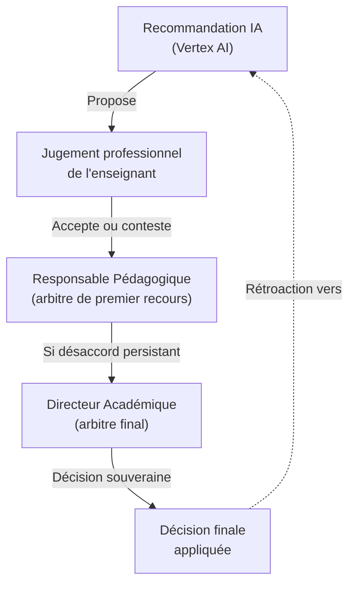
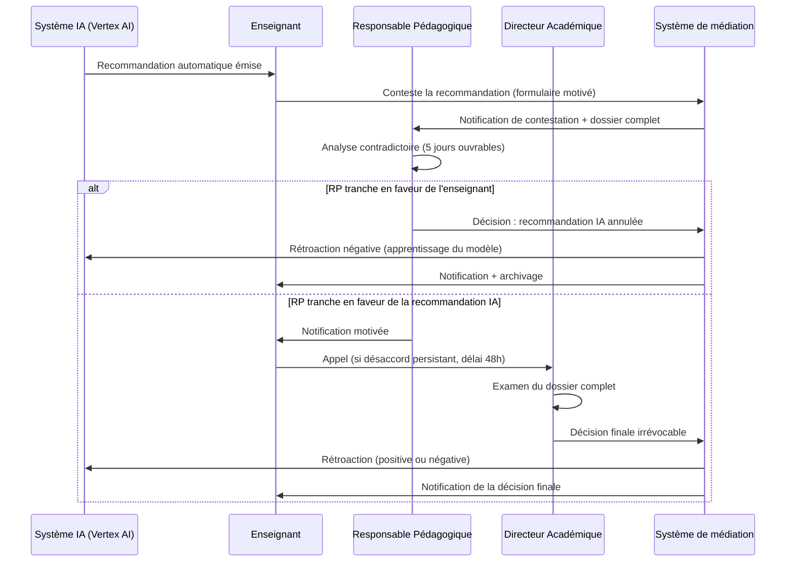
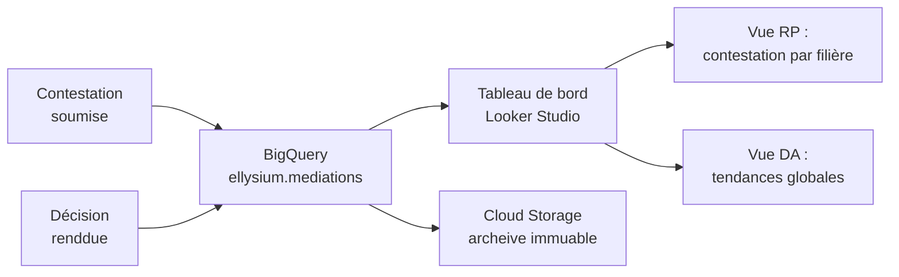

# Module 254 — Gestion des conflits entre enseignant et recommandation IA — médiation

> **Positionnement :** Tome 14 — Organisation, Gouvernance Opérationnelle, RH et Production des Contenus
> Module 8 sur 16 | Référence : ELLYSIUM-T14-M254
> **Autorité :** Responsable Pédagogique / Comité de Médiation
> **Liaison amont :** Module 253 — Gestion intégrée des enseignants
> **Liaison aval :** Module 255 — Chaîne éditoriale : rédaction et validation pédagogique

---

## 1. Objet

ELLYSIUM intègre des systèmes d'intelligence artificielle (Vertex AI) pour générer des recommandations pédagogiques : suggestions de parcours, signalements de contenus peu efficaces, propositions d'adaptation du rythme ou du niveau. Ces recommandations peuvent entrer en tension avec le jugement professionnel des enseignants.

Ce module établit la **doctrine de résolution de ces tensions**, en conformité avec l'Article 6 de la Constitution ELLYSIUM qui stipule que *l'IA est purement auxiliaire et qu'un humain a toujours le dernier mot*.

Il définit également la procédure de médiation applicable en cas de désaccord persistant.

---

## 2. Principes Fondamentaux

### 2.1 Hiérarchie des décisions (Article 6 de la Constitution)



> **Principe absolu :** Une recommandation IA ne peut jamais s'imposer à un enseignant sans validation humaine. L'IA propose, l'humain dispose.

### 2.2 Catégories de recommandations IA susceptibles de générer un conflit

| Type de recommandation | Exemple | Risque de conflit |
|---|---|---|
| **Contenu** | "Ce cours a un faible engagement, le réviser" | Moyen |
| **Parcours** | "Réorienter cet apprenant vers un niveau inférieur" | Élevé |
| **Évaluation** | "La difficulté de cet examen est inadaptée" | Élevé |
| **Rythme** | "Accélérer le séquençage de ce module" | Faible |
| **Suppression** | "Ce contenu est redondant avec le Module X" | Très élevé |

---

## 3. Processus de Gestion d'un Désaccord Enseignant/IA



---

## 4. Comité de Médiation Pédagogique

### 4.1 Composition

Le Comité de Médiation Pédagogique (CMP) est convoqué pour les cas complexes ou récurrents :

| Membre | Rôle | Pouvoir de vote |
|---|---|---|
| Responsable Pédagogique | Président du comité | Voix prépondérante |
| Directeur Académique | Garant académique | Oui |
| Enseignant référent de la filière | Pair expert | Oui |
| Représentant des apprenants | Voix des bénéficiaires | Consultatif |
| Préfet Numérique | Garant technique de la recommandation IA | Consultatif |

### 4.2 Saisine du CMP

Le CMP est saisi lorsque :
- La même recommandation IA génère trois contestations en 6 mois (dysfonctionnement probable du modèle).
- Un enseignant conteste une décision du RP en appel.
- Une recommandation IA provoque un impact mesurable négatif sur les résultats des apprenants.

---

## 5. Protocole de Rétroaction vers l'IA

Chaque décision de médiation constitue un signal d'apprentissage pour améliorer le modèle Vertex AI.

```python
# ellysium/ai/feedback.py
from google.cloud import aiplatform
from dataclasses import dataclass
from enum import Enum

class FeedbackType(Enum):
    POSITIVE = "positive"
    NEGATIVE = "negative"
    NEUTRAL   = "neutral"

@dataclass
class MediationFeedback:
    recommendation_id: str
    decision: FeedbackType
    motif: str
    decided_by: str  # "RP" | "DA" | "CMP"

def enregistrer_retroaction(feedback: MediationFeedback) -> None:
    """
    Enregistre la décision humaine dans BigQuery pour rétroaction
    vers le pipeline d'amélioration du modèle Vertex AI.
    Aucune décision automatique n'est prise ; un ingénieur ML
    valide le lot de rétroactions lors de la revue mensuelle.
    """
    # Insertion dans BigQuery
    from google.cloud import bigquery
    client = bigquery.Client()
    table_id = "ellysium-prod.ai_feedback.mediations"
    row = {
        "recommendation_id": feedback.recommendation_id,
        "decision":           feedback.decision.value,
        "motif":              feedback.motif,
        "decided_by":         feedback.decided_by,
    }
    errors = client.insert_rows_json(table_id, [row])
    if errors:
        raise RuntimeError(f"Erreur insertion BigQuery : {errors}")
```

---

## 6. Journalisation et Traçabilité

Toute contestation, décision et rétroaction est enregistrée dans Cloud Storage et BigQuery :



---

## 7. Indicateurs de Santé du Système IA/Enseignant

| Indicateur | Formule | Seuil d'alerte |
|---|---|---|
| Taux de contestation des recs IA | Contestations / Total recommandations | > 20 % |
| Délai moyen de résolution | Jours entre contestation et décision | > 7 jours |
| Taux d'annulation des recs IA | Décisions en faveur de l'enseignant / Contestations | > 40 % (modèle à revoir) |
| Récidive enseignant | Contestations du même enseignant / 6 mois | > 5 (médiation RH) |
| Satisfaction post-médiation | Score NPS de l'enseignant post-décision | < 20 (alerte RH) |

---

## 8. Verrous Fonctionnels

| ID | Règle | Niveau |
|---|---|---|
| VF-254-01 | Aucune recommandation IA ne peut être appliquée automatiquement sans validation d'un enseignant ou d'un responsable humain | CRITIQUE |
| VF-254-02 | Toute contestation doit recevoir une réponse motivée dans un délai maximum de 7 jours ouvrables | CRITIQUE |
| VF-254-03 | La décision du DA est finale et irrévocable ; elle doit être archivée dans Cloud Storage avec un hash d'intégrité | CRITIQUE |
| VF-254-04 | Le taux de contestation > 20 % déclenche automatiquement une revue du modèle IA par l'équipe Data | OBLIGATOIRE |
| VF-254-05 | Les rétroactions vers le modèle IA ne peuvent être appliquées qu'après validation humaine lors de la revue mensuelle ML | CRITIQUE |

---

*Sous-tome rédigé conformément aux Normes documentaires ELLYSIUM — Fondations 04.*
