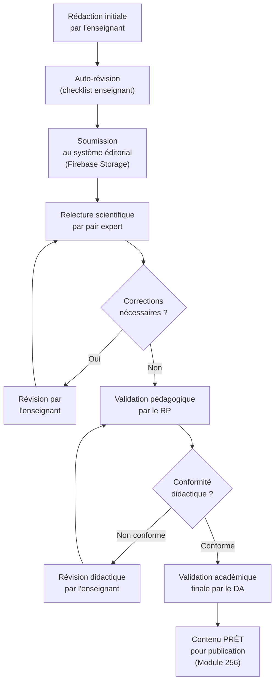

# Module 255 — Chaîne éditoriale : rédaction, relecture scientifique et validation pédagogique

> **Positionnement :** Tome 14 — Organisation, Gouvernance Opérationnelle, RH et Production des Contenus
> Module 9 sur 16 | Référence : ELLYSIUM-T14-M255
> **Autorité :** Responsable Pédagogique / Directeur Académique
> **Liaison amont :** Module 254 — Gestion des conflits IA/enseignant
> **Liaison aval :** Module 256 — Publication, versionnage et mise à jour des contenus

---

## 1. Objet

La chaîne éditoriale ELLYSIUM est le processus structuré et traçable par lequel un contenu brut produit par un enseignant devient un module pédagogique officiellement publié sur la plateforme. Ce processus garantit la qualité scientifique, la conformité didactique et la cohérence stylistique de l'ensemble du corpus ELLYSIUM.

Ce module couvre la première moitié de la chaîne : de la rédaction initiale jusqu'à la validation finale avant publication.

---

## 2. Vue d'ensemble de la Chaîne Éditoriale (Phase 1)



---

## 3. Phase 1 — Rédaction par l'Enseignant

### 3.1 Gabarit obligatoire d'un module de cours ELLYSIUM

Tout contenu de cours doit respecter la structure suivante :

| Section | Contenu attendu | Obligatoire |
|---|---|---|
| Titre et positionnement | Filière, niveau, module N sur total | Oui |
| Objectifs d'apprentissage | Au format SMART, verbes d'action | Oui |
| Prérequis | Liste des notions préalables | Oui |
| Corps du cours | Exposé structuré en sections numérotées | Oui |
| Exemples et illustrations | Minimum 2 exemples concrets par section | Oui |
| Exercices d'application | Minimum 5 exercices de niveaux progressifs | Oui |
| Évaluation formative | QCM ou questions ouvertes avec corrigé | Oui |
| Ressources complémentaires | Bibliographie, liens, vidéos suggérées | Recommandé |
| Glossaire | Définitions des termes clés | Oui si niveau avancé |

### 3.2 Checklist d'auto-révision (enseignant)

Avant toute soumission, l'enseignant doit valider :
- [ ] Le gabarit est respecté intégralement
- [ ] Les objectifs sont formulés avec des verbes d'action mesurables
- [ ] Aucune erreur factuelle détectée (vérification croisée avec au moins 2 sources)
- [ ] Le niveau de langue est adapté au public cible
- [ ] Les exemples sont contextualisés à la réalité congolaise/africaine quand pertinent
- [ ] Les exercices couvrent les niveaux de Bloom : mémorisation, compréhension, application

---

## 4. Phase 2 — Relecture Scientifique

### 4.1 Qui relecteur ?

La relecture scientifique est effectuée par un **pair expert** (enseignant de même filière, grade supérieur ou équivalent) désigné par le RP. Elle est systématique pour tout contenu avant validation pédagogique.

### 4.2 Grille de relecture scientifique

| Critère | Évaluation | Score (/5) |
|---|---|---|
| Exactitude factuelle | Toutes les assertions sont vérifiables et exactes | /5 |
| Actualité des références | Sources datant de moins de 5 ans (sauf classiques) | /5 |
| Profondeur disciplinaire | Le niveau de détail correspond au niveau cible | /5 |
| Cohérence interne | Absence de contradictions dans le contenu | /5 |
| Originalité pédagogique | Apport distinctif par rapport au curriculum officiel | /5 |

**Score minimum requis pour passer en validation pédagogique : 20/25**

### 4.3 Délais de relecture scientifique

| Taille du module | Délai maximum |
|---|---|
| < 10 pages | 5 jours ouvrables |
| 10–25 pages | 10 jours ouvrables |
| > 25 pages | 15 jours ouvrables |

---

## 5. Phase 3 — Validation Pédagogique

### 5.1 Rôle du Responsable Pédagogique

Le RP évalue la conformité didactique du contenu, indépendamment de son exactitude scientifique :

| Critère | Description | Pondération |
|---|---|---|
| Alignement avec les objectifs | Les exercices mesurent bien les objectifs déclarés | 30 % |
| Progressivité | La difficulté croît de manière logique | 20 % |
| Clarté pédagogique | Le contenu est compréhensible par le public cible | 25 % |
| Activités d'apprentissage | Variété et richesse des activités proposées | 15 % |
| Accessibilité | Utilisable en mode offline / faible bande passante | 10 % |

**Score minimum : 70/100**

### 5.2 Validation académique finale (DA)

Le Directeur Académique effectue une revue de dernier niveau, centrée sur :
- La conformité avec les référentiels nationaux (EPST/ESU) et internationaux.
- L'absence de contenus sensibles (politiques, religieux, discriminatoires).
- La cohérence avec l'offre globale de la filière.

Sa signature électronique est obligatoire pour toute publication.

---

## 6. Traçabilité dans le Système d'Information

```sql
-- Cloud SQL PostgreSQL 16 — Table workflow éditorial
CREATE TABLE workflow_editorial (
    id                  UUID PRIMARY KEY DEFAULT gen_random_uuid(),
    module_cours_id     UUID NOT NULL REFERENCES modules_cours(id),
    statut              VARCHAR(30) CHECK (statut IN (
                        'REDACTION', 'AUTO_REVISION', 'SOUMIS',
                        'RELECTURE_SCI', 'REVISION_SCI', 'VALIDATION_PED',
                        'REVISION_PED', 'VALIDATION_DA', 'PRET_PUBLICATION')),
    relecteur_id        UUID REFERENCES enseignants(id),
    score_scientifique  NUMERIC(4,2),
    score_pedagogique   NUMERIC(5,2),
    commentaires_rp     TEXT,
    commentaires_da     TEXT,
    date_soumission     TIMESTAMPTZ,
    date_validation_da  TIMESTAMPTZ,
    signature_da        VARCHAR(512),  -- hash signature électronique
    created_at          TIMESTAMPTZ DEFAULT NOW(),
    updated_at          TIMESTAMPTZ DEFAULT NOW()
);

CREATE INDEX idx_we_statut    ON workflow_editorial(statut);
CREATE INDEX idx_we_module    ON workflow_editorial(module_cours_id);
```

---

## 7. Verrous Fonctionnels

| ID | Règle | Niveau |
|---|---|---|
| VF-255-01 | Aucun contenu ne peut passer à la phase de publication sans la signature électronique du DA | CRITIQUE |
| VF-255-02 | Un contenu ayant obtenu un score scientifique < 20/25 est automatiquement retourné à l'enseignant sans passage chez le RP | CRITIQUE |
| VF-255-03 | Le délai maximum de la phase de relecture scientifique est contractuellement garanti (cf. tableau délais) ; tout dépassement déclenche une alerte au RP | OBLIGATOIRE |
| VF-255-04 | Le relecteur scientifique ne peut pas être l'enseignant auteur du contenu examiné | CRITIQUE |
| VF-255-05 | Toutes les versions intermédiaires du contenu sont archivées dans Cloud Storage avec horodatage et hash d'intégrité | OBLIGATOIRE |
| VF-255-06 | Toute décision de gestion est revêtue d'un identifiant de traçabilité unique lié à l'acte signé | OBLIGATOIRE |

---

*Sous-tome rédigé conformément aux Normes documentaires ELLYSIUM — Fondations 04.*
