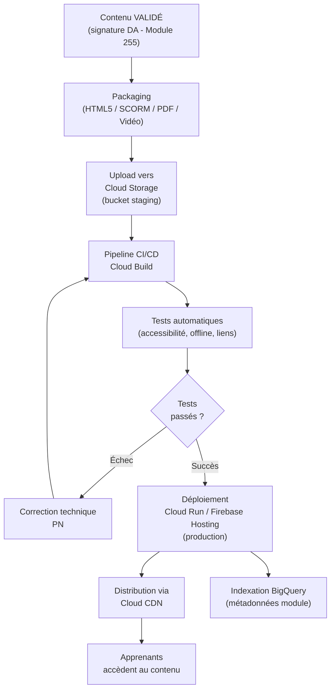
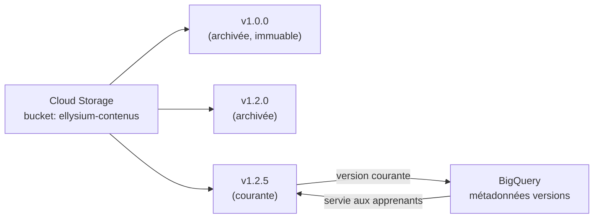
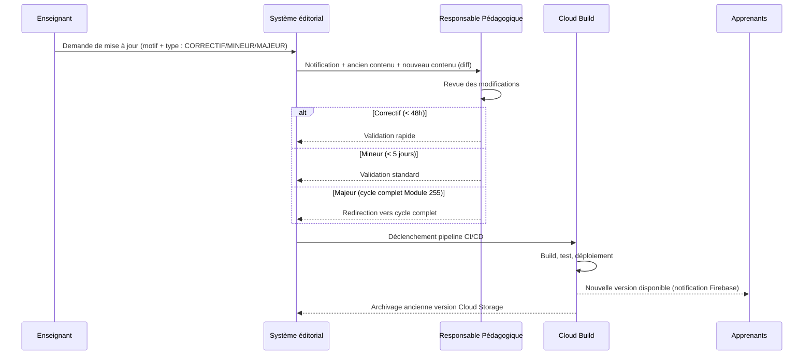

# Module 256 — Chaîne éditoriale : publication, versionnage et mise à jour des contenus

> **Positionnement :** Tome 14 — Organisation, Gouvernance Opérationnelle, RH et Production des Contenus
> Module 10 sur 16 | Référence : ELLYSIUM-T14-M256
> **Autorité :** Préfet Numérique / Responsable Pédagogique
> **Liaison amont :** Module 255 — Rédaction, relecture scientifique et validation pédagogique
> **Liaison aval :** Module 257 — Outils de création éditoriale

---

## 1. Objet

Ce module couvre la deuxième moitié de la chaîne éditoriale ELLYSIUM : une fois qu'un contenu a reçu la validation académique finale (Module 255), il entre dans le processus de publication technique, de versionnage et de mise à jour continue. Ce processus garantit que les apprenants accèdent toujours à la version correcte, que les révisions sont tracées et que les déploiements sont sûrs.

---

## 2. Vue d'ensemble de la Chaîne (Phase 2 — Publication et Versionnage)



---

## 3. Formats de Publication Supportés

| Format | Cas d'usage | Moteur |
|---|---|---|
| **HTML5 interactif** | Cours enrichis avec animations, quiz intégrés | Firebase Hosting + Cloud CDN |
| **SCORM 1.2 / 2004** | Interopérabilité avec d'autres LMS partenaires | Cloud Storage + API SCORM |
| **PDF imprimable** | Zones sans connexion permanente | Cloud Storage, téléchargeable |
| **Vidéo MP4 (H.264)** | Cours magistraux enregistrés | Cloud Storage + Cloud CDN |
| **Audio MP3** | Podcasts pédagogiques, accessibilité | Cloud Storage + Cloud CDN |
| **Pack offline** | Service Worker + cache Firebase | Progressive Web App |

---

## 4. Système de Versionnage Sémantique

ELLYSIUM adopte le versionnage sémantique **MAJEUR.MINEUR.CORRECTIF** pour tous les contenus :

| Type de version | Définition | Exemple |
|---|---|---|
| **MAJEUR (X.0.0)** | Refonte complète du contenu ou des objectifs | v2.0.0 |
| **MINEUR (x.Y.0)** | Ajout de sections, nouveaux exercices, mise à jour références | v1.3.0 |
| **CORRECTIF (x.y.Z)** | Correction d'erreurs factuelles, typos, liens brisés | v1.2.5 |

### 4.1 Règles de versionnage

- Un passage en version MAJEURE nécessite une revalidation complète (cycle Module 255).
- Un passage en version MINEURE nécessite la validation du RP uniquement.
- Un passage en version CORRECTIF peut être fait par l'enseignant, validé par le RP en 48h.

### 4.2 Stockage des versions



---

## 5. Pipeline CI/CD de Publication

```yaml
# cloud-build/publish-content.yaml
# Pipeline Cloud Build — Publication de contenu ELLYSIUM
steps:
  # Étape 1 : Validation du package (format, métadonnées)
  - name: 'gcr.io/cloud-builders/gcloud'
    args: ['storage', 'cp', '${_CONTENT_PATH}', 'gs://ellysium-staging/${_MODULE_ID}/']
    id: upload-staging

  # Étape 2 : Tests automatiques d'accessibilité et de liens
  - name: 'gcr.io/ellysium-prod/content-tester:latest'
    args: ['--module-id', '${_MODULE_ID}', '--env', 'staging']
    id: run-tests
    waitFor: ['upload-staging']

  # Étape 3 : Déploiement en production si tests OK
  - name: 'gcr.io/cloud-builders/gcloud'
    args:
      - 'storage'
      - 'cp'
      - 'gs://ellysium-staging/${_MODULE_ID}/'
      - 'gs://ellysium-production/${_MODULE_ID}/'
      - '--recursive'
    id: deploy-production
    waitFor: ['run-tests']

  # Étape 4 : Invalidation du cache CDN
  - name: 'gcr.io/cloud-builders/gcloud'
    args:
      - 'compute'
      - 'url-maps'
      - 'invalidate-cdn-cache'
      - 'ellysium-lb'
      - '--path'
      - '/modules/${_MODULE_ID}/*'
    id: invalidate-cdn
    waitFor: ['deploy-production']

substitutions:
  _MODULE_ID: 'default'
  _CONTENT_PATH: 'content/'
options:
  logging: CLOUD_LOGGING_ONLY
```

---

## 6. Processus de Mise à Jour d'un Contenu Existant



---

## 7. Politique de Dépréciation et d'Archivage

| Statut | Définition | Visibilité apprenants |
|---|---|---|
| **ACTIF** | Version courante, servie par CDN | Totale |
| **DÉPRÉCIÉ** | Remplacé par version plus récente, conservé 1 an | Non (sauf admin) |
| **ARCHIVÉ** | Conservé dans Cloud Storage Nearline après 1 an | Non |
| **SUPPRIMÉ** | Suppression logique uniquement ; contenu conservé Coldline 5 ans | Non |

---

## 8. Notification aux Apprenants lors d'une Mise à Jour

```typescript
// ellysium/notifications/content-update.ts
import * as admin from 'firebase-admin';

interface ContentUpdatePayload {
  moduleId: string;
  titre: string;
  version: string;
  typeChangement: 'CORRECTIF' | 'MINEUR' | 'MAJEUR';
}

async function notifierMiseAJour(
  payload: ContentUpdatePayload,
  topicId: string
): Promise<void> {
  const message: admin.messaging.Message = {
    topic: topicId, // ex: "module-M253-abonnes"
    notification: {
      title: `Mise à jour : ${payload.titre}`,
      body:
        payload.typeChangement === 'MAJEUR'
          ? 'Ce cours a été entièrement révisé. Consultez la nouvelle version.'
          : 'Correction ou amélioration apportée à ce cours.',
    },
    data: {
      moduleId:       payload.moduleId,
      version:        payload.version,
      typeChangement: payload.typeChangement,
    },
    android: { priority: 'normal' },
    apns:    { payload: { aps: { badge: 1 } } },
  };
  await admin.messaging().send(message);
}
```

---

## 9. Verrous Fonctionnels

| ID | Règle | Niveau |
|---|---|---|
| VF-256-01 | Aucun déploiement en production n'est possible si les tests du pipeline CI/CD n'ont pas tous réussi | CRITIQUE |
| VF-256-02 | Toute version déployée est immuable dans Cloud Storage ; seule une nouvelle version peut la remplacer | CRITIQUE |
| VF-256-03 | L'invalidation du cache CDN est obligatoire après tout déploiement ; un contenu périmé servi aux apprenants est un incident de niveau 2 | OBLIGATOIRE |
| VF-256-04 | Les apprenants engagés dans un module sont notifiés par Firebase Cloud Messaging lors de toute mise à jour MINEURE ou MAJEURE | OBLIGATOIRE |
| VF-256-05 | La rétention minimale de toute version archivée est de 5 ans en Cloud Storage Coldline, conformément à la politique de conservation des données éducatives | OBLIGATOIRE |

---

*Sous-tome rédigé conformément aux Normes documentaires ELLYSIUM — Fondations 04.*
