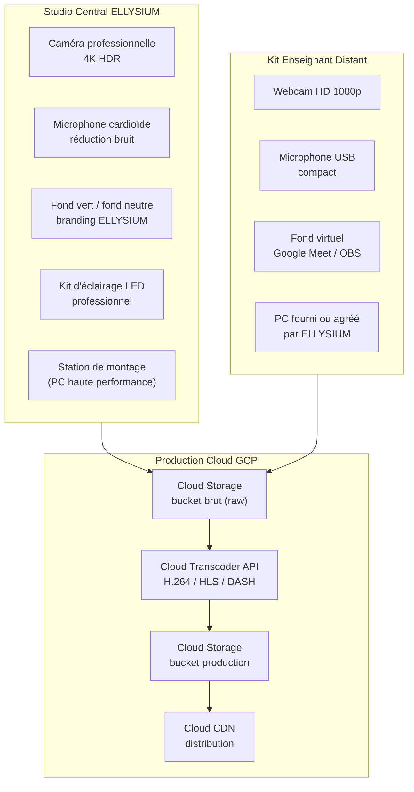
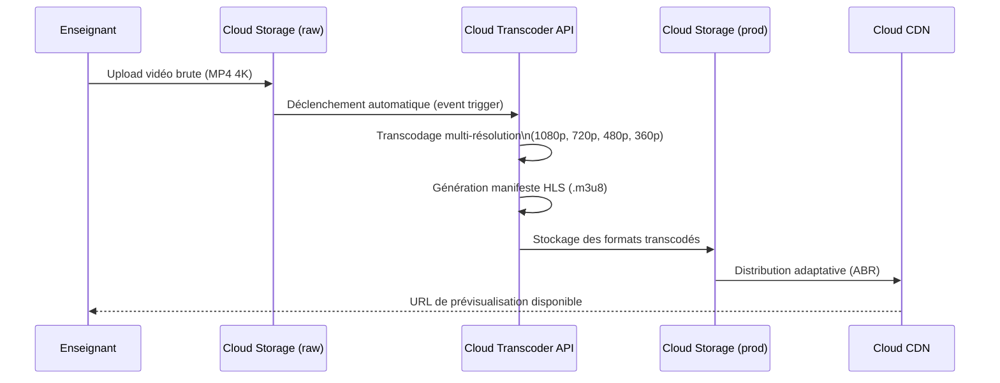

# Module 257 — Outils de création éditoriale : studio vidéo, templates et environnements de production

> **Positionnement :** Tome 14 — Organisation, Gouvernance Opérationnelle, RH et Production des Contenus
> Module 11 sur 16 | Référence : ELLYSIUM-T14-M257
> **Autorité :** Préfet Numérique / Responsable Pédagogique
> **Liaison amont :** Module 256 — Publication, versionnage et mise à jour
> **Liaison aval :** Module 258 — Propriété intellectuelle des contenus

---

## 1. Objet

La qualité des contenus ELLYSIUM dépend autant des compétences pédagogiques des enseignants que des outils mis à leur disposition. Ce module décrit l'ensemble des équipements, logiciels, gabarits et environnements de production fournis par ELLYSIUM pour permettre à chaque enseignant de produire des contenus professionnels, cohérents et accessibles, quelle que soit la connectivité disponible dans son contexte.

---

## 2. Architecture des Environnements de Production

---

## 3. Studio Vidéo Central

### 3.1 Équipement du studio central ELLYSIUM

| Équipement | Spécification minimale | Rôle |
|---|---|---|
| Caméra | Sony ZV-E10 ou équivalent 4K | Enregistrement principal |
| Microphone | Rode NT-USB Mini | Voix claire sans écho |
| Éclairage | Elgato Key Light Air (x2) | Éclairage professionnel |
| Écran de prompteur | Teleprompter iPad 10" | Confort de tournage |
| Fond | Fond vert 2x3m + fond blanc neutre | Flexibilité de post-prod |
| Logiciel montage | DaVinci Resolve (gratuit) | Montage, étalonnage |
| PC station | 32 Go RAM, GPU NVIDIA RTX 3060 | Rendu vidéo rapide |

### 3.2 Charte graphique vidéo ELLYSIUM

Toute vidéo produite doit respecter :
- **Intro** : Jingle ELLYSIUM + logo animé (5 secondes) — fourni en template After Effects.
- **Générique** : Nom de l'enseignant, filière, niveau, module (15 secondes).
- **Corps** : Slides au format 16:9, police Roboto, couleurs charte ELLYSIUM (bleu #0057B7, or #FFD700).
- **Outro** : Call to action (exercices, module suivant) + logo ELLYSIUM (10 secondes).
- **Sous-titres** : Obligatoires, générés via l'API Speech-to-Text de Google puis révisés manuellement.

---

## 4. Kit Enseignant Distant

Pour les enseignants ne pouvant pas accéder au studio central, ELLYSIUM fournit ou subventionne :

| Composant | Fourni par ELLYSIUM | Subventionné à 50 % |
|---|---|---|
| Webcam 1080p | Si indisponible localement | Oui |
| Microphone USB | Oui | — |
| Abonnement OBS Studio | Gratuit (open source) | — |
| Templates de présentation Google Slides | Oui (Drive partagé) | — |
| Guide de tournage à domicile (PDF) | Oui | — |

### 4.1 Exigences minimales de tournage distant

- Connexion upload ≥ 5 Mbps pour l'envoi des fichiers bruts vers Cloud Storage.
- Pièce calme, éclairée naturellement ou avec le kit LED.
- Fond neutre ou fond virtuel ELLYSIUM activé.
- Résolution minimale de l'enregistrement : 1080p à 25 images/secondes.

---

## 5. Gabarits (Templates) Officiels ELLYSIUM

### 5.1 Bibliothèque de gabarits

| Type | Outil | Accès |
|---|---|---|
| Cours magistral (slides) | Google Slides (charte ELLYSIUM) | Google Drive partagé |
| Fiche apprenant (PDF) | Google Docs (template) | Google Drive partagé |
| Quiz interactif | Firebase Extensions + HTML5 | Portail enseignant |
| Infographie | Canva Pro (licence collective ELLYSIUM) | Canva Teams |
| Mindmap | Google Jamboard ou Miro (licence ELLYSIUM) | Portail enseignant |
| Exercice pratique codé | VS Code + template GitHub | Dépôt GitHub ELLYSIUM |

### 5.2 Règle d'utilisation des gabarits

- L'utilisation des gabarits officiels est **obligatoire** pour toute production destinée à la publication.
- Toute déviation de la charte graphique doit être approuvée par le RP.
- Les gabarits sont mis à jour trimestriellement ; les enseignants reçoivent une notification Firebase.

---

## 6. Pipeline de Transcodage Vidéo (Cloud Transcoder API)

---

## 7. Accessibilité des Contenus Produits

Tout contenu publié doit satisfaire les critères suivants :

| Critère d'accessibilité | Standard | Outil de vérification |
|---|---|---|
| Sous-titres vidéo | WCAG 2.1 AA — 1.2.2 | Google Speech-to-Text + révision manuelle |
| Contraste texte/fond | Ratio >= 4,5:1 | Google Lighthouse |
| Navigation clavier | Focus visible sur tous les éléments interactifs | Chrome DevTools |
| Compatibilité lecteur d'écran | ARIA labels sur tous les éléments | axe DevTools |
| Mode offline fonctionnel | Service Worker opérationnel | Lighthouse Offline Test |

---

## 8. Verrous Fonctionnels

| ID | Règle | Niveau |
|---|---|---|
| VF-257-01 | Tout contenu vidéo doit être transcodé via Cloud Transcoder API avant publication ; aucun fichier brut ne doit être servi directement aux apprenants | CRITIQUE |
| VF-257-02 | Les sous-titres sont obligatoires pour toute vidéo ; un contenu vidéo sans sous-titres validés ne peut pas être publié | CRITIQUE |
| VF-257-03 | L'utilisation des gabarits officiels est obligatoire ; toute déviation non approuvée par le RP entraîne le retour du contenu en phase de révision | OBLIGATOIRE |
| VF-257-04 | Le score Lighthouse Accessibilité d'un module HTML5 doit être >= 90 avant déploiement en production | OBLIGATOIRE |
| VF-257-05 | Les fichiers vidéo bruts dans le bucket staging sont automatiquement supprimés après 30 jours pour maîtriser les coûts Cloud Storage | OBLIGATOIRE |

---

*Sous-tome rédigé conformément aux Normes documentaires ELLYSIUM — Fondations 04.*
