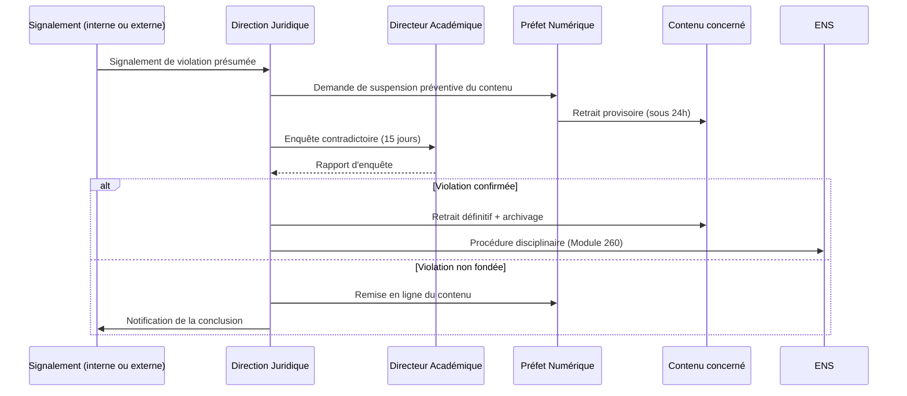

# Module 258 — Propriété intellectuelle des contenus : contrats de cession, licence ELLYSIUM et OER

> **Positionnement :** Tome 14 — Organisation, Gouvernance Opérationnelle, RH et Production des Contenus
> Module 12 sur 16 | Référence : ELLYSIUM-T14-M258
> **Autorité :** Direction juridique ELLYSIUM / Directeur Académique
> **Liaison amont :** Module 257 — Outils de création éditoriale
> **Liaison aval :** Module 259 — Gestion des équipes de support et modération

---

## 1. Objet

La propriété intellectuelle (PI) des contenus pédagogiques est un enjeu stratégique pour ELLYSIUM. Ce module définit le cadre juridique régissant la création, la cession, la diffusion et la réutilisation des contenus produits par les enseignants dans le contexte ELLYSIUM, en tenant compte du droit congolais, du droit international et des principes des ressources éducatives ouvertes (OER).

---

## 2. Cadre Juridique de Référence

| Texte | Périmètre | Application ELLYSIUM |
|---|---|---|
| Loi n° 86-033 du 5 avril 1986 (RDC) | Protection des œuvres littéraires et artistiques | Base légale nationale |
| Convention de Berne (1886, révisée) | Protection internationale des droits d'auteur | Contenus diffusés hors RDC |
| ADPIC / TRIPS (OMC) | Propriété intellectuelle dans le commerce | Partenariats internationaux |
| Licences Creative Commons | Cadre de partage OER | Modules marqués OER |
| RGPD (par analogie) | Données liées aux œuvres numériques | Métadonnées des contenus |

---

## 3. Régimes de Propriété Intellectuelle des Contenus ELLYSIUM

ELLYSIUM distingue trois régimes selon la nature de la production :

### 3.1 Contenu commandé (œuvre de commande)

- **Situation :** ELLYSIUM passe une commande spécifique à un enseignant (cours d'un module précis, dans un gabarit défini).
- **Propriété :** ELLYSIUM est propriétaire des droits patrimoniaux dès livraison et acceptation.
- **Droit moral :** L'enseignant conserve son droit moral (paternité, intégrité de l'œuvre).
- **Rémunération :** Forfait de production + redevance de performance (cf. Module 253).

### 3.2 Contenu apporté (œuvre préexistante)

- **Situation :** Un enseignant souhaite intégrer un cours qu'il a développé antérieurement.
- **Propriété :** L'enseignant reste propriétaire ; il concède à ELLYSIUM une **licence exclusive d'exploitation** sur la durée du contrat.
- **Rémunération :** Négociée au cas par cas ; redevance annuelle possible.

### 3.3 Contenu libre (OER — Open Educational Resources)

- **Situation :** Un enseignant ou un tiers produit un contenu sous licence Creative Commons BY ou BY-SA.
- **Propriété :** Maintenue par l'auteur original selon les termes de la licence CC.
- **Utilisation :** Autorisée si la licence CC est compatible (CC BY, CC BY-SA, CC BY-NC).

---

## 4. Contrat de Cession de Droits ELLYSIUM

### 4.1 Structure du contrat-type de cession

```mermaid
flowchart TD
    CONTRAT["Contrat de cession\nde droits ELLYSIUM"]
    ID["1. Identification des parties\n(enseignant + ELLYSIUM)"]
    OBJET["2. Objet de la cession\n(description précise du contenu)"]
    DROITS["3. Droits cédés\n(reproduction, adaptation, distribution,\ncommunication au public)"]
    TERRIT["4. Territoire\n(RDC + international si applicable)"]
    DUREE["5. Durée\n(durée du contrat de travail + 2 ans)"]
    REMUN["6. Rémunération de la cession\n(incluse dans le forfait de production)"]
    MORAL["7. Droit moral\n(paternité conservée par l'enseignant)"]
    MODIF["8. Droit de modification\n(ELLYSIUM peut adapter, avec accord enseignant\npour révisions majeures)"]
    RESIL["9. Clause de résiliation\n(restitution des droits si ELLYSIUM cesse d'exploiter)"]

    CONTRAT --> ID
    CONTRAT --> OBJET
    CONTRAT --> DROITS
    CONTRAT --> TERRIT
    CONTRAT --> DUREE
    CONTRAT --> REMUN
    CONTRAT --> MORAL
    CONTRAT --> MODIF
    CONTRAT --> RESIL
```



### 4.2 Clause de droit moral — protections garanties à l'enseignant

L'enseignant conserve les droits moraux suivants, inaliénables et perpétuels :
- **Droit de paternité :** Son nom est toujours mentionné sur le contenu.
- **Droit à l'intégrité :** Aucune modification dénaturante ne peut être apportée sans son accord.
- **Droit de divulgation :** Il peut refuser qu'un contenu soit publié dans un contexte contraire à ses valeurs.
- **Droit de retrait :** Sous conditions contractuelles, il peut demander le retrait (avec indemnisation d'ELLYSIUM).

---

## 5. Licence ELLYSIUM — Définition et Niveaux

ELLYSIUM crée sa propre marque de licence interne, distincte mais compatible avec Creative Commons :

| Niveau de licence | Définition | Utilisation autorisée |
|---|---|---|
| **ELLYSIUM-PROPRIETARY** | Droits exclusifs ELLYSIUM | Plateforme ELLYSIUM uniquement |
| **ELLYSIUM-PARTNER** | Licence non-exclusive aux établissements partenaires | ELLYSIUM + partenaires signataires |
| **ELLYSIUM-OER** | Contenu ouvert sous CC BY-NC-SA | Tout usage éducatif non commercial |
| **ELLYSIUM-PUBLIC** | Contenu gratuit sous CC BY | Tout usage avec attribution |

---

## 6. Cadre OER (Open Educational Resources)

### 6.1 Politique OER d'ELLYSIUM

ELLYSIUM s'engage à publier en OER une portion croissante de son catalogue :

| Année | Objectif OER (% du catalogue) |
|---|---|
| An 1 | 5 % (modules de base des filières les plus accessibles) |
| An 3 | 15 % |
| An 5 | 25 % |
| An 10 | 40 % |

### 6.2 Critères de sélection des contenus OER

Un contenu peut être labellisé OER si :
- Il couvre des savoirs fondamentaux (mathématiques, sciences, langue française).
- Sa publication en accès libre ne compromet pas la viabilité économique d'ELLYSIUM.
- L'enseignant auteur a donné son accord exprès par avenant au contrat.
- Le contenu est compatible avec la licence CC BY-NC-SA.

---

## 7. Gestion des Violations de Droits d'Auteur



---

## 8. Extrait SQL — Registre de Propriété Intellectuelle

```sql
-- Cloud SQL PostgreSQL 16
CREATE TABLE registre_pi (
    id                  UUID PRIMARY KEY DEFAULT gen_random_uuid(),
    module_cours_id     UUID NOT NULL REFERENCES modules_cours(id),
    enseignant_id       UUID NOT NULL REFERENCES enseignants(id),
    regime_pi           VARCHAR(30) CHECK (regime_pi IN
                        ('COMMANDE', 'APPORTE', 'OER')),
    licence_ellysium    VARCHAR(30) CHECK (licence_ellysium IN
                        ('PROPRIETARY', 'PARTNER', 'OER', 'PUBLIC')),
    licence_cc          VARCHAR(50),  -- ex: 'CC BY-NC-SA 4.0'
    date_cession        DATE NOT NULL,
    date_fin_cession    DATE,
    droit_moral_reserve BOOLEAN DEFAULT TRUE,
    accord_oer          BOOLEAN DEFAULT FALSE,
    hash_contrat        VARCHAR(512) NOT NULL,  -- SHA-256 du PDF signé
    created_at          TIMESTAMPTZ DEFAULT NOW()
);

CREATE INDEX idx_pi_module ON registre_pi(module_cours_id);
CREATE INDEX idx_pi_regime ON registre_pi(regime_pi);
```

---

## 9. Verrous Fonctionnels

| ID | Règle | Niveau |
|---|---|---|
| VF-258-01 | Aucun contenu ne peut être publié sans qu'un enregistrement correspondant existe dans le registre de propriété intellectuelle | CRITIQUE |
| VF-258-02 | Le hash SHA-256 du contrat de cession signé doit être stocké dans la base de données et dans Cloud Storage ; toute divergence est un incident de sécurité | CRITIQUE |
| VF-258-03 | La labellisation OER d'un contenu requiert l'accord écrit exprès de l'enseignant auteur ; aucune labellisation automatique n'est autorisée | CRITIQUE |
| VF-258-04 | Tout signalement de violation de droits d'auteur entraîne une suspension préventive automatique du contenu sous 24 heures | OBLIGATOIRE |
| VF-258-05 | Le droit moral de l'enseignant (paternité) doit être affiché sur le contenu et ne peut jamais être supprimé, même après résiliation du contrat | CRITIQUE |
| VF-258-06 | Toute décision de gestion est revêtue d'un identifiant de traçabilité unique lié à l'acte signé | OBLIGATOIRE |

---

*Sous-tome rédigé conformément aux Normes documentaires ELLYSIUM — Fondations 04.*
