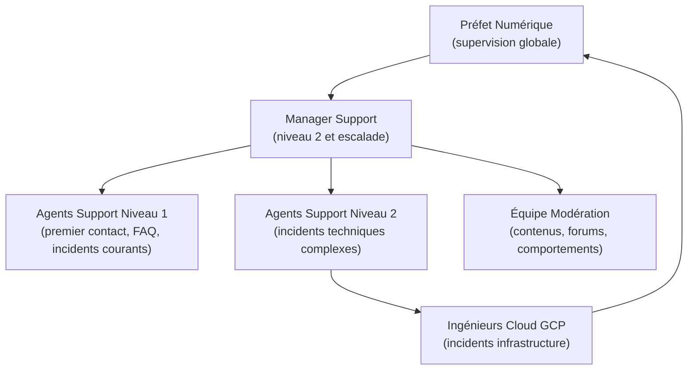
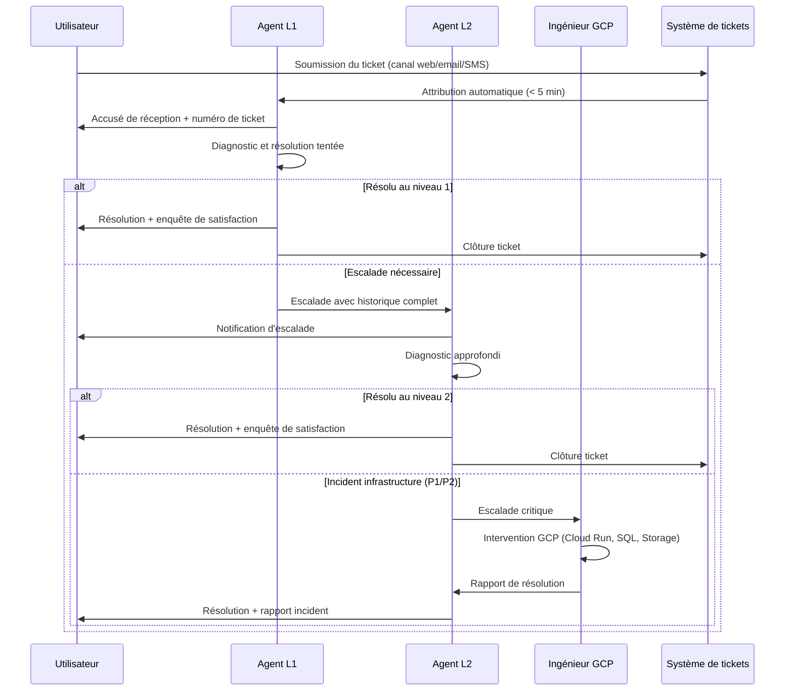
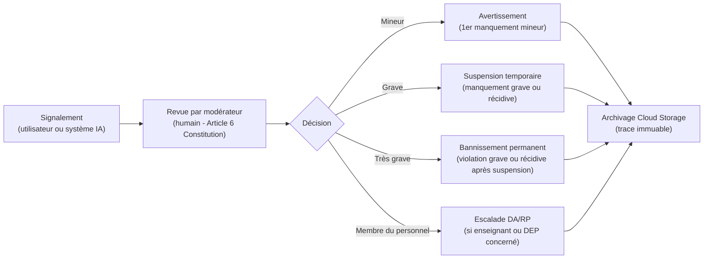
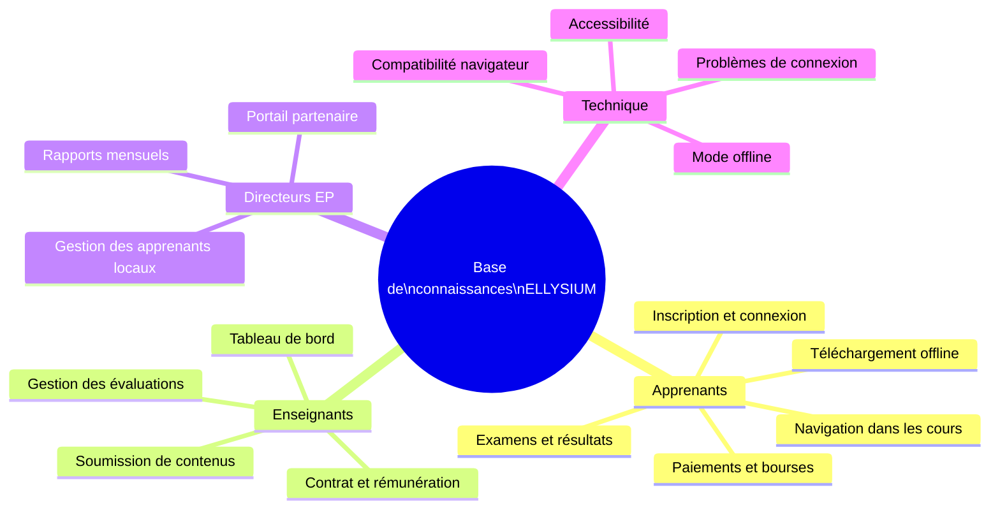

# Module 259 — Gestion des équipes de support et modération

> **Positionnement :** Tome 14 — Organisation, Gouvernance Opérationnelle, RH et Production des Contenus
> Module 13 sur 16 | Référence : ELLYSIUM-T14-M259
> **Autorité :** Préfet Numérique / Direction des Opérations
> **Liaison amont :** Module 258 — Propriété intellectuelle des contenus
> **Liaison aval :** Module 260 — Procédure disciplinaire et code de déontologie

---

## 1. Objet

Le support et la modération constituent la ligne de contact directe entre ELLYSIUM et ses utilisateurs (apprenants, enseignants, directeurs d'établissements partenaires). Ce module définit l'organisation des équipes, les processus de traitement des demandes et incidents, les outils utilisés et les standards de qualité de service attendus.

---

## 2. Organisation des Équipes de Support

---

## 3. Niveaux de Support et Périmètres

| Niveau | Équipe | Type d'incidents | Délai SLA |
|---|---|---|---|
| **Niveau 0** | Auto-assistance | FAQ, tutoriels, base de connaissances | Immédiat (self-service) |
| **Niveau 1** | Agents Support L1 | Accès, mot de passe, navigation, questions cours | < 4h ouvrables |
| **Niveau 2** | Agents Support L2 | Bugs fonctionnels, erreurs de progression, paiements | < 24h ouvrables |
| **Niveau 3** | Ingénieurs GCP | Incidents infrastructure, perte de données, sécurité | < 2h (24/7 pour P1) |
| **Modération** | Équipe Modération | Contenus inappropriés, harcèlement, fraude | < 2h pour signalements urgents |

---

## 4. Canal de Support et Outils

| Canal | Outil | Public cible | Disponibilité |
|---|---|---|---|
| Chat en ligne | Firebase Realtime Database + interface web | Apprenants, enseignants | Lu–Ve 8h–20h (UTC+2) |
| Email support | Google Workspace (support@ellysium.cd) | Tous utilisateurs | 24/7 (réponse SLA) |
| Forum communautaire | Module forum intégré à la plateforme | Apprenants | 24/7 (modéré) |
| Téléphone | Ligne dédiée (Kinshasa) | Directeurs établissements | Lu–Ve 8h–17h |
| Portail ticket | Système de tickets interne (Cloud Run) | Escalades L2/L3 | 24/7 |
| SMS | Firebase Cloud Messaging / SMS API | Zones faible bande passante | 24/7 |

---

## 5. Processus de Traitement d'un Ticket de Support

---

## 6. Équipe de Modération

### 6.1 Périmètre de la modération

L'équipe de modération intervient sur :

| Domaine | Type d'action |
|---|---|
| **Forum et commentaires** | Suppression de contenus haineux, offensants, hors-sujet |
| **Fraude académique** | Détection de partage de comptes, usurpation d'identité, triche aux évaluations |
| **Harcèlement** | Traitement des signalements entre utilisateurs |
| **Contenus uploadés** | Vérification des fichiers soumis par les utilisateurs (virus, contenus illicites) |
| **Comportements suspects** | Détection de bots, tentatives d'intrusion, abus des API |

### 6.2 Procédure de modération

---

## 7. Indicateurs de Performance (SLA & KPI)

| KPI | Formule | Cible |
|---|---|---|
| Taux de résolution L1 | Tickets résolus L1 / Total tickets | >= 70 % |
| Délai moyen de première réponse | Somme délais / Nombre tickets | < 2h ouvrables |
| Délai moyen de résolution | Somme durées de résolution / Tickets clôturés | < 24h ouvrables |
| Satisfaction support (CSAT) | Score moyen enquête post-clôture | >= 4/5 |
| Taux de réouverture | Tickets réouverts / Tickets clôturés | < 5 % |
| Délai de modération urgente | Temps signalement -> décision modération | < 2h |

---

## 8. Base de Connaissances (Self-Service)

La base de connaissances ELLYSIUM est hébergée sur Firebase Hosting et indexée pour permettre une recherche rapide :

---

## 9. Verrous Fonctionnels

| ID | Règle | Niveau |
|---|---|---|
| VF-259-01 | Tout signalement de harcèlement ou de contenu illicite doit recevoir une réponse de modération dans un délai maximum de 2 heures, 24h/24 et 7j/7 | CRITIQUE |
| VF-259-02 | Aucune décision de suspension ou bannissement ne peut être prise par un système automatique sans validation humaine (Article 6 Constitution) | CRITIQUE |
| VF-259-03 | Tout incident de niveau P1 (indisponibilité plateforme, brèche de sécurité) est escaladé automatiquement au Préfet Numérique et au Directeur Général sous 15 minutes | CRITIQUE |
| VF-259-04 | Les enquêtes de satisfaction post-support sont automatiquement envoyées 1 heure après clôture du ticket via Firebase Cloud Messaging | OBLIGATOIRE |
| VF-259-05 | Toute décision de modération est archivée dans Cloud Storage avec horodatage et identifiant du modérateur responsable | OBLIGATOIRE |

---

*Sous-tome rédigé conformément aux Normes documentaires ELLYSIUM — Fondations 04.*
