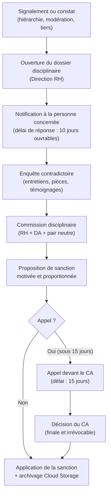

# Module 260 — Procédure disciplinaire interne et code de déontologie

> **Positionnement :** Tome 14 — Organisation, Gouvernance Opérationnelle, RH et Production des Contenus
> Module 14 sur 16 | Référence : ELLYSIUM-T14-M260
> **Autorité :** Direction des Ressources Humaines / Directeur Académique / Conseil d'Administration
> **Liaison amont :** Module 259 — Gestion des équipes de support et modération
> **Liaison aval :** Module 261 — Manuel des procédures opérationnelles standards (SOP)

---

## 1. Objet

La confiance que les apprenants, les familles, les institutions partenaires et la société accordent à ELLYSIUM repose sur l'intégrité de chaque membre de son personnel. Ce module établit le code de déontologie auquel tous les acteurs d'ELLYSIUM sont soumis, ainsi que la procédure disciplinaire applicable en cas de manquement, garantissant à la fois l'équité, la transparence et la proportionnalité des sanctions.

---

## 2. Code de Déontologie ELLYSIUM

### 2.1 Principes fondamentaux

Tout membre du personnel ELLYSIUM (enseignants, équipes support, modérateurs, dirigeants, prestataires) s'engage à respecter les principes suivants :

| Principe | Description |
|---|---|
| **Intégrité académique** | Ne jamais produire, valider ou diffuser des contenus inexacts ou trompeurs |
| **Respect de la personne** | Traiter chaque apprenant, collègue et partenaire avec dignité et sans discrimination |
| **Confidentialité** | Protéger les données personnelles des apprenants ; ne jamais les divulguer |
| **Neutralité** | S'abstenir de tout prosélytisme politique, religieux ou idéologique dans les contenus |
| **Loyauté** | Agir dans l'intérêt d'ELLYSIUM et de ses apprenants, sans conflit d'intérêts |
| **Transparence** | Signaler tout conflit d'intérêt, toute erreur, tout incident dont on a connaissance |
| **Non-discrimination** | Garantir un traitement égal à tous les apprenants, sans distinction d'origine, genre, religion ou statut économique |
| **Respect de la Constitution ELLYSIUM** | Appliquer en toutes circonstances les articles constitutionnels (séparation caisse/pédagogie, primauté humaine sur l'IA, etc.) |

---

## 3. Catégories de Manquements Disciplinaires

### 3.1 Manquements mineurs

| Exemple | Sanction habituelle |
|---|---|
| Retard répété dans la livraison des cours | Avertissement écrit |
| Non-réponse aux apprenants dans les délais | Rappel à l'ordre |
| Utilisation non conforme des gabarits | Correction exigée |
| Absence non justifiée à une réunion pédagogique | Avertissement |

### 3.2 Manquements graves

| Exemple | Sanction habituelle |
|---|---|
| Plagiat scientifique avéré | Mise à pied temporaire + remboursement forfait |
| Discrimination envers un apprenant | Mise à pied + obligation de formation |
| Violation du secret professionnel (données apprenants) | Mise à pied + signalement CNIL/équivalent |
| Contournement du processus de validation éditoriale | Suspension des droits de publication |

### 3.3 Manquements très graves (faute lourde)

| Exemple | Sanction habituelle |
|---|---|
| Blocage d'un apprenant pour motif financier | Résiliation immédiate du contrat |
| Fraude aux évaluations (manipulation des résultats) | Résiliation + signalement judiciaire |
| Harcèlement sexuel ou moral d'un apprenant | Résiliation immédiate + signalement judiciaire |
| Divulgation délibérée de données confidentielles | Résiliation + poursuites judiciaires |

---

## 4. Procédure Disciplinaire



---

## 5. Garanties de Procédure (Droits de la Défense)

Toute personne faisant l'objet d'une procédure disciplinaire bénéficie des garanties suivantes :

| Garantie | Délai / Modalité |
|---|---|
| Notification écrite des faits reprochés | Avant toute audition |
| Droit d'accès au dossier | Dans les 5 jours suivant l'ouverture |
| Droit d'être entendu | Entretien contradictoire obligatoire |
| Droit d'être assisté | Par un collègue ou représentant choisi |
| Droit de réponse écrite | Délai minimum de 10 jours ouvrables |
| Droit d'appel | Dans les 15 jours suivant la notification de la sanction |
| Présomption d'innocence | Maintien du salaire pendant l'enquête (sauf cas de flagrance grave) |

---

## 6. Commission Disciplinaire — Composition et Règles

### 6.1 Composition

| Membre | Rôle | Condition |
|---|---|---|
| Directeur des RH | Président | Toujours présent |
| Directeur Académique | Garant académique | Pour manquements liés aux contenus |
| Pair neutre désigné | Représentant du corps enseignant | Tiré au sort parmi les enseignants seniors |
| Juriste ELLYSIUM | Conseil juridique | Pour manquements graves ou très graves |
| Représentant des apprenants | Voix des bénéficiaires | Consultatif uniquement, pour manquements envers apprenants |

### 6.2 Règles de délibération

- Quorum : 3 membres minimum sur 5.
- Décision à la majorité simple ; voix prépondérante du Directeur des RH en cas d'égalité.
- La délibération est confidentielle ; le procès-verbal est archivé dans Cloud Storage.

---

## 7. Registre Disciplinaire et Traçabilité

```sql
-- Cloud SQL PostgreSQL 16
CREATE TABLE dossiers_disciplinaires (
    id                  UUID PRIMARY KEY DEFAULT gen_random_uuid(),
    personne_id         UUID NOT NULL,  -- enseignant, agent support, etc.
    type_personne       VARCHAR(30) CHECK (type_personne IN
                        ('ENSEIGNANT', 'AGENT_SUPPORT', 'MODERATEUR', 'DEP', 'DIRECTION')),
    nature_manquement   VARCHAR(100) NOT NULL,
    categorie           VARCHAR(20) CHECK (categorie IN ('MINEUR', 'GRAVE', 'TRES_GRAVE')),
    date_signalement    DATE NOT NULL,
    date_decision       DATE,
    sanction_appliquee  VARCHAR(100),
    statut              VARCHAR(20) DEFAULT 'OUVERT'
                        CHECK (statut IN ('OUVERT', 'EN_ENQUETE', 'APPEL', 'CLOS')),
    archive_url         TEXT,  -- URL Cloud Storage du dossier complet
    hash_dossier        VARCHAR(512),  -- SHA-256 intégrité du dossier
    created_at          TIMESTAMPTZ DEFAULT NOW(),
    updated_at          TIMESTAMPTZ DEFAULT NOW()
);

CREATE INDEX idx_disc_personne ON dossiers_disciplinaires(personne_id);
CREATE INDEX idx_disc_statut   ON dossiers_disciplinaires(statut);
CREATE INDEX idx_disc_cat      ON dossiers_disciplinaires(categorie);
```

---

## 8. Verrous Fonctionnels

| ID | Règle | Niveau |
|---|---|---|
| VF-260-01 | Aucune sanction ne peut être prononcée sans qu'un entretien contradictoire ait été tenu et documenté | CRITIQUE |
| VF-260-02 | Toute résiliation de contrat pour faute lourde doit être validée par le Conseil d'Administration | CRITIQUE |
| VF-260-03 | Le dossier disciplinaire complet (signalement, enquête, décision, appel éventuel) est archivé dans Cloud Storage avec un hash d'intégrité SHA-256 | OBLIGATOIRE |
| VF-260-04 | La personne sanctionnée est notifiée par écrit sous 24h suivant la décision de la Commission | OBLIGATOIRE |
| VF-260-05 | Tout manquement impliquant un blocage d'accès apprenant (violation Article 5 Constitution) est automatiquement classé en faute lourde sans possibilité de déclassement | CRITIQUE |

---

*Sous-tome rédigé conformément aux Normes documentaires ELLYSIUM — Fondations 04.*
