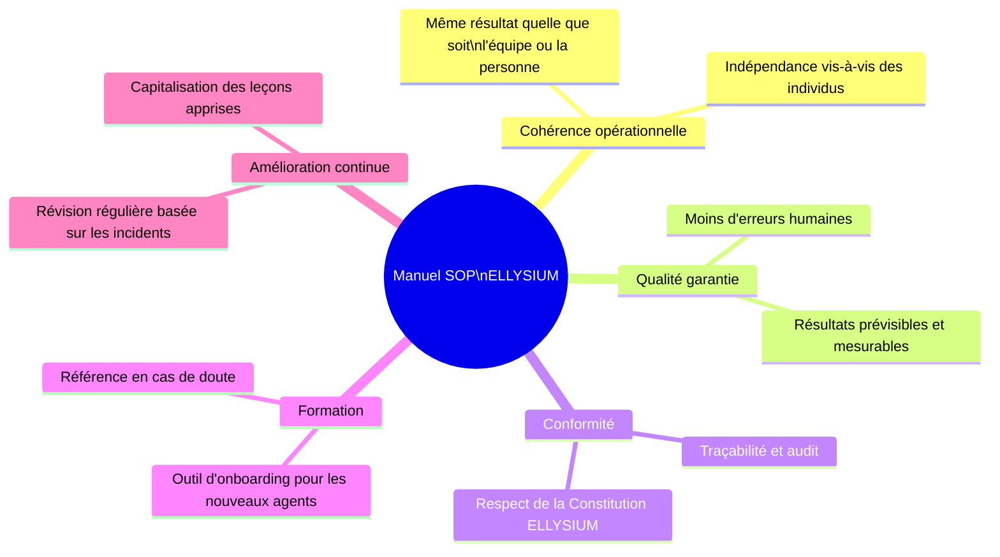
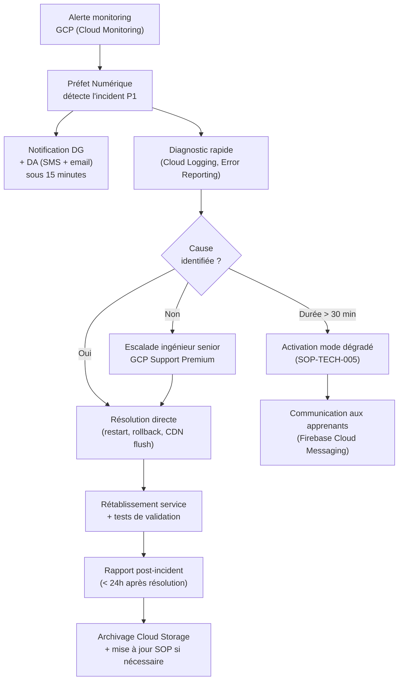
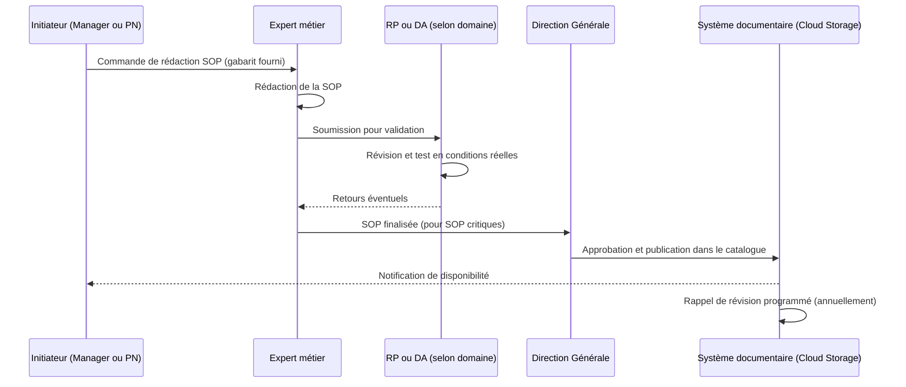

# Module 261 — Manuel des procédures opérationnelles standards (SOP)

> **Positionnement :** Tome 14 — Organisation, Gouvernance Opérationnelle, RH et Production des Contenus
> Module 15 sur 16 | Référence : ELLYSIUM-T14-M261
> **Autorité :** Direction générale ELLYSIUM / Préfet Numérique / Direction des Opérations
> **Liaison amont :** Module 260 — Procédure disciplinaire et code de déontologie
> **Liaison aval :** Module 262 — Dépendances Tome 14

---

## 1. Objet

Un manuel des procédures opérationnelles standards (SOP — Standard Operating Procedures) est l'ensemble des instructions documentées, précises et reproductibles qui permettent à n'importe quel membre du personnel ELLYSIUM d'exécuter correctement une tâche récurrente, sans avoir à improviser ni à solliciter une décision hiérarchique pour chaque occurrence standard.

Ce module définit la structure du manuel SOP ELLYSIUM, les SOP critiques prioritaires et le processus de création, validation, mise à jour et archivage des SOP.

---

## 2. Pourquoi un Manuel SOP dans une Plateforme Numérique ?

---

## 3. Structure d'une SOP ELLYSIUM

Chaque SOP ELLYSIUM respecte le gabarit suivant :

| Section | Contenu |
|---|---|
| **Identifiant** | SOP-[DOMAINE]-[NUMÉRO] (ex : SOP-SUP-001) |
| **Titre** | Intitulé court et précis |
| **Version** | Versionnage sémantique (MAJEUR.MINEUR.CORRECTIF) |
| **Date de création / révision** | Dates avec responsable |
| **Domaine** | Support, Pédagogie, Technique, RH, Editorial, Gouvernance |
| **Déclencheur** | Événement qui déclenche l'exécution de la SOP |
| **Acteurs** | Qui exécute, qui supervise, qui valide |
| **Étapes** | Instructions numérotées, non ambiguës |
| **Critères de réussite** | Comment savoir que la SOP a été exécutée correctement |
| **Points de contrôle** | Vérifications intermédiaires |
| **Escalade** | À qui s'adresser si la SOP ne suffit pas |
| **Documents liés** | Autres SOP, modules ELLYSIUM, outils |

---

## 4. Catalogue des SOP Critiques ELLYSIUM

### 4.1 Domaine : Support Utilisateur

| Code SOP | Titre | Déclencheur |
|---|---|---|
| SOP-SUP-001 | Traitement d'un ticket de premier niveau | Ticket entrant sur le portail |
| SOP-SUP-002 | Escalade d'un ticket de L1 vers L2 | Ticket non résolu en 4h ou complexité technique |
| SOP-SUP-003 | Procédure de réinitialisation de compte apprenant | Demande de reset mot de passe |
| SOP-SUP-004 | Gestion d'un signalement de harcèlement | Signalement reçu via le portail |
| SOP-SUP-005 | Enquête de satisfaction post-ticket | Clôture d'un ticket |

### 4.2 Domaine : Pédagogie et Editorial

| Code SOP | Titre | Déclencheur |
|---|---|---|
| SOP-PED-001 | Soumission d'un nouveau module de cours | Enseignant soumet un contenu |
| SOP-PED-002 | Relecture scientifique d'un module | Attribution à un relecteur |
| SOP-PED-003 | Retour de contenu à l'enseignant pour révision | Score scientifique < 20/25 |
| SOP-PED-004 | Demande de mise à jour d'un contenu publié | Enseignant signale une erreur |
| SOP-PED-005 | Labellisation OER d'un contenu | Décision pédagogique de partage ouvert |

### 4.3 Domaine : Technique et Infrastructure GCP

| Code SOP | Titre | Déclencheur |
|---|---|---|
| SOP-TECH-001 | Déploiement d'une nouvelle version de la plateforme | Pipeline Cloud Build déclenché |
| SOP-TECH-002 | Gestion d'un incident P1 (indisponibilité totale) | Monitoring GCP alerte SLA breach |
| SOP-TECH-003 | Procédure de sauvegarde et restauration Cloud SQL | Planifiée (quotidienne) ou incident |
| SOP-TECH-004 | Rotation des clés Cloud KMS | Mensuelle ou incident de sécurité |
| SOP-TECH-005 | Activation du mode dégradé (offline fallback) | Incident de connectivité P1/P2 |

### 4.4 Domaine : Ressources Humaines

| Code SOP | Titre | Déclencheur |
|---|---|---|
| SOP-RH-001 | Onboarding d'un nouvel enseignant | Contrat signé |
| SOP-RH-002 | Offboarding d'un enseignant (fin de contrat) | Résiliation ou non-renouvellement |
| SOP-RH-003 | Ouverture d'un dossier disciplinaire | Signalement ou constat de manquement |
| SOP-RH-004 | Évaluation semestrielle des enseignants | Agenda RH semestriel |
| SOP-RH-005 | Déclaration et traitement d'un conflit d'intérêts | Auto-déclaration ou signalement |

### 4.5 Domaine : Gouvernance et Conformité

| Code SOP | Titre | Déclencheur |
|---|---|---|
| SOP-GOV-001 | Préparation du rapport trimestriel du CA | J-15 avant chaque CA |
| SOP-GOV-002 | Révision et mise à jour d'une SOP | Incident révélant une faille SOP ou révision annuelle |
| SOP-GOV-003 | Gestion d'une demande d'accès aux données (RGPD) | Demande d'un apprenant ou d'une autorité |
| SOP-GOV-004 | Déclaration d'un incident de sécurité (RGPD) | Brèche détectée |
| SOP-GOV-005 | Audit interne annuel des SOP | Calendrier d'audit |

---

## 5. Exemple de SOP Complète — SOP-TECH-002 : Gestion d'un incident P1

---

## 6. Processus de Création et Mise à Jour d'une SOP

---

## 7. Verrous Fonctionnels

| ID | Règle | Niveau |
|---|---|---|
| VF-261-01 | Toute SOP doit être testée en conditions réelles avant publication dans le catalogue officiel | CRITIQUE |
| VF-261-02 | Les SOP de domaine TECH et GOV sont révisées au minimum annuellement ; les SOP impactées par un incident sont révisées sous 30 jours | OBLIGATOIRE |
| VF-261-03 | Tout nouvel employé doit lire et signer les SOP de son domaine dans les 10 jours suivant son onboarding | OBLIGATOIRE |
| VF-261-04 | Le catalogue des SOP est hébergé sur Firebase Hosting, accessible 24h/24, avec contrôle d'accès par rôle IAM | OBLIGATOIRE |
| VF-261-05 | Toute déviation documentée d'une SOP en situation réelle est consignée comme « leçon apprise » et transmise à l'équipe de révision sous 48h | OBLIGATOIRE |
| VF-261-06 | Toute décision de gestion est revêtue d'un identifiant de traçabilité unique lié à l'acte signé | OBLIGATOIRE |

---

*Sous-tome rédigé conformément aux Normes documentaires ELLYSIUM — Fondations 04.*
