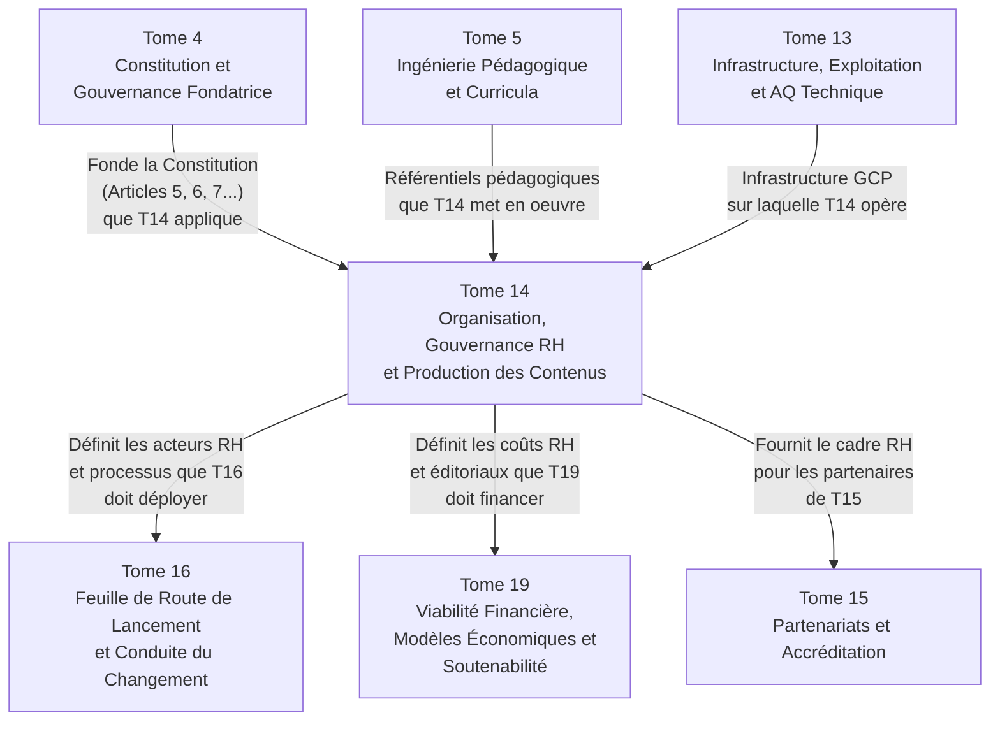
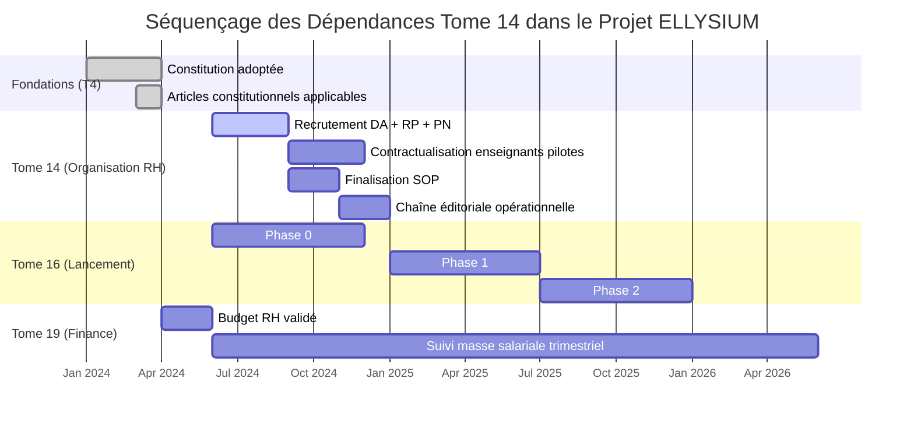

# Module 262 — Dépendances du Tome 14 avec les Tomes 4, 16 et 19

> **Positionnement :** Tome 14 — Organisation, Gouvernance Opérationnelle, RH et Production des Contenus
> Module 16 sur 16 | Référence : ELLYSIUM-T14-M262
> **Autorité :** Direction générale ELLYSIUM
> **Liaison amont :** Module 261 — Manuel des procédures opérationnelles standards (SOP)
> **Liaison aval :** Tome 15 — Partenariats, Accréditation et Reconnaissance Institutionnelle (M263)

---

## 1. Objet

Ce module de clôture du Tome 14 remplit deux fonctions :

1. **Cartographier les dépendances** entre le Tome 14 et les autres tomes du corpus ELLYSIUM qui sont liés à son contenu (Tomes 4, 16 et 19 principalement).
2. **Certifier la complétude** du Tome 14 en dressant le tableau récapitulatif de ses 16 modules.

---

## 2. Matrice de Dépendances — Tome 14 ↔ Corpus ELLYSIUM

---

## 3. Détail des Dépendances Critiques

### 3.1 Tome 14 → Tome 4 (Constitution)

| Module T14 | Dépendance T4 | Nature |
|---|---|---|
| M248 — Conformité constitutionnelle | Art. 5 (séparation caisse/pédagogie) | Fondatrice — T14 ne peut violer T4 |
| M253 — Gestion enseignants | Art. 7 (dignité des enseignants, rémunération) | Fondatrice |
| M254 — Conflits IA/enseignant | Art. 6 (primauté humaine sur l'IA) | Fondatrice |
| M260 — Procédure disciplinaire | Art. 5 + Principes généraux | Fondatrice |

### 3.2 Tome 14 → Tome 16 (Feuille de Route de Lancement)

| Module T14 | Ce que T16 doit prendre en compte |
|---|---|
| M251 — Rôles DA, RP, PN | Les recrutements de ces postes doivent être planifiés dans la Phase 0 du lancement |
| M252 — Directeurs établissements partenaires | La sélection des 10 établissements pilotes (Phase 1 T16) doit utiliser les critères de M252 |
| M261 — Manuel SOP | Les SOP doivent être finalisées avant le lancement en Phase 1 |
| M253 — Gestion enseignants | Le recrutement du premier corps enseignant fait partie du plan de lancement |

### 3.3 Tome 14 → Tome 19 (Viabilité financière)

| Module T14 | Impact financier à modéliser dans T19 |
|---|---|
| M253 — Rémunération enseignants | Masse salariale pédagogique (poste budgétaire majeur) |
| M257 — Studio vidéo + outils | CAPEX matériel + licences logicielles |
| M259 — Équipes support | Coûts de fonctionnement des équipes de support |
| M252 — Partenariats établissements | Coûts de convention, audit, formation DEP |

---

## 4. Diagramme Chronologique des Interdépendances

---

## 5. Tableau Récapitulatif de Complétude — Tome 14

| N° | Titre du module | Statut |
|---|---|---|
| 247 | Périmètre du Tome 14 – organisation générale et gouvernance | ✅ COMPLET |
| 248 | Conformité avec la Constitution (engagements envers les enseignants, transparence) | ✅ COMPLET |
| 249 | Organigramme fonctionnel – conseil d'administration, direction, comités | ✅ COMPLET |
| 250 | Gouvernance académique, technique et administrative (rôles distincts) | ✅ COMPLET |
| 251 | Rôle du directeur académique, du responsable pédagogique et du préfet numérique | ✅ COMPLET |
| 252 | Rôle des directeurs d'établissements partenaires | ✅ COMPLET |
| 253 | Gestion intégrée des enseignants : recrutement, contrat-type, rémunération, évaluation, formation continue | ✅ COMPLET |
| 254 | Gestion des conflits entre enseignant et recommandation IA – médiation | ✅ COMPLET |
| 255 | Chaîne éditoriale – rédaction, relecture scientifique, validation pédagogique | ✅ COMPLET |
| 256 | Chaîne éditoriale – publication, versionnage et mise à jour des contenus | ✅ COMPLET |
| 257 | Outils de création éditoriale – studio vidéo, templates | ✅ COMPLET |
| 258 | Propriété intellectuelle des contenus – contrats de cession, licence ELLYSIUM, OER | ✅ COMPLET |
| 259 | Gestion des équipes de support et modération | ✅ COMPLET |
| 260 | Procédure disciplinaire interne et code de déontologie | ✅ COMPLET |
| 261 | Manuel des procédures opérationnelles standards (SOP) | ✅ COMPLET |
| 262 | Dépendances – avec les Tomes 4, 16, 19 | ✅ COMPLET |

---

## 6. Prochaine Étape

Le Tome 14 étant intégralement complété (16 modules sur 16), le chantier se poursuit avec :

> **Tome 15 — Partenariats, Accréditation et Reconnaissance Institutionnelle**
> Modules 263 à 277 (15 modules)
> Objectif : Construire la crédibilité externe d'ELLYSIUM auprès des institutions nationales et internationales.

---

## 7. Verrous Fonctionnels

| ID | Règle | Niveau |
|---|---|---|
| VF-262-01 | Toute modification d'un module du Tome 14 affectant une dépendance avec T4 (Constitution) doit faire l'objet d'un avis du CA avant application | CRITIQUE |
| VF-262-02 | Le plan de recrutement des postes DA, RP et PN doit être validé et signé avant le lancement de la Phase 0 (Tome 16) | CRITIQUE |
| VF-262-03 | La matrice de dépendances est révisée à chaque mise à jour majeure d'un tome connexe | OBLIGATOIRE |
| VF-262-04 | Le budget RH prévisionnel (M253 + M259) doit être soumis à T19 au moins 6 mois avant le début de la Phase 1 | OBLIGATOIRE |
| VF-262-05 | Ce module de clôture est le document de référence pour tout audit de cohérence inter-tomes du Tome 14 | OBLIGATOIRE |
| VF-262-06 | Toute décision de gestion est revêtue d'un identifiant de traçabilité unique lié à l'acte signé | OBLIGATOIRE |

---

*Tome 14 — Organisation, Gouvernance Opérationnelle, RH et Production des Contenus — COMPLET ✅ (16 modules, M247–M262)*

*Sous-tome rédigé conformément aux Normes documentaires ELLYSIUM — Fondations 04.*
