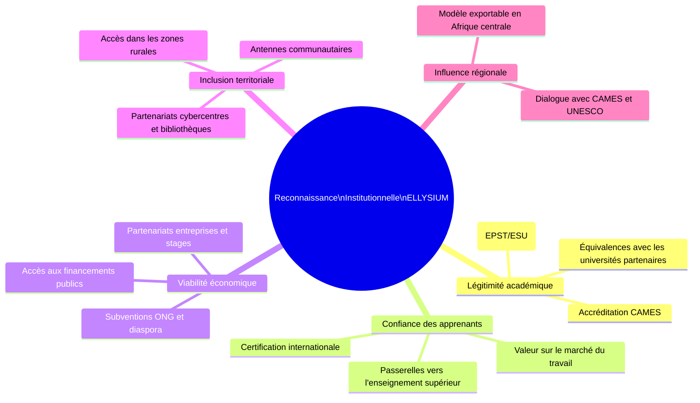
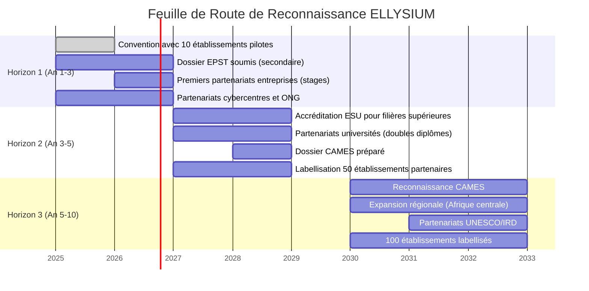

# Module 263 — Périmètre du Tome 15 : stratégie de reconnaissance progressive

> **Positionnement :** Tome 15 — Partenariats, Accréditation et Reconnaissance Institutionnelle
> Module 1 sur 15 | Référence : ELLYSIUM-T15-M263
> **Autorité :** Direction générale ELLYSIUM / Direction des Partenariats
> **Liaison amont :** Tome 14 complet (M247–M262)
> **Liaison aval :** Module 264 — Conformité constitutionnelle Tome 15

---

## 1. Objet

Ce module d'ouverture du Tome 15 définit la stratégie globale d'ELLYSIUM pour construire sa légitimité externe, obtenir des accréditations institutionnelles progressives et bâtir un réseau de partenariats solide et durable. La reconnaissance n'est pas un objectif accessoire : c'est une condition de la crédibilité des diplômes et attestations ELLYSIUM auprès des employeurs, des institutions académiques et des autorités nationales.

---

## 2. Pourquoi la Reconnaissance Institutionnelle est-elle Stratégique ?

---

## 3. Périmètre du Tome 15

Le Tome 15 couvre quatre grandes catégories de relations externes :

| Catégorie | Modules concernés | Enjeu principal |
|---|---|---|
| **Relations avec les autorités de tutelle** | M265, M266, M267 | Légalité, accréditation, conformité curricula |
| **Partenariats académiques** | M268 | Doubles diplômes, reconnaissance de crédits |
| **Partenariats économiques et techniques** | M269, M270 | Employabilité, infrastructure, Mobile Money |
| **Partenariats d'accès et solidarité** | M271, M272 | Inclusion, zones rurales, diaspora, ONG |
| **Cadre de gestion des partenariats** | M273, M274, M275, M276 | Processus, KPI, labellisation, feuille de route |

---

## 4. Stratégie de Reconnaissance Progressive

ELLYSIUM adopte une stratégie de reconnaissance en trois horizons, réaliste et graduée :

---

## 5. Acteurs de la Reconnaissance Institutionnelle

| Acteur | Rôle | Priorité |
|---|---|---|
| **Ministère EPST (RDC)** | Reconnaissance des programmes secondaires | Horizon 1 |
| **Ministère ESU (RDC)** | Accréditation des filières supérieures | Horizon 2 |
| **CAMES** | Reconnaissance interafricaine | Horizon 3 |
| **Universités partenaires** | Doubles diplômes, validation de crédits | Horizon 2 |
| **Entreprises et employeurs** | Stages, alternance, recrutement | Horizon 1-2 |
| **Opérateurs télécoms** | Zéro-rating, Mobile Money | Horizon 1 |
| **ONG éducatives** | Financement, accès, sensibilisation | Horizon 1 |
| **Diaspora congolaise** | Financement, expertise, réseaux | Horizon 1-2 |

---

## 6. Principes Directeurs du Tome 15

Six principes guident toute la stratégie de partenariat et de reconnaissance d'ELLYSIUM :

1. **Ancrage local en premier :** La reconnaissance commence par la RDC avant toute visée régionale ou internationale.
2. **Qualité comme préalable :** Aucune accréditation n'est sollicitée avant que les standards internes ne soient atteints (cf. Module 264 — Conformité constitutionnelle).
3. **Partenariats équilibrés :** Tout accord est mutuellement bénéfique ; ELLYSIUM ne s'aligne pas sur des partenaires imposant des conditions contraires à sa Constitution.
4. **Inclusion non négociable :** Les partenariats d'accès (cybercentres, antennes) ont la même priorité que les partenariats académiques.
5. **Transparence des accords :** Tous les accords de partenariat sont publics dans leurs grandes lignes (sans données confidentielles) sur le site ELLYSIUM.
6. **Souveraineté numérique :** L'infrastructure reste 100 % Google Cloud Platform ; aucun partenariat ne peut imposer un hébergement alternatif.

---

## 7. Verrous Fonctionnels

| ID | Règle | Niveau |
|---|---|---|
| VF-263-01 | Aucune démarche d'accréditation externe ne peut être initiée sans validation préalable du Conseil d'Administration | CRITIQUE |
| VF-263-02 | Tout partenariat impliquant un partage de données d'apprenants doit faire l'objet d'un accord de traitement des données conforme au RGPD, signé avant toute transmission | CRITIQUE |
| VF-263-03 | La stratégie de reconnaissance est révisée annuellement par le CA et actualisée dans ce module | OBLIGATOIRE |
| VF-263-04 | Aucun partenariat ne peut imposer à ELLYSIUM un hébergement de données en dehors de l'infrastructure Google Cloud Platform | CRITIQUE |
| VF-263-05 | La feuille de route de reconnaissance est publiée sur le site ELLYSIUM (Firebase Hosting) et mise à jour à chaque étape franchie | OBLIGATOIRE |
| VF-263-06 | Aucun partenariat commercial ne peut modifier les règles académiques de la plateforme | CONSTITUTIONNEL |

---

*Sous-tome rédigé conformément aux Normes documentaires ELLYSIUM — Fondations 04.*
