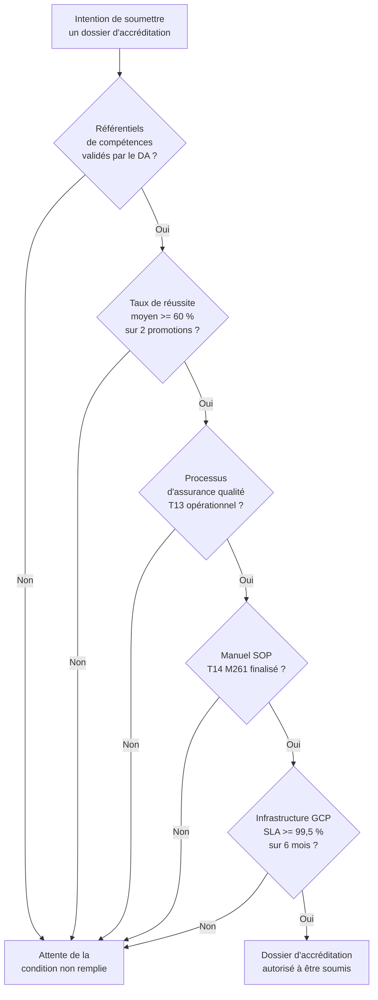
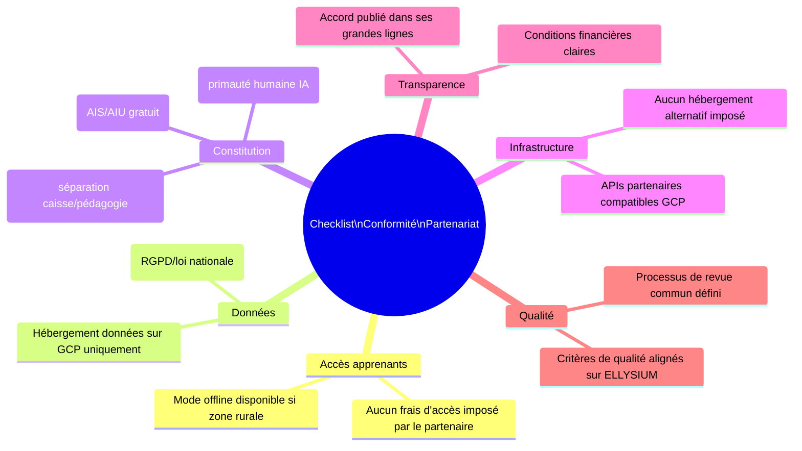
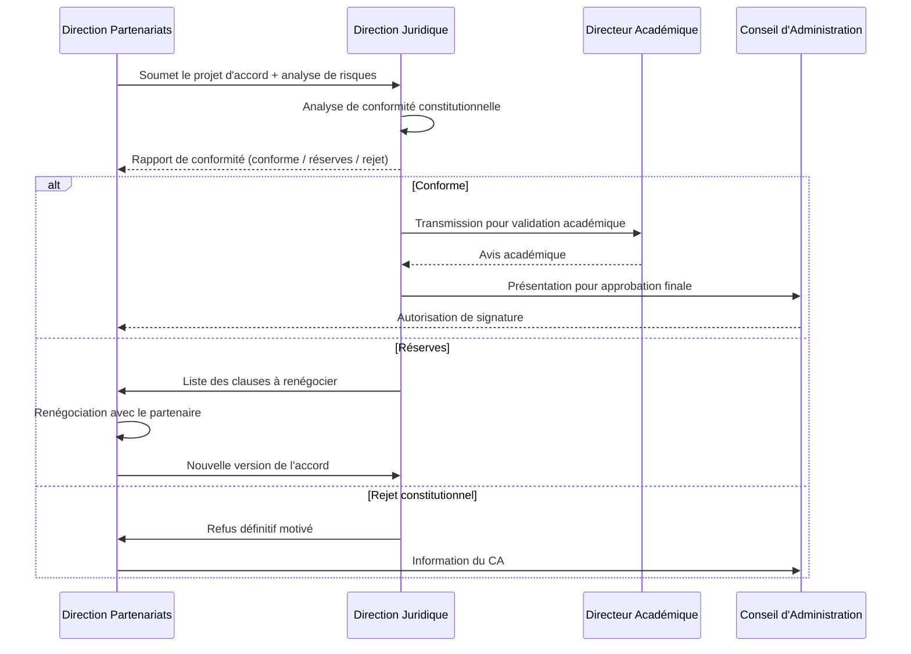

# Module 264 — Conformité avec la Constitution : ancrage local et exigence de qualité

> **Positionnement :** Tome 15 — Partenariats, Accréditation et Reconnaissance Institutionnelle
> Module 2 sur 15 | Référence : ELLYSIUM-T15-M264
> **Autorité :** Direction générale ELLYSIUM / Direction juridique
> **Liaison amont :** Module 263 — Périmètre du Tome 15
> **Liaison aval :** Module 265 — Relations avec le Ministère de l'EPST

---

## 1. Objet

Avant d'engager toute démarche de partenariat ou d'accréditation externe, ELLYSIUM doit vérifier que ses pratiques internes sont conformes à sa propre Constitution et aux exigences légales du contexte congolais et africain. Ce module documente les points de conformité constitutionnelle spécifiques au Tome 15, identifie les risques de non-conformité et définit les garde-fous applicables à toute relation externe.

---

## 2. Articles Constitutionnels Applicables au Tome 15

| Article | Libellé synthétique | Application dans le Tome 15 |
|---|---|---|
| **Art. 1** | Mission éducative inclusive | Tout partenariat doit servir la mission éducative, pas contredire l'inclusion |
| **Art. 4** | Accès gratuit pour les AIS/AIU | Les partenariats ne peuvent pas introduire de barrières financières pour les apprenants indépendants |
| **Art. 5** | Séparation caisse / pédagogie | Les accords financiers avec les partenaires ne peuvent conditionner l'accès pédagogique |
| **Art. 6** | Primauté humaine sur l'IA | Dans tous les partenariats impliquant de l'IA, l'humain garde le dernier mot |
| **Art. 9** | Ancrage dans les réalités congolaises | Les partenariats doivent s'adapter aux contraintes locales (connectivité, langues, contexte) |
| **Art. 12** | Transparence financière | Les conditions financières des partenariats sont publiées dans leurs grandes lignes |

---

## 3. Exigence de Qualité Interne Préalable à toute Accréditation

ELLYSIUM applique le principe : **« On ne demande pas une accréditation que l'on ne mérite pas encore. »**

Avant de soumettre un dossier d'accréditation à une autorité externe, les prérequis internes suivants doivent être satisfaits :

---

## 4. Ancrage Local — Principes d'Adaptation au Contexte Congolais

Toute démarche de reconnaissance doit respecter les réalités du contexte congolais :

| Réalité locale | Adaptation ELLYSIUM dans les partenariats |
|---|---|
| **Faible connectivité en zones rurales** | Les partenariats d'accès (M271) privilégient les solutions offline et les antennes communautaires |
| **Mobile Money dominant (M-Pesa, Airtel Money)** | Les accords avec les opérateurs télécoms (M270) intègrent les paiements Mobile Money |
| **Plurilinguisme (français, lingala, swahili, kikongo, tshiluba)** | Les accords avec les partenaires locaux prévoient des interfaces et supports locaux |
| **Systèmes éducatifs formels contraints** | Les partenariats avec EPST/ESU s'adaptent aux curricula officiels sans les court-circuiter |
| **Dynamique de la diaspora** | Les partenariats avec la diaspora (M272) valorisent l'expertise africaine dans le monde |
| **Contexte économique fragile** | Les partenariats financiers (M269) prévoient des modèles à faible coût d'entrée pour les PME |

---

## 5. Risques de Non-Conformité dans les Partenariats

| Risque | Probabilité | Impact | Mitigation |
|---|---|---|---|
| Partenaire imposant des frais d'accès aux apprenants | Moyen | Critique (viole Art. 5) | Clause contractuelle + audit annuel |
| Partenaire demandant un hébergement hors GCP | Faible | Critique (viole politique d'infrastructure) | Clause contractuelle non négociable |
| Accréditation conditionnée à des pratiques contraires à la Constitution | Faible | Critique | Refus de l'accréditation aux conditions imposées |
| Partenaire utilisant les données des apprenants à des fins commerciales | Moyen | Critique (RGPD + Art. 8) | DPA (Data Processing Agreement) obligatoire |
| Partenariat déséquilibré (ELLYSIUM dépendant d'un seul partenaire) | Moyen | Élevé | Règle de diversification : aucun partenaire > 30 % du financement |

---

## 6. Grille de Conformité Constitutionnelle — Checklist Partenariat

Avant toute signature d'accord de partenariat, la Direction juridique valide la checklist suivante :

---

## 7. Processus de Validation Constitutionnelle d'un Partenariat

---

## 8. Verrous Fonctionnels

| ID | Règle | Niveau |
|---|---|---|
| VF-264-01 | Aucun accord de partenariat ne peut être signé sans la validation de conformité constitutionnelle par la Direction juridique | CRITIQUE |
| VF-264-02 | Tout partenariat impliquant un transfert de données d'apprenants doit comporter un DPA conforme au RGPD, validé avant toute transmission de données | CRITIQUE |
| VF-264-03 | Le taux de réussite moyen >= 60 % sur deux promotions est une condition préalable non négociable à toute demande d'accréditation externe | CRITIQUE |
| VF-264-04 | Aucun partenaire unique ne peut représenter plus de 30 % des financements externes d'ELLYSIUM | OBLIGATOIRE |
| VF-264-05 | La grille de conformité constitutionnelle est révisée annuellement par la Direction juridique et soumise au CA pour approbation | OBLIGATOIRE |
| VF-264-06 | Aucun partenariat commercial ne peut modifier les règles académiques de la plateforme | CONSTITUTIONNEL |

---

*Sous-tome rédigé conformément aux Normes documentaires ELLYSIUM — Fondations 04.*
