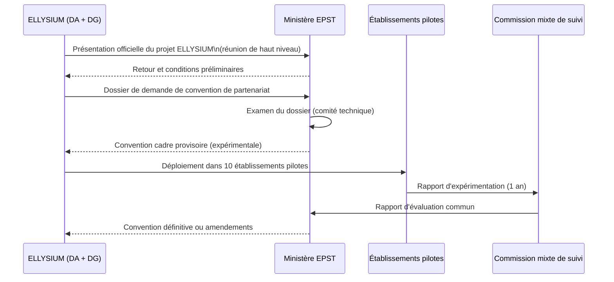
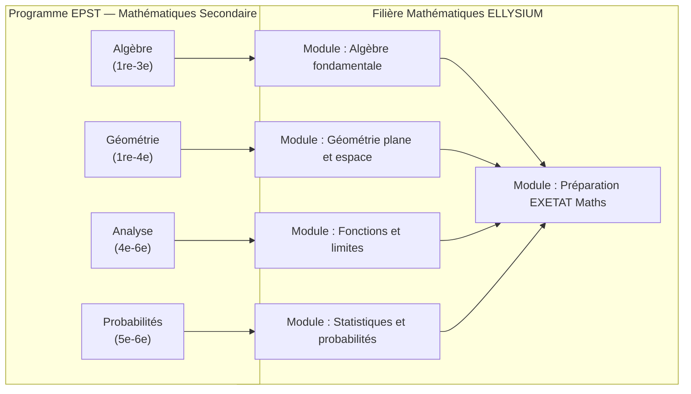

# Module 265 — Relations avec le Ministère de l'EPST (enseignement secondaire)

> **Positionnement :** Tome 15 — Partenariats, Accréditation et Reconnaissance Institutionnelle
> Module 3 sur 15 | Référence : ELLYSIUM-T15-M265
> **Autorité :** Direction générale ELLYSIUM / Directeur Académique
> **Liaison amont :** Module 264 — Conformité constitutionnelle Tome 15
> **Liaison aval :** Module 266 — Relations avec le Ministère de l'ESU

---

## 1. Objet

Le Ministère de l'Enseignement Primaire, Secondaire et Technique (EPST) de la République Démocratique du Congo est l'autorité de tutelle pour l'enseignement secondaire. ELLYSIUM opère en complémentarité avec le système formel EPST pour les apprenants de niveau secondaire inscrits dans ses filières. Ce module définit la stratégie relationnelle avec l'EPST, les démarches d'homologation progressives et les mécanismes de coopération pédagogique.

---

## 2. Contexte et Enjeux

### 2.1 Positionnement d'ELLYSIUM vis-à-vis du système EPST

ELLYSIUM ne se pose pas en concurrent du système EPST mais en **complément numérique** :

| Dimension | Système EPST | ELLYSIUM | Complémentarité |
|---|---|---|---|
| Présence physique | Obligatoire (établissements physiques) | Optionnelle (hybride/distanciel) | ELLYSIUM enrichit sans remplacer |
| Programme | Officiel EPST (curricula nationaux) | Aligné + enrichi (compétences numériques) | ELLYSIUM complète les lacunes |
| Évaluation | Examens d'État (TENAFEP, EXETAT) | Certifications internes + préparation examens | ELLYSIUM prépare aux examens officiels |
| Accès | Établissements physiques | En ligne + offline + centres d'accès | ELLYSIUM atteint les zones non couvertes |
| Coût apprenant | Frais de scolarité étatiques | Gratuit (AIS) ou faible coût | ELLYSIUM ne concurrence pas sur les frais |

### 2.2 Opportunités de coopération

- Préparation aux examens officiels TENAFEP (fin de primaire) et EXETAT (fin du secondaire).
- Remédiation pour les élèves en difficulté dans les établissements EPST.
- Formation continue des enseignants du secondaire via les ressources ELLYSIUM.
- Contribution aux révisions curriculaires nationales.

---

## 3. Stratégie d'Engagement avec l'EPST

---

## 4. Dossier de Demande de Convention EPST — Contenu Requis

| Section | Contenu | Responsable |
|---|---|---|
| **Note de présentation** | Mission, valeurs, Constitution ELLYSIUM | Direction générale |
| **Alignement curriculaire** | Tableau de correspondance programmes ELLYSIUM ↔ curricula EPST | Directeur Académique |
| **Évaluations et examens** | Preuve de conformité des évaluations aux standards EXETAT | DA + Comité Pédagogique |
| **Rapport technique** | Architecture GCP, sécurité des données, disponibilité SLA | Préfet Numérique |
| **Données d'impact** | Statistiques apprenants, taux de réussite, couverture territoriale | Direction des Opérations |
| **Modèle économique** | Preuve de non-concurrence financière avec le système public | Direction Financière |
| **Références partenaires** | Lettres de soutien des établissements pilotes | Direction des Partenariats |

---

## 5. Alignement des Filières ELLYSIUM avec les Curricula EPST

| Filière ELLYSIUM | Correspondance EPST | Niveau |
|---|---|---|
| Mathématiques et Sciences | Programme EPST – Math/Sciences (1re–6e secondaire) | Secondaire |
| Langue française et Communication | Programme EPST – Français (1re–6e secondaire) | Secondaire |
| Technologies et Informatique | Programme EPST – Tech. (orientation technique) | Secondaire technique |
| Sciences économiques | Programme EPST – Sciences commerciales | Secondaire commercial |
| Préparation EXETAT | Transversal toutes filières EPST | Terminale |

---

## 6. Indicateurs de Suivi du Partenariat EPST

| KPI | Formule | Cible (An 2) |
|---|---|---|
| Taux de réussite EXETAT des apprenants ELLYSIUM | Admis EXETAT / Inscrits ELLYSIUM ayant préparé l'examen | >= 70 % |
| Taux d'alignement curriculaire | Compétences alignées / Total compétences EPST par filière | >= 90 % |
| Établissements en convention active | Nombre d'établissements EPST signataires | >= 15 |
| Satisfaction directeurs d'établissement EPST | Score NPS enquête annuelle | >= 40 |
| Signalements de non-conformité | Nombre de signalements EPST sur contenus | 0 |

---

## 7. Risques et Mesures de Mitigation

| Risque | Mitigation |
|---|---|
| EPST refuse tout partenariat (approche défensive) | Commencer par des partenariats avec des établissements individuels ; constituer une preuve d'impact avant de solliciter le ministère |
| EPST impose des modifications contraires à la Constitution ELLYSIUM | Refuser les conditions contraires ; maintenir le partenariat au niveau des établissements |
| Changement de gouvernement modifiant la politique EPST | Diversifier les relations (établissements + ministère + ONG) pour limiter la dépendance |
| Exigences de certification locale incompatibles avec la Constitution | Négocier des modalités adaptées en préservant les principes fondateurs |

---

## 8. Extrait — Tableau de Correspondance Curriculaire (Mathématiques)

---

## 9. Verrous Fonctionnels

| ID | Règle | Niveau |
|---|---|---|
| VF-265-01 | Toute convention avec l'EPST doit être validée par le CA avant signature | CRITIQUE |
| VF-265-02 | Les contenus ELLYSIUM destinés aux apprenants de niveau secondaire doivent être alignés à >= 90 % avec les curricula EPST avant toute demande de convention | CRITIQUE |
| VF-265-03 | Aucune clause d'une convention EPST ne peut contredire les Articles 4, 5 et 6 de la Constitution ELLYSIUM | CRITIQUE |
| VF-265-04 | Le rapport d'alignement curriculaire est mis à jour chaque fois que l'EPST révise ses programmes | OBLIGATOIRE |
| VF-265-05 | Un représentant ELLYSIUM (DA ou délégué) participe aux commissions de révision curriculaire EPST lorsqu'il est invité | OBLIGATOIRE |
| VF-265-06 | Aucun partenariat commercial ne peut modifier les règles académiques de la plateforme | CONSTITUTIONNEL |

---

*Sous-tome rédigé conformément aux Normes documentaires ELLYSIUM — Fondations 04.*
