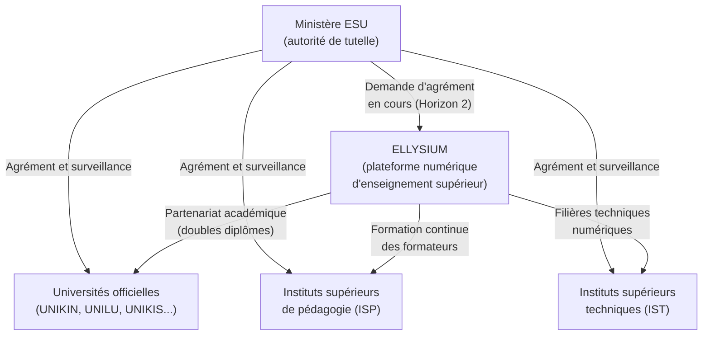
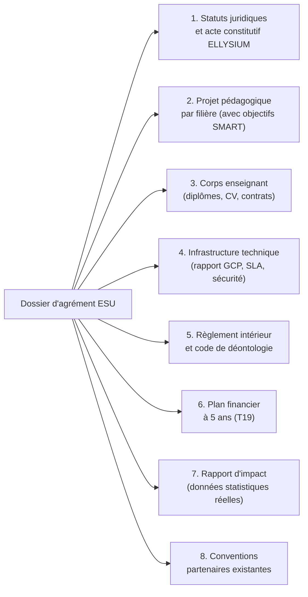
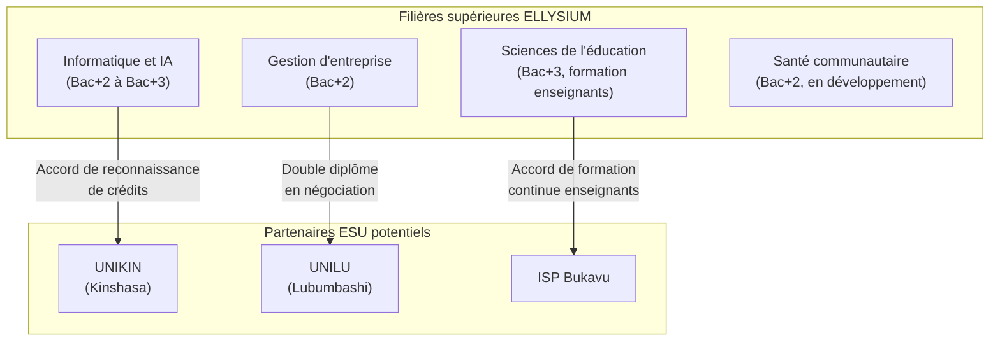

# Module 266 — Relations avec le Ministère de l'ESU (enseignement supérieur et universitaire)

> **Positionnement :** Tome 15 — Partenariats, Accréditation et Reconnaissance Institutionnelle
> Module 4 sur 15 | Référence : ELLYSIUM-T15-M266
> **Autorité :** Direction générale ELLYSIUM / Directeur Académique
> **Liaison amont :** Module 265 — Relations avec le Ministère de l'EPST
> **Liaison aval :** Module 267 — Relations avec le CAMES

---

## 1. Objet

Le Ministère de l'Enseignement Supérieur et Universitaire (ESU) de la République Démocratique du Congo est l'autorité de tutelle pour l'enseignement supérieur, les universités et les instituts supérieurs. Ce module définit la stratégie de relation d'ELLYSIUM avec l'ESU en vue de l'accréditation de ses filières supérieures, de la reconnaissance de ses certifications et de l'établissement de passerelles entre la plateforme et le système universitaire officiel.

---

## 2. Cadre Légal et Réglementaire

| Texte de référence | Objet | Pertinence pour ELLYSIUM |
|---|---|---|
| Loi-cadre n° 14/004 du 11 février 2014 | Organisation de l'enseignement national | Définit les conditions d'agrément des établissements d'enseignement supérieur |
| Arrêté ministériel ESU sur l'enseignement à distance | Réglementation de la formation en ligne | Base légale pour les demandes d'agrément ELLYSIUM |
| Décret sur les équivalences de diplômes | Reconnaissance des formations étrangères et hybrides | Applicable aux doubles diplômes avec universités partenaires |
| Règlement du CAMES | Normes régionales d'accréditation | Préparation dossier CAMES (Module 267) |

---

## 3. Positionnement ELLYSIUM dans le Paysage ESU

---

## 4. Feuille de Route de l'Engagement ESU

### 4.1 Horizon 1 (An 1–2) : Présence informelle et constitution des preuves

| Action | Responsable | Livrable |
|---|---|---|
| Présentation officielle d'ELLYSIUM au Ministère ESU | DG + DA | Compte-rendu de réunion |
| Constitution du dossier de preuve d'impact | DA + Direction des Opérations | Rapport d'impact An 1 |
| Signature de conventions avec 3 universités partenaires (avant ESU) | Direction Partenariats | 3 conventions signées |
| Alignement de 2 filières supérieures sur les curricula ESU | DA + RP | Rapport d'alignement |

### 4.2 Horizon 2 (An 3–5) : Demande d'agrément officiel

| Action | Responsable | Livrable |
|---|---|---|
| Dépôt du dossier d'agrément ESU pour l'enseignement à distance | DA + Direction Juridique | Dossier complet soumis |
| Réponse aux requêtes du comité technique ESU | DA | Compléments au dossier |
| Obtention de l'agrément provisoire (objectif) | DG + DA | Arrêté ministériel |
| Développement des curricula de niveau licence reconnus | DA + RP | 2 filières à niveau Bac+3 |

### 4.3 Horizon 3 (An 5–10) : Reconnaissance pleine et entière

| Action | Objectif |
|---|---|
| Agrément définitif ESU | Délivrance de diplômes co-signés avec l'ESU |
| Partenariats avec 5 universités (doubles diplômes) | Cf. Module 268 |
| Soumission au CAMES | Cf. Module 267 |

---

## 5. Dossier de Demande d'Agrément ESU — Structure

---

## 6. Exigences Spécifiques ESU pour l'Enseignement à Distance

| Exigence ESU (typique) | Réponse ELLYSIUM |
|---|---|
| Ratio enseignant/étudiant minimal | Garantie contractuelle (Module 253) |
| Sessions de contact présentiel minimum | Partenariats avec établissements partenaires (Module 252) pour les TP et examens physiques |
| Examens finaux en présentiel | Centres d'examen dans les villes principales, supervisés par des DEP agréés |
| Diplômes co-signés | Modèle de convention avec universités partenaires (Module 268) |
| Rapport annuel d'activité | Production automatisée via BigQuery + Looker Studio |

---

## 7. Synergies avec les Filières Techniques et Pédagogiques

---

## 8. Verrous Fonctionnels

| ID | Règle | Niveau |
|---|---|---|
| VF-266-01 | Le dossier d'agrément ESU ne peut être déposé qu'après la validation des prérequis internes définis au Module 264 | CRITIQUE |
| VF-266-02 | Toute filière supérieure ELLYSIUM doit avoir au moins un enseignant titulaire d'un doctorat ou d'une maîtrise + 5 ans d'expérience dans le domaine | CRITIQUE |
| VF-266-03 | Les examens finaux de niveau supérieur se tiennent dans des centres physiques agréés et supervisés ; aucun examen certifiant de niveau Bac+2 ou plus ne peut se tenir uniquement en ligne | OBLIGATOIRE |
| VF-266-04 | Le rapport annuel d'activité destiné à l'ESU est produit et soumis dans les 60 jours suivant la clôture de l'année académique | OBLIGATOIRE |
| VF-266-05 | Aucune clause d'un accord avec l'ESU ne peut restreindre l'accès gratuit des apprenants indépendants (AIS/AIU) ni introduire de discrimination basée sur le statut économique | CRITIQUE |
| VF-266-06 | Aucun partenariat commercial ne peut modifier les règles académiques de la plateforme | CONSTITUTIONNEL |

---

*Sous-tome rédigé conformément aux Normes documentaires ELLYSIUM — Fondations 04.*
