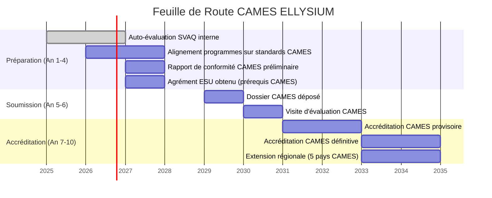
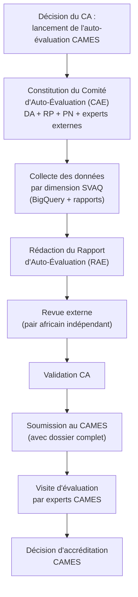

# Module 267 — Relations avec le CAMES et les organismes d'assurance qualité

> **Positionnement :** Tome 15 — Partenariats, Accréditation et Reconnaissance Institutionnelle
> Module 5 sur 15 | Référence : ELLYSIUM-T15-M267
> **Autorité :** Direction générale ELLYSIUM / Directeur Académique
> **Liaison amont :** Module 266 — Relations avec le Ministère de l'ESU
> **Liaison aval :** Module 268 — Partenariats avec des universités accréditées

---

## 1. Objet

Le Conseil Africain et Malgache pour l'Enseignement Supérieur (CAMES) est l'organisme interafricain de référence pour la reconnaissance et l'équivalence des diplômes dans l'espace francophone africain et malgache. Une accréditation CAMES conférerait à ELLYSIUM une légitimité régionale majeure, permettant à ses apprenants d'être reconnus dans 19 pays membres. Ce module définit la stratégie et la feuille de route d'ELLYSIUM pour atteindre cet objectif à l'horizon 5–10 ans.

---

## 2. Présentation du CAMES

### 2.1 Qu'est-ce que le CAMES ?

| Attribut | Détail |
|---|---|
| Nom complet | Conseil Africain et Malgache pour l'Enseignement Supérieur |
| Siège | Ouagadougou, Burkina Faso |
| Membres | 19 États africains et malgache francophones |
| Missions principales | Équivalence des diplômes, concours communs (CAMES), accréditation des établissements |
| RDC | Membre actif |
| Site de référence | www.cames.bf |

### 2.2 Programmes CAMES pertinents pour ELLYSIUM

| Programme | Description | Pertinence ELLYSIUM |
|---|---|---|
| **Comité Consultatif** | Équivalence de diplômes pour les enseignants | Permet aux enseignants ELLYSIUM d'être reconnus dans l'espace CAMES |
| **LASER** | Listes africaines des experts reconnus | Valorise les enseignants experts ELLYSIUM à l'échelle régionale |
| **Programme Qualité** | Évaluation et accréditation des établissements | Cible principale pour ELLYSIUM (Horizon 3) |
| **SVAQ** | Système de Vérification et d'Assurance Qualité | Grille d'évaluation de la qualité académique |

---

## 3. Stratégie ELLYSIUM vis-à-vis du CAMES

---

## 4. Critères SVAQ (Système de Vérification et d'Assurance Qualité)

Les critères CAMES/SVAQ que doit satisfaire ELLYSIUM sont organisés autour de 7 dimensions :

| Dimension | Critères clés | Auto-évaluation ELLYSIUM (cible An 4) |
|---|---|---|
| **Gouvernance** | Organes décisionnels, transparence, statuts | CA constitué, Constitution publiée ✅ |
| **Programmes** | Conformité aux référentiels régionaux, crédits ECTS | Alignement en cours (80 %) |
| **Corps enseignant** | Taux de docteurs, ratio enseignant/étudiant | Recrutement en cours |
| **Recherche** | Publications, projets de recherche | À développer (Horizon 2) |
| **Infrastructure** | Locaux, équipements, bibliothèque numérique | GCP complet ✅ ; locaux physiques à développer |
| **Financement** | Viabilité financière, sources de revenus | Plan T19 en cours |
| **Assurance qualité interne** | Système AQ (Tome 13), évaluations, rétroaction | Opérationnel ✅ |

---

## 5. Autres Organismes d'Assurance Qualité

Au-delà du CAMES, ELLYSIUM s'inscrit dans un écosystème plus large d'assurance qualité :

| Organisme | Périmètre | Pertinence ELLYSIUM |
|---|---|---|
| **UNESCO** | Normes mondiales pour l'enseignement à distance | Référence pour les contenus OER (Module 258) |
| **ISO 29990:2010** | Qualité des services d'enseignement non formel | Standard international pour les certifications ELLYSIUM |
| **ISO 21001:2018** | Systèmes de management des organismes d'enseignement | Certification qualité de l'organisation ELLYSIUM |
| **Quality Matters (QM)** | Assurance qualité pour les cours en ligne | Référence pour la conception des cours ELLYSIUM |
| **ENQA** | Standards européens AQ (référence internationale) | Alignement partiel pour les partenariats européens |

---

## 6. Plan d'Auto-Évaluation Interne (Préparation CAMES)

---

## 7. Verrous Fonctionnels

| ID | Règle | Niveau |
|---|---|---|
| VF-267-01 | Le dossier CAMES ne peut être soumis qu'après l'obtention de l'agrément ESU (prérequis national obligatoire) | CRITIQUE |
| VF-267-02 | L'auto-évaluation interne SVAQ doit être conduite annuellement à partir de l'An 2 pour mesurer la progression vers les critères CAMES | OBLIGATOIRE |
| VF-267-03 | Le Rapport d'Auto-Évaluation (RAE) doit être revu par au moins un pair académique externe indépendant avant soumission | CRITIQUE |
| VF-267-04 | ELLYSIUM doit justifier d'au moins 30 % de son corps enseignant titulaire d'un doctorat avant de soumettre un dossier CAMES | CRITIQUE |
| VF-267-05 | Toute accréditation sectorielle (ISO, Quality Matters) obtenue est documentée dans le dossier CAMES comme preuve de qualité complémentaire | OBLIGATOIRE |
| VF-267-06 | Aucun partenariat commercial ne peut modifier les règles académiques de la plateforme | CONSTITUTIONNEL |

---

*Sous-tome rédigé conformément aux Normes documentaires ELLYSIUM — Fondations 04.*
