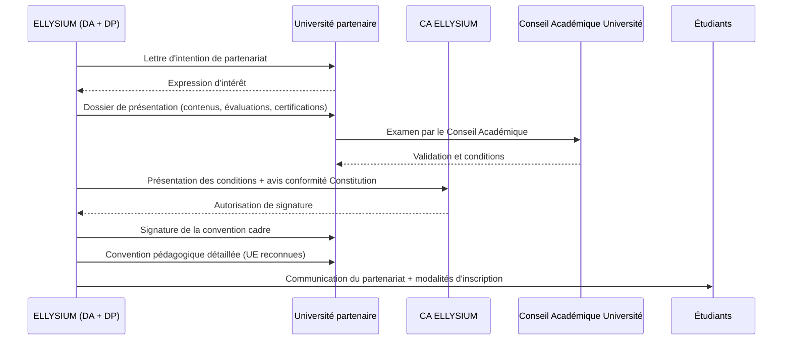
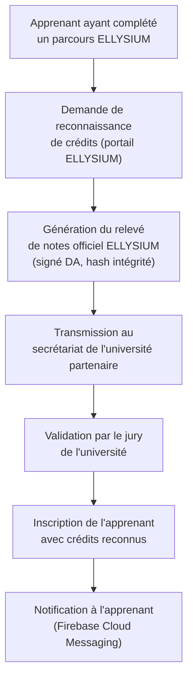

# Module 268 — Partenariats avec des universités accréditées : doubles diplômes et reconnaissance de crédits

> **Positionnement :** Tome 15 — Partenariats, Accréditation et Reconnaissance Institutionnelle
> Module 6 sur 15 | Référence : ELLYSIUM-T15-M268
> **Autorité :** Direction Académique / Direction des Partenariats
> **Liaison amont :** Module 267 — Relations avec le CAMES
> **Liaison aval :** Module 269 — Partenariats avec les entreprises

---

## 1. Objet

Les partenariats universitaires constituent un levier stratégique majeur pour ELLYSIUM : ils permettent de valoriser immédiatement les parcours des apprenants en leur ouvrant des passerelles vers des diplômes reconnus par l'État, sans attendre l'obtention de l'agrément ESU ou de l'accréditation CAMES. Ce module définit les modèles de partenariat universitaire, les processus de mise en place et les mécanismes de reconnaissance de crédits.

---

## 2. Modèles de Partenariat Universitaire

### 2.1 Trois modèles complémentaires

| Modèle | Description | Avantage apprenant | Complexité |
|---|---|---|---|
| **Reconnaissance de crédits** | L'université partenaire reconnaît des unités d'enseignement ELLYSIUM comme équivalentes à des UE de son propre cursus | Réduction de la durée des études | Faible |
| **Double inscription** | L'apprenant est inscrit simultanément dans un cursus ELLYSIUM et dans l'université partenaire | Deux diplômes, deux réseaux | Moyenne |
| **Double diplôme** | Accord bilatéral : l'apprenant valide un cursus intégré reconnu par les deux institutions | Diplôme co-signé, valeur maximale | Élevée |

---

## 3. Processus de Mise en Place d'un Partenariat Universitaire



---

## 4. Matrice de Reconnaissance de Crédits (Modèle)

La reconnaissance de crédits repose sur une table de correspondance établie conjointement avec l'université partenaire :

| Unité d'Enseignement ELLYSIUM | ECTS ELLYSIUM | UE Équivalente (Université X) | ECTS Université X | Conditions |
|---|---|---|---|---|
| Algorithmique fondamentale | 4 | INF201 — Algorithmique | 4 | Examen commun requis |
| Base de données relationnelles | 3 | INF305 — Bases de données | 3 | Validation directe (note >= 14/20) |
| Mathématiques discrètes | 4 | MATH201 — Maths discrètes | 4 | Examen commun requis |
| Programmation Python | 3 | INF210 — Python | 3 | Projet commun |
| Communication professionnelle | 2 | LET201 — Communication | 2 | Validation directe |

---

## 5. Universités Partenaires Cibles (Horizon 1–2)

### 5.1 Partenaires nationaux (RDC)

| Université | Ville | Filières cibles | Horizon |
|---|---|---|---|
| Université de Kinshasa (UNIKIN) | Kinshasa | Informatique, Sciences de l'éducation | 2 |
| Université de Lubumbashi (UNILU) | Lubumbashi | Sciences économiques, Informatique | 2 |
| Université de Kisangani (UNIKIS) | Kisangani | Sciences, Technologies | 2 |
| Institut Supérieur de Pédagogie (ISP) | Kinshasa | Sciences de l'éducation | 1 |

### 5.2 Partenaires régionaux et internationaux (Horizon 2–3)

| Université | Pays | Filières cibles | Horizon |
|---|---|---|---|
| Université de Yaoundé I | Cameroun | Informatique, Mathématiques | 2 |
| Université Cheikh Anta Diop (UCAD) | Sénégal | Technologies, Sciences sociales | 3 |
| Université d'Abomey-Calavi (UAC) | Bénin | Sciences, Technologies | 3 |
| Partenaire européen (à identifier) | France/Belgique | Double diplôme ingénierie | 3 |

---

## 6. Mécanisme de Validation des Crédits



---

## 7. Relevé de Notes Officiel — Spécifications Techniques

Le relevé de notes ELLYSIUM transmis aux universités partenaires doit satisfaire :

```typescript
// ellysium/certificates/transcript.ts
interface RelevéDeNotes {
    apprenantId:        string;
    nom:                string;
    prenom:             string;
    dateNaissance:      string;
    filiere:            string;
    niveauAtteint:      string;    // ex: "Bac+2 Informatique"
    unitesDEnseignement: UE[];
    dateEmission:       string;
    signatureDA:        string;    // Signature électronique SHA-256
    hashIntegrite:      string;    // Hash du document complet
    qrCodeVerification: string;   // URL de vérification Firebase
    universitePartenaire?: string; // Si envoyé pour reconnaissance
}

interface UE {
    code:         string;
    intitule:     string;
    ects:         number;
    note:         number;    // sur 20
    mention:      string;    // "Passable", "Satisfaisant", "Bien", "Très Bien", "Excellent"
    sessionDate:  string;
    statut:       "VALIDE" | "ECHEC" | "ABSENT";
}
```

---

## 8. Indicateurs de Performance des Partenariats Universitaires

| KPI | Formule | Cible (An 3) |
|---|---|---|
| Nombre de conventions actives | Conventions signées et en vigueur | >= 5 |
| Taux de reconnaissance de crédits accordée | Demandes acceptées / Demandes soumises | >= 85 % |
| Apprenants bénéficiant du partenariat | Nombre d'apprenants ayant eu des crédits reconnus | >= 200 |
| Délai moyen de traitement d'une demande | Jours entre soumission et décision universitaire | <= 30 jours |
| Taux de poursuite d'études post-ELLYSIUM | Apprenants poursuivant en université partenaire | >= 30 % |

---

## 9. Verrous Fonctionnels

| ID | Règle | Niveau |
|---|---|---|
| VF-268-01 | Tout relevé de notes officiel ELLYSIUM doit être signé électroniquement par le DA et horodaté ; le hash d'intégrité est vérifiable via un QR code pointant vers Firebase Hosting | CRITIQUE |
| VF-268-02 | Aucun accord de double diplôme ne peut être signé sans une convention pédagogique détaillée précisant les UE reconnues, les modalités d'examen commun et les droits des apprenants | CRITIQUE |
| VF-268-03 | La table de reconnaissance de crédits est révisée chaque année avec chaque université partenaire et archivée dans Cloud Storage | OBLIGATOIRE |
| VF-268-04 | Un apprenant ayant échoué à une UE ELLYSIUM ne peut pas demander la reconnaissance de cette UE auprès d'une université partenaire | OBLIGATOIRE |
| VF-268-05 | Tout partenariat universitaire imposant des frais supplémentaires aux apprenants ELLYSIUM doit prévoir un mécanisme de bourse ou d'exonération pour les apprenants AIS/AIU | CRITIQUE |

---

*Sous-tome rédigé conformément aux Normes documentaires ELLYSIUM — Fondations 04.*
