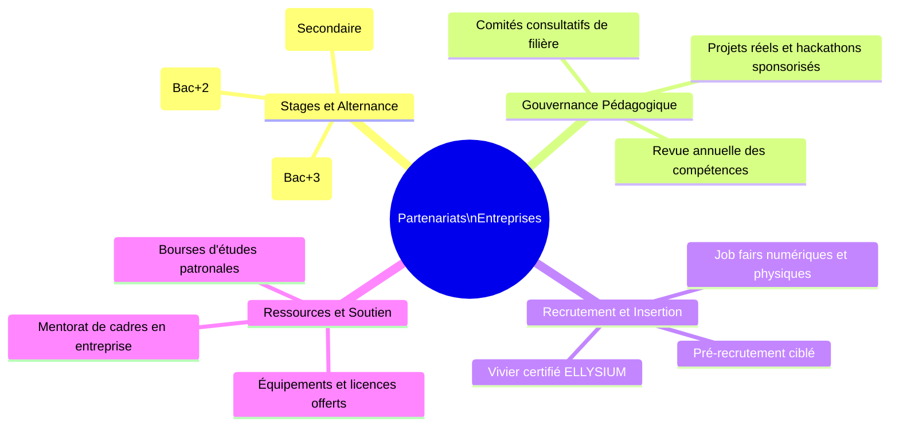
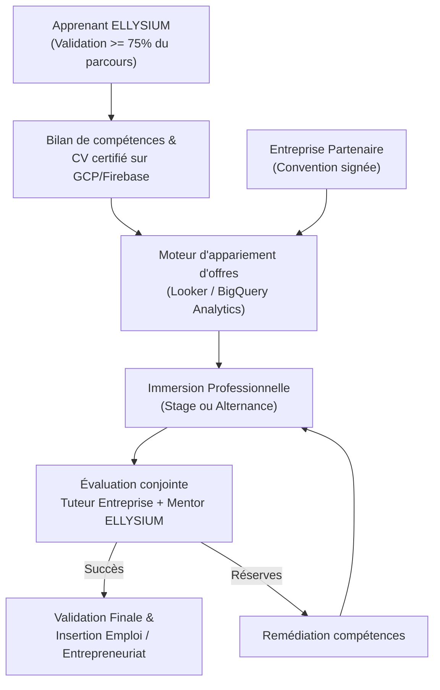

# Module 269 — Partenariats avec les entreprises : stages, alternance et employabilité

> **Positionnement :** Tome 15 — Partenariats, Accréditation et Reconnaissance Institutionnelle
> Module 7 sur 15 | Référence : ELLYSIUM-T15-M269
> **Autorité :** Direction de l'Insertion Professionnelle / Direction des Partenariats
> **Liaison amont :** Module 268 — Partenariats avec des universités accréditées
> **Liaison aval :** Module 270 — Partenariats techniques (cloud, télécoms)

---

## 1. Objet

L'insertion professionnelle et l'employabilité effective des apprenants constituent l'ultime mesure d'impact de la plateforme ELLYSIUM. Ce module formalise les relations partenariales avec le secteur productif, les entreprises privées, les sociétés publiques et les écosystèmes d'innovation. Il définit les mécanismes d'immersion professionnelle (stages d'observation, stages d'application, contrats d'alternance, mentorat industriel) et encadre l'alignement continu des référentiels de compétences avec les besoins réels du marché du travail en République Démocratique du Congo et en Afrique centrale.

---

## 2. Typologie des Partenariats Entreprises



| Type de Partenariat | Engagement Entreprise | Apport ELLYSIUM | Durée Type |
|---|---|---|---|
| **Convention de Stage** | Accueil de stagiaires, tutorat interne, évaluation | Profils préqualifiés, suivi pédagogique, assurance | 1 à 3 mois |
| **Accord d'Alternance** | Contrat de travail ou convention rémunérée, immersion 3j/2j | Adaptation du planning académique, plateforme suivi | 6 à 12 mois |
| **Partenaire Curriculaire** | Participation au conseil de filière, validation des compétences | Main-d'œuvre formée sur-mesure, image de marque | 2 ans renouvelable |
| **Sponsor d'Excellence** | Financement de bourses pour apprenants AIS/AIU, dotations | Visibilité sur les meilleurs talents, mention RSE | Annuel |

---

## 3. Parcours d'Immersion et d'Employabilité



---

## 4. Cadre Juridique et Rémunération des Stagiaires

Conformément à la législation du travail congolaise et aux principes de dignité humaine défendus par la Constitution ELLYSIUM :

1. **Interdiction du travail dissimulé :** Tout stage excédant 30 jours consécutifs doit comporter une indemnité forfaitaire de transport et de subsistance prise en charge par l'entreprise partenaire.
2. **Convention tripartite obligatoire :** Signée entre ELLYSIUM, l'entreprise d'accueil et l'apprenant (ou son tuteur légal pour les mineurs).
3. **Séparation financière stricte (Article 5 Constitutionnel) :** ELLYSIUM ne prélève aucune commission ni rétrocommission sur les indemnités versées directement aux apprenants par les entreprises.

---

## 5. Schéma de Données — Conventions et Placements Entreprises

```sql
-- Cloud SQL PostgreSQL 16
CREATE TABLE entreprises_partenaires (
    id UUID PRIMARY KEY DEFAULT gen_random_uuid(),
    raison_sociale VARCHAR(255) NOT NULL,
    secteur_activite VARCHAR(100) NOT NULL,
    rccm VARCHAR(100) UNIQUE,
    id_nat VARCHAR(100),
    contact_nom VARCHAR(150) NOT NULL,
    contact_email VARCHAR(200) NOT NULL,
    niveau_partenariat VARCHAR(50) DEFAULT 'STAGE' CHECK (niveau_partenariat IN ('STAGE', 'ALTERNANCE', 'CURRICULAIRE', 'STRATEGIQUE')),
    statut VARCHAR(30) DEFAULT 'ACTIF' CHECK (statut IN ('ACTIF', 'SUSPENDU', 'EN_REVUE')),
    created_at TIMESTAMPTZ DEFAULT NOW(),
    updated_at TIMESTAMPTZ DEFAULT NOW()
);

CREATE TABLE conventions_placement (
    id UUID PRIMARY KEY DEFAULT gen_random_uuid(),
    apprenant_id UUID NOT NULL,
    entreprise_id UUID NOT NULL REFERENCES entreprises_partenaires(id),
    type_immersion VARCHAR(30) CHECK (type_immersion IN ('STAGE_OBSERVATION', 'STAGE_TECHNIQUE', 'ALTERNANCE')),
    date_debut DATE NOT NULL,
    date_fin DATE NOT NULL,
    tuteur_entreprise VARCHAR(150) NOT NULL,
    mentor_ellysium VARCHAR(150) NOT NULL,
    indemnite_mensuelle_usd NUMERIC(10,2) DEFAULT 0.00,
    note_evaluation_finale NUMERIC(5,2),
    statut VARCHAR(30) DEFAULT 'EN_COURS' CHECK (statut IN ('SIGNEE', 'EN_COURS', 'VALIDEE', 'RESILIEE')),
    hash_convention_gcs VARCHAR(255) NOT NULL,
    created_at TIMESTAMPTZ DEFAULT NOW()
);

CREATE INDEX idx_placement_apprenant ON conventions_placement(apprenant_id);
CREATE INDEX idx_placement_entreprise ON conventions_placement(entreprise_id);
```

---

## 6. Métriques et Suivi de l'Employabilité

Les indicateurs sont calculés de manière automatisée dans BigQuery et visualisés sur Looker Studio :

| Indicateur | Formule de Calcul | Cible Minimale |
|---|---|---|
| **Taux de Placement en Stage** | Stagiaires placés / Apprenants éligibles demandeurs | >= 75 % |
| **Taux d'Insertion post-diplôme (6 mois)** | Diplômés en emploi ou auto-entrepreneurs / Total diplômés | >= 65 % |
| **Indice de Satisfaction Entreprise (NPS)** | Promoteurs - Détracteurs parmi les tuteurs entreprises | >= +45 |
| **Taux de Rétention en Emploi** | Apprenants maintenus en poste à 12 mois / Total placés | >= 80 % |

---

## 7. Verrous Fonctionnels

| ID | Règle | Niveau |
|---|---|---|
| VF-269-01 | Aucune convention de stage ou d'alternance ne peut être validée sans convention-cadre d'entreprise active et vérifiée | CRITIQUE |
| VF-269-02 | L'accès aux offres de stage et d'emploi sur la plateforme est strictement gratuit pour tous les apprenants (AIS/AIU compris) | CRITIQUE |
| VF-269-03 | Il est strictement interdit à tout personnel ou entité ELLYSIUM de prélever un pourcentage sur les indemnités de stage des apprenants | CRITIQUE |
| VF-269-04 | L'évaluation finale du stage doit être co-signée par le tuteur entreprise et le mentor ELLYSIUM pour valider les crédits ECTS associés | OBLIGATOIRE |
| VF-269-05 | Les conventions d'immersion et rapports de stage sont archivés avec contrôle d'intégrité SHA-256 dans Google Cloud Storage | OBLIGATOIRE |

---

*Sous-tome rédigé conformément aux Normes documentaires ELLYSIUM — Fondations 04.*
