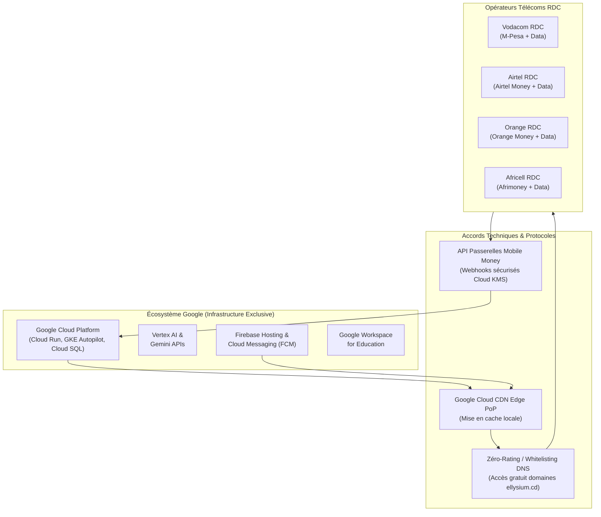
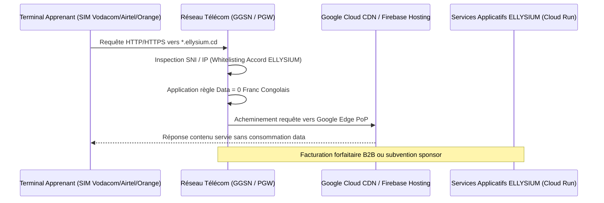

# Module 270 — Partenariats techniques : fournisseurs cloud, IA et opérateurs télécoms

> **Positionnement :** Tome 15 — Partenariats, Accréditation et Reconnaissance Institutionnelle
> Module 8 sur 15 | Référence : ELLYSIUM-T15-M270
> **Autorité :** Préfet Numérique / Direction Technique & Télécoms
> **Liaison amont :** Module 269 — Partenariats avec les entreprises
> **Liaison aval :** Module 271 — Partenariats d'accès physique (cybercentres, bibliothèques)

---

## 1. Objet

L'architecture et l'infrastructure d'ELLYSIUM reposent sur un impératif technique et contractuel absolu : **un déploiement exclusif et souverain au sein de l'environnement Google Cloud Platform (GCP)**. Cependant, pour que les services hébergés sur GCP et distribués via Firebase Hosting atteignent les apprenants au dernier kilomètre en RDC et en Afrique subsaharienne, des partenariats techniques robustes avec les opérateurs de télécommunications (MNO) et les agrégateurs de paiement mobile (Mobile Money) sont indispensables.

Ce module structure les accords techniques fondamentaux : les relations stratégiques avec Google (GCP, Google for Education, Vertex AI), les protocoles de zéro-rating (tarification data subventionnée ou nulle) et l'intégration directe des passerelles Mobile Money nationales.

---

## 2. Piliers des Partenariats Techniques



---

## 3. Partenariat Stratégique avec Google Cloud

### 3.1 Périmètre de la Coopération Institutionnelle

Conformément à la directive d'infrastructure exclusive, ELLYSIUM s'inscrit dans les programmes d'accompagnement officiels de Google :

| Programme Google | Bénéfice Opérationnel | Engagement ELLYSIUM |
|---|---|---|
| **Google for Education** | Licences Workspace gratuites/subventionnées, Classroom API | Respect de la conformité FERPA / COPPA / RGPD |
| **Google Cloud for Startups & EdTech** | Crédits d'infrastructure GCP, accompagnement d'architectes Google | Hébergement 100% natif GCP, études de cas publiques |
| **Vertex AI Partner Program** | Quotas dédiés Vertex AI (Gemini Flash/Pro), accès anticipé | Respect de l'éthique IA et de l'Article 6 de la Constitution |
| **Google Open Web Standards** | Optimisation Progressive Web App (PWA) et Service Workers | Navigation fluide en mode basse connectivité |

### 3.2 Immuabilité de l'Infrastructure Google

> **Règle d'or :** Aucun partenariat commercial ou subvention tierce ne peut imposer une migration ou un hébergement hybride chez un tiers (AWS, Azure, serveurs sur site non Google). Tout service d'arrière-plan réside sur Cloud Run, GKE Autopilot ou Cloud SQL.

---

## 4. Partenariats Télécoms : Zéro-Rating et Reverse-Billing

### 4.1 Mécanisme du Zéro-Rating Éducatif

Le zéro-rating permet aux apprenants d'accéder aux contenus textuels, infographies, quiz et évaluations sans décompte de leur forfait Internet personnel.



### 4.2 Modalités de Prise en Charge Financière

Le coût de la bande passante consommée en zéro-rating est pris en charge selon trois mécanismes :
1. **Sponsoring RSE des opérateurs :** Dotation annuelle de gigaoctets éducatifs dans le cadre de leur responsabilité sociétale.
2. **Reverse-Billing (Facturation inversée) :** ELLYSIUM achète des volumes de données en gros auprès des opérateurs et les affecte aux adresses IP de ses sous-domaines pédagogiques.
3. **Subventions de bailleurs de fonds :** Fonds d'accès universel (FASP) ou programmes d'inclusion numérique.

---

## 5. Intégration Sécurisée Mobile Money

### 5.1 Architecture des Passerelles de Paiement

Les transactions (droits d'inscription facultatifs, bourses, certifications) transitent via des liaisons chiffrées gérées par Cloud KMS :

```go
// ellysium/telecoms/mobile_money.go
package telecoms

import (
	"context"
	"crypto/hmac"
	"crypto/sha256"
	"encoding/hex"
	"errors"
	"time"
)

type MNOProvider string

const (
	VodacomMPesa   MNOProvider = "VODACOM_MPESA"
	AirtelMoney    MNOProvider = "AIRTEL_MONEY"
	OrangeMoney    MNOProvider = "ORANGE_MONEY"
	AfricellMoney  MNOProvider = "AFRICEL_MONEY"
)

type PaymentWebhookPayload struct {
	TransactionID   string      `json:"transaction_id"`
	MNOReference    string      `json:"mno_reference"`
	Provider        MNOProvider `json:"provider"`
	AmountCDF       int64       `json:"amount_cdf"`
	ApprenantRef    string      `json:"apprenant_ref"`
	Timestamp       time.Time   `json:"timestamp"`
	Signature       string      `json:"signature"`
}

// VerifyWebhookSignature vérifie l'authenticité de la notification MNO
func VerifyWebhookSignature(ctx context.Context, payload []byte, signature, secretKey string) (bool, error) {
	mac := hmac.New(sha256.New, []byte(secretKey))
	mac.Write(payload)
	expectedMAC := hex.EncodeToString(mac.Sum(nil))
	if !hmac.Equal([]byte(signature), []byte(expectedMAC)) {
		return false, errors.New("signature webhook non valide : altération détectée")
	}
	return true, nil
}
```

---

## 6. Schéma SQL — Gestion des Conventions Télécoms

```sql
-- Cloud SQL PostgreSQL 16
CREATE TABLE telecom_partenariats (
    id UUID PRIMARY KEY DEFAULT gen_random_uuid(),
    operateur VARCHAR(50) NOT NULL CHECK (operateur IN ('VODACOM', 'AIRTEL', 'ORANGE', 'AFRICELL')),
    type_accord VARCHAR(50) NOT NULL CHECK (type_accord IN ('ZERO_RATING', 'MOBILE_MONEY', 'SPONSORING_DATA', 'GLOBAL')),
    statut VARCHAR(30) DEFAULT 'EN_NEGOCIATION' CHECK (statut IN ('EN_NEGOCIATION', 'ACTIF', 'SUSPENDU', 'RENOUVELLEMENT')),
    date_signature DATE,
    date_expiration DATE,
    plages_ip_whitelistes TEXT[],
    domaines_concernes TEXT[] DEFAULT ARRAY['*.ellysium.cd', 'cdn.ellysium.cd'],
    quota_data_mensuel_go BIGINT DEFAULT 0,
    consommation_reelle_go BIGINT DEFAULT 0,
    contact_technique VARCHAR(150),
    created_at TIMESTAMPTZ DEFAULT NOW(),
    updated_at TIMESTAMPTZ DEFAULT NOW()
);

CREATE INDEX idx_telecom_operateur ON telecom_partenariats(operateur);
CREATE INDEX idx_telecom_statut ON telecom_partenariats(statut);
```

---

## 7. Verrous Fonctionnels

| ID | Règle | Niveau |
|---|---|---|
| VF-270-01 | L'infrastructure d'hébergement, de calcul et de données doit impérativement et exclusivement résider sur Google Cloud Platform | CRITIQUE |
| VF-270-02 | Le zéro-rating ne doit jamais privilégier une filière payante au détriment du tronc commun ou des filières gratuites AIS/AIU | CRITIQUE |
| VF-270-03 | Les clés secrètes des API Mobile Money et webhooks opérateurs doivent être stockées dans Google Cloud Secret Manager avec chiffrement Cloud KMS | CRITIQUE |
| VF-270-04 | Tout webhook de paiement non signé ou dont la signature est invalide doit être rejeté et journalisé dans Cloud Logging | CRITIQUE |
| VF-270-05 | Les métriques de consommation réseau en zéro-rating doivent être réconciliées mensuellement avec les données BigQuery des opérateurs | OBLIGATOIRE |
| VF-270-06 | Aucun partenariat commercial ne peut modifier les règles académiques de la plateforme | CONSTITUTIONNEL |

---

*Sous-tome rédigé conformément aux Normes documentaires ELLYSIUM — Fondations 04.*
