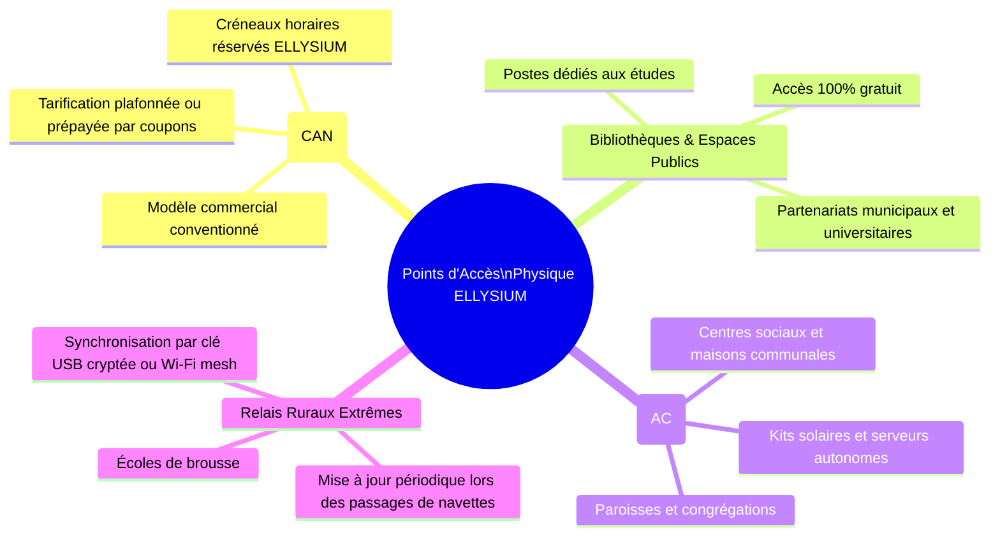
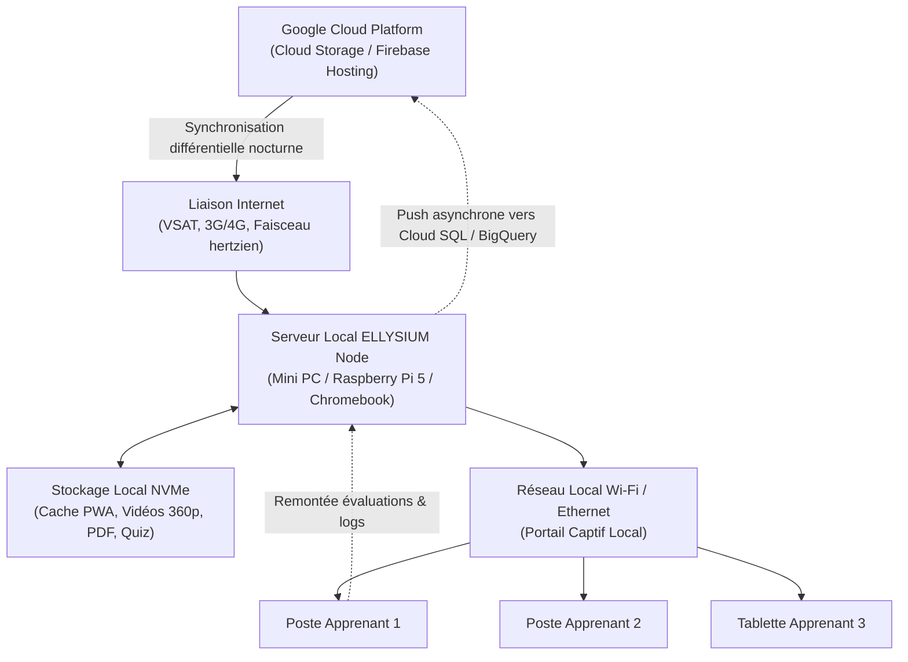
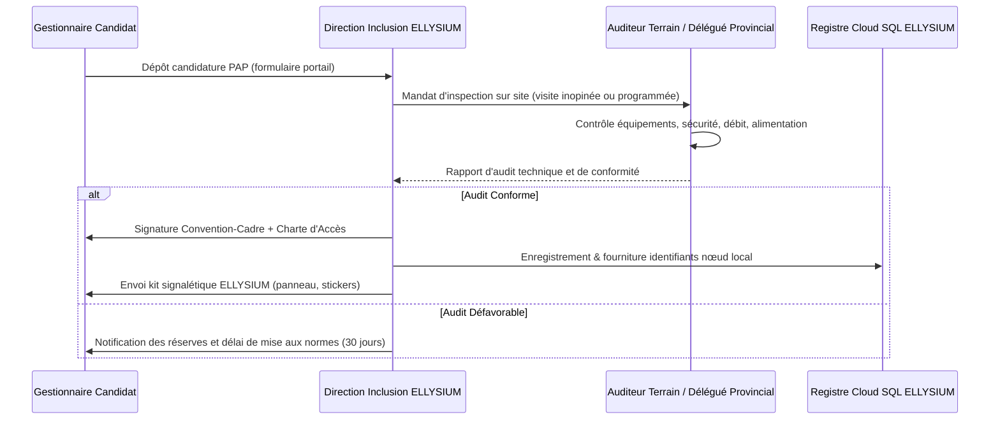

# Module 271 — Partenariats d'accès physique : cybercentres, bibliothèques et antennes communautaires

> **Positionnement :** Tome 15 — Partenariats, Accréditation et Reconnaissance Institutionnelle
> Module 9 sur 15 | Référence : ELLYSIUM-T15-M271
> **Autorité :** Direction de l'Inclusion et du Déploiement Territorial / Direction des Partenariats
> **Liaison amont :** Module 270 — Partenariats techniques (cloud, télécoms)
> **Liaison aval :** Module 272 — Partenariats avec les ONG éducatives et la diaspora

---

## 1. Objet

L'accès universel à l'éducation défendu par la Constitution ELLYSIUM (Articles 1 et 4) ne peut être effectif si la plateforme demeure confinée aux foyers équipés d'ordinateurs et d'une connexion domestique haut débit. Dans le contexte congolais, une écrasante majorité des apprenants dépend de points d'accès partagés.

Ce module structure les partenariats de proximité physique avec les **cybercentres privés**, les **bibliothèques publiques et universitaires**, et les **antennes communautaires** (paroisses, maisons des jeunes, centres culturels). Il définit les conditions d'agrément, les protocoles techniques de desserte locale (serveurs relais locaux et synchronisation asynchrone avec GCP) et les garanties d'accès gratuit ou à tarif solidaire pour les apprenants vulnérables.

---

## 2. Typologie des Points d'Accès Physique (PAP)



| Type de Point d'Accès | Infrastructure Minimale | Modèle Économique | Cible d'Apprenants |
|---|---|---|---|
| **Cybercentre Agréé (CAN)** | 10+ PC, 2 Mbps dédié, onduleur | Remboursement au forfait horaire par ELLYSIUM ou coupon | Zones urbaines et périurbaines denses |
| **Bibliothèque Publique** | 5+ PC, accès filaire/Wi-Fi | Mise à disposition gracieuse par convention publique | Étudiants universitaires et chercheurs |
| **Antenne Communautaire (AC)** | 3-5 terminaux basse consommation, panneau solaire | Bénévolat associatif, soutien confessionnel ou ONG | Quartiers périphériques et milieux semi-ruraux |
| **Relais Rural Hors-Réseau** | 2-3 tablettes durcies, kit solaire pico | Subvention intégrale de développement solidaire | Territoires isolés sans réseau cellulaire |

---

## 3. Architecture Technique de Déploiement Local

Pour éviter que les points d'accès ne saturent leur faible bande passante, un relais de cache local (ELLYSIUM Local Cache Node) synchronise les contenus statiques depuis Google Cloud Storage :



---

## 4. Charte d'Accès Solidaire et Obligations du Gestionnaire

Tout gestionnaire de PAP signe une **Charte d'Engagements Éthiques** annexée à sa convention :

1. **Plafond Tarifaire Infranchissable :** Dans les cybercentres commerciaux conventionnés, l'accès à ELLYSIUM ne peut excéder 30 % du tarif horaire internet standard de la zone.
2. **Quota d'Heures Gratuites (Bourse d'Accès) :** Le gestionnaire s'engage à allouer quotidiennement au minimum 2 heures de connexion gratuite par apprenant titulaire d'un statut AIS/AIU ou boursier.
3. **Neutralité Pédagogique :** Interdiction d'exiger des consommations annexes (boissons, impressions payantes obligatoires) pour accéder aux postes d'étude.
4. **Protection des Mineurs :** Filtrage DNS obligatoire bloquant les contenus pornographiques, violents ou illicites au niveau du routeur local.

---

## 5. Schéma de Données — Registre des Points d'Accès

```sql
-- Cloud SQL PostgreSQL 16
CREATE TABLE points_acces_physiques (
    id UUID PRIMARY KEY DEFAULT gen_random_uuid(),
    nom_espace VARCHAR(200) NOT NULL,
    type_pap VARCHAR(50) NOT NULL CHECK (type_pap IN ('CYBERCENTRE', 'BIBLIOTHEQUE', 'ANTENNE_COMMUNAUTAIRE', 'RELAIS_RURAL')),
    responsable_nom VARCHAR(150) NOT NULL,
    telephone_contact VARCHAR(50) NOT NULL,
    province VARCHAR(100) NOT NULL,
    ville_territoire VARCHAR(100) NOT NULL,
    adresse_physique TEXT NOT NULL,
    coordonnees_gps POINT,
    nb_postes_actifs INTEGER DEFAULT 1,
    debit_connexion_mbps NUMERIC(5,2),
    source_energie VARCHAR(50) DEFAULT 'SECTEUR' CHECK (source_energie IN ('SECTEUR', 'SOLAIRE', 'GROUPE', 'HYBRIDE')),
    statut VARCHAR(30) DEFAULT 'ACTIF' CHECK (statut IN ('ACTIF', 'INACTIF', 'SUSPENDU', 'EN_AUDIT')),
    capacite_cache_local_go INTEGER DEFAULT 0,
    derniere_synchro_gcp TIMESTAMPTZ,
    created_at TIMESTAMPTZ DEFAULT NOW(),
    updated_at TIMESTAMPTZ DEFAULT NOW()
);

CREATE INDEX idx_pap_province ON points_acces_physiques(province);
CREATE INDEX idx_pap_type ON points_acces_physiques(type_pap);
CREATE INDEX idx_pap_statut ON points_acces_physiques(statut);
```

---

## 6. Processus d'Agrément et d'Inspection



---

## 7. Verrous Fonctionnels

| ID | Règle | Niveau |
|---|---|---|
| VF-271-01 | Tout point d'accès physique doit offrir au moins un créneau quotidien gratuit pour les apprenants AIS/AIU | CRITIQUE |
| VF-271-02 | Aucun nœud local de cache ne peut modifier ou altérer les empreintes cryptographiques des cours émis par GCP | CRITIQUE |
| VF-271-03 | Tout cybercentre agréé appliquant une tarification abusive aux apprenants ELLYSIUM est suspendu immédiatement sous 24h | CRITIQUE |
| VF-271-04 | La synchronisation des données de progression depuis les relais hors-ligne vers GCP doit comporter une signature d'intégrité SHA-256 | CRITIQUE |
| VF-271-05 | Une visite d'inspection inopinée annuelle est obligatoire pour maintenir le label « Espace Agréé ELLYSIUM » | OBLIGATOIRE |

---

*Sous-tome rédigé conformément aux Normes documentaires ELLYSIUM — Fondations 04.*
