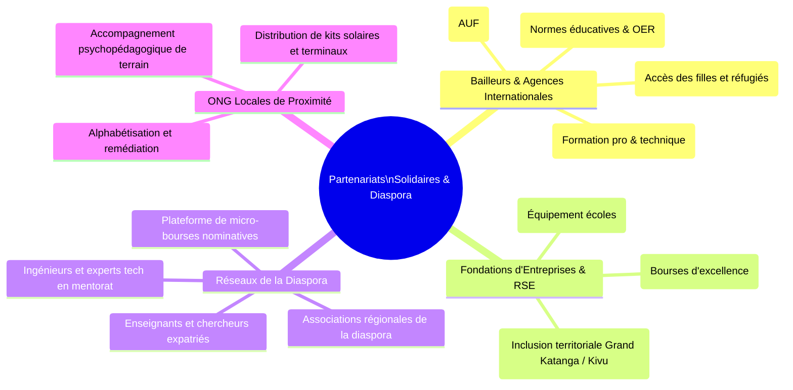
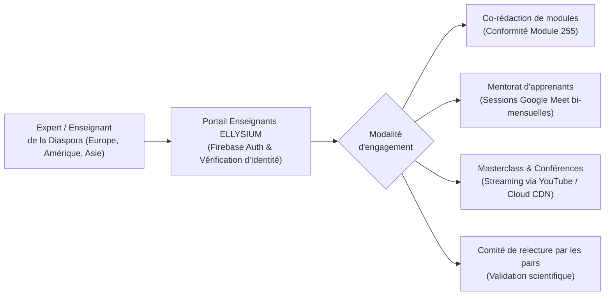
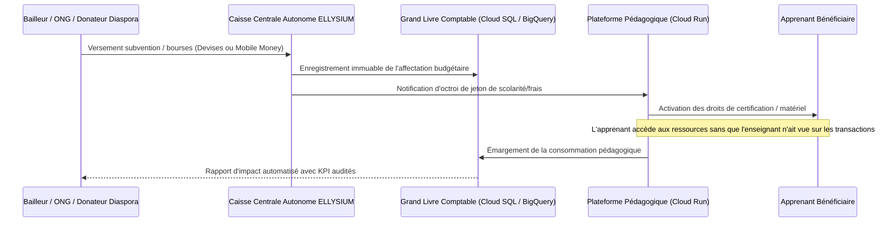

# Module 272 — Partenariats avec les ONG éducatives et la diaspora

> **Positionnement :** Tome 15 — Partenariats, Accréditation et Reconnaissance Institutionnelle
> Module 10 sur 15 | Référence : ELLYSIUM-T15-M272
> **Autorité :** Direction des Relations Extérieures / Direction des Partenariats
> **Liaison amont :** Module 271 — Partenariats d'accès physique
> **Liaison aval :** Module 273 — Critères de sélection des partenaires et modèle d'accord type

---

## 1. Objet

L'émancipation éducative à grande échelle en République Démocratique du Congo exige la mobilisation de forces vives dépassant les seules ressources étatiques. Les organisations non gouvernementales (ONG) humanitaires et de développement d'une part, et la diaspora congolaise et africaine hautement qualifiée d'autre part, représentent des leviers stratégiques considérables.

Ce module fixe les modalités d'engagement, les instruments de coopération et les garanties d'intégrité financière régissant les partenariats avec les bailleurs institutionnels, les fondations privées, les associations de terrain et les réseaux de la diaspora.

---

## 2. Typologie des Partenaires Solidaires et Internationaux



---

## 3. Programme « Corps des Mentors et Enseignants de la Diaspora »

ELLYSIUM structure la contribution intellectuelle de la diaspora à travers un dispositif formel intégré à la gouvernance pédagogique :



### 3.1 Modalités d'Intervention de la Diaspora

- **Bénévolat académique qualifié :** Les membres de la diaspora peuvent dispenser jusqu'à 4 heures mensuelles de mentorat ou de tutorat sans contrepartie financière, reconnues par une attestation institutionnelle officielle.
- **Vacations d'expertise rémunérées :** Pour la rédaction complète de filières spécialisées de haut niveau (ex. génie logiciel avancé, intelligence artificielle), des contrats de vacation standardisés (Module 253) sont établis.

---

## 4. Bourses d'Études et Financements Ciblés par les ONG

Pour préserver l'Article 5 de la Constitution (étanchéité absolue entre la caisse financière et le parcours pédagogique), la gestion des subventions et bourses suit un protocole cryptographique auditable :



---

## 5. Schéma de Données — Conventions Bailleurs et Projets Solidaires

```sql
-- Cloud SQL PostgreSQL 16
CREATE TABLE partenaires_ong_diaspora (
    id UUID PRIMARY KEY DEFAULT gen_random_uuid(),
    nom_organisme VARCHAR(255) NOT NULL,
    type_organisme VARCHAR(50) NOT NULL CHECK (type_organisme IN ('ONG_INTERNATIONALE', 'ONG_LOCALE', 'ASSOCIATION_DIASPORA', 'FONDATION_RSE', 'BAILLEUR_MULTILATERAL')),
    pays_siege VARCHAR(100) NOT NULL,
    representant_legal VARCHAR(150) NOT NULL,
    email_institutionnel VARCHAR(200) NOT NULL,
    statut_juridique VARCHAR(100),
    numero_agrement VARCHAR(100),
    date_convention_cadre DATE,
    statut VARCHAR(30) DEFAULT 'ACTIF' CHECK (statut IN ('PROSPECT', 'ACTIF', 'SUSPENDU', 'ARCHIVE')),
    created_at TIMESTAMPTZ DEFAULT NOW(),
    updated_at TIMESTAMPTZ DEFAULT NOW()
);

CREATE TABLE subventions_bourses (
    id UUID PRIMARY KEY DEFAULT gen_random_uuid(),
    partenaire_id UUID NOT NULL REFERENCES partenaires_ong_diaspora(id),
    intitule_projet VARCHAR(255) NOT NULL,
    montant_total_alloue NUMERIC(12,2) NOT NULL,
    devise VARCHAR(3) DEFAULT 'USD' CHECK (devise IN ('USD', 'EUR', 'CDF')),
    nb_apprenants_cibles INTEGER NOT NULL,
    criteres_eligibilite JSONB NOT NULL,
    date_debut DATE NOT NULL,
    date_fin DATE NOT NULL,
    montant_consomme NUMERIC(12,2) DEFAULT 0.00,
    statut_projet VARCHAR(30) DEFAULT 'EN_COURS' CHECK (statut_projet IN ('VALIDE', 'EN_COURS', 'SOLDE', 'CLOTURE')),
    audit_hash_gcs VARCHAR(255),
    created_at TIMESTAMPTZ DEFAULT NOW()
);

CREATE INDEX idx_bourses_partenaire ON subventions_bourses(partenaire_id);
CREATE INDEX idx_bourses_statut ON subventions_bourses(statut_projet);
```

---

## 6. Audit, Transparence et Reddition de Comptes

Pour répondre aux exigences de conformité des bailleurs internationaux (USAID, UE, Banque Mondiale) :

1. **Rapports d'impact automatisés :** Requêtes analytiques planifiées sous BigQuery extrayant les métriques réelles de complétion, d'assiduité et de diplomation désagrégées par genre et région.
2. **Interdiction de toute commission d'intermédiation :** Tolérance zéro envers les commissions occultes, rétrocommissions ou frais administratifs opaques.
3. **Publication annuelle de la liste des donateurs :** Les rapports financiers consolidés sont publiés sur Firebase Hosting dans le portail institutionnel.

---

## 7. Verrous Fonctionnels

| ID | Règle | Niveau |
|---|---|---|
| VF-272-01 | Aucune subvention ne peut être affectée à une fin politique, confessionnelle excluante ou contraire à la Constitution ELLYSIUM | CRITIQUE |
| VF-272-02 | 100 % des fonds alloués aux bourses d'études doivent être traçables jusqu'aux apprenants bénéficiaires réels dans Cloud SQL | CRITIQUE |
| VF-272-03 | L'attribution des bourses financées par les ONG doit être anonymisée et découplée des évaluateurs pédagogiques | CRITIQUE |
| VF-272-04 | Tout projet de subvention supérieur à 50 000 USD doit faire l'objet d'un audit financier externe indépendant annuel | OBLIGATOIRE |
| VF-272-05 | Les intervenants de la diaspora doivent signer le code de déontologie et de protection des apprenants (Module 260) avant toute interaction | CRITIQUE |
| VF-272-06 | Aucun partenariat commercial ne peut modifier les règles académiques de la plateforme | CONSTITUTIONNEL |

---

*Sous-tome rédigé conformément aux Normes documentaires ELLYSIUM — Fondations 04.*
